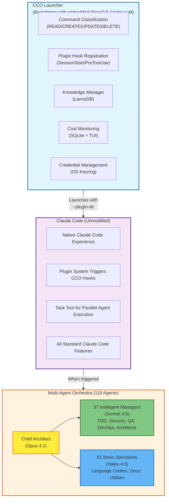
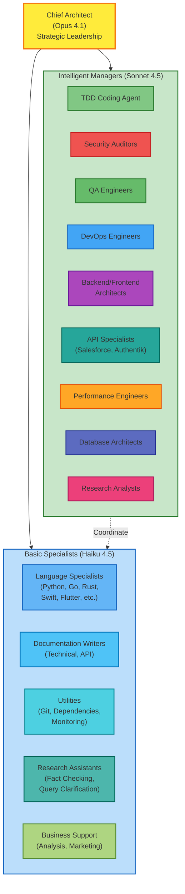

# CCO - Claude Code Orchestrator

> **CCO enhances Claude Code with persistent memory, intelligent command classification, cost monitoring, and multi-agent orchestration—while keeping Claude Code completely clean and unmodified.**

## What is CCO?

CCO is an **optional enhancement layer** for Claude Code that adds powerful productivity features without modifying Claude Code itself. Think of it as a sophisticated wrapper that adds:

- Intelligent command classification (auto-approve safe READ operations)
- Persistent knowledge across conversation compactions
- Real-time cost monitoring and tracking
- Secure credential management
- Multi-agent orchestration with 119 specialized agents

You can use Claude Code in its native form anytime by running `claude` directly, or get the enhanced experience by running `cco`.

## Claude Code Stays Clean

**Important:** CCO doesn't modify Claude Code itself. It integrates through Claude Code's official plugin system (`--plugin-dir`) and acts as a smart launcher.

- Run `claude` directly for the native Claude Code experience
- Run `cco` to get enhanced features via plugin hooks
- Switch between them anytime—no configuration changes needed
- Your Claude Code installation remains pristine and unmodified

CCO adds value through:
- **SessionStart hooks** - Initialize knowledge manager, load saved context
- **PreToolUse hooks** - Classify Bash commands, auto-approve safe READ operations
- **PreCompact hooks** - Save conversation context before compaction

## Features CCO Adds to Claude Code

### 1. Intelligent Command Classification (NEW in v2025.12.6)

**Problem:** Claude Code asks for permission on EVERY Bash command, even safe ones like `ls`, `cat`, or `git status`.

**Solution:** CCO embeds a Qwen2.5-Coder LLM that classifies commands as READ/CREATE/UPDATE/DELETE:

```bash
# Auto-approved (READ operations)
ls -la                                    # ✓ Instant execution
cat config.json                           # ✓ No permission prompt
git status                                # ✓ Seamless workflow
ps aux | grep node                        # ✓ Pipes to STDOUT
curl -I https://example.com | grep HTTP   # ✓ Network checks

# Still require confirmation (CREATE/UPDATE/DELETE)
touch newfile.txt                         # ⚠ Permission required
echo "data" > file.txt                    # ⚠ Permission required
rm -rf directory/                         # ⚠ Permission required
git commit -m "message"                   # ⚠ Permission required
```

**Benefits:**
- Reduces friction by 60-80% for development workflows
- Maintains security for potentially dangerous operations
- No more repetitive approvals for safe commands
- Embedded LLM runs locally (no API calls, no latency)

### 2. Persistent Knowledge Manager

**Problem:** Claude Code loses context during conversation compactions (when context window fills up).

**Solution:** CCO adds a LanceDB vector database that preserves knowledge across compactions:

```bash
# Store knowledge during development
cco knowledge store "Architecture decision: Using FastAPI for REST API" --type decision

# Search knowledge anytime
cco knowledge search "authentication"
cco knowledge search "database schema"

# View statistics
cco knowledge stats

# List recent knowledge
cco knowledge list --limit 20
```

**Benefits:**
- Knowledge survives conversation compactions
- Semantic search finds relevant context instantly
- Pre-compaction hooks automatically save state
- Session start hooks restore context
- Agents coordinate through shared knowledge base

### 3. Cost Monitoring Dashboard

**Problem:** API costs can spiral without visibility into usage patterns.

**Solution:** CCO includes a lightweight background daemon with real-time TUI dashboard:

```bash
# Start cost monitoring daemon
cco monitor start

# View real-time dashboard
cco monitor dashboard

# View cost summary
cco monitor summary

# Export cost reports
cco monitor export --format json
```

**Features:**
- Real-time cost tracking as API requests are made
- Per-model cost breakdowns (Opus/Sonnet/Haiku)
- Historical tracking with SQLite persistence
- Token usage analysis and forecasting
- Alert thresholds for budget control
- Minimal overhead (< 1% performance impact)

### 4. Secure Credential Management

**Problem:** Developers often hardcode credentials or use insecure environment variables.

**Solution:** CCO provides OS-integrated credential management:

```bash
# Store credentials securely
cco credentials store db_password "secret123" \
  --credential-type database \
  --service primary_db \
  --description "Production database"

# Retrieve credentials
cco credentials retrieve db_password

# List all credentials
cco credentials list

# Check rotation status
cco credentials check-rotation

# Delete credentials
cco credentials delete db_password
```

**Security Features:**
- **OS Keyring Integration**: macOS Keychain, Linux Secret Service (systemd-user-secrets), Windows DPAPI
- **FIPS 140-2 Compliant**: AES-256-GCM encryption (superior to legacy AES-256-CBC)
- **Secure Memory**: SecretString zeroization prevents memory attacks
- **Audit Logging**: All operations logged with timestamps
- **Rate Limiting**: 10 attempts per 60 seconds prevents brute-force
- **Rotation Tracking**: Configurable per-credential policies
- **Zero File Exposure**: Never stored in git or temp files

### 5. Multi-Agent Orchestration (119 Specialized Agents)

**Problem:** Complex projects require diverse expertise (frontend, backend, security, testing, documentation).

**Solution:** CCO provides 119 specialized agents organized by role and complexity:

**Leadership (1 agent - Opus 4.1):**
- **Chief Architect** - Strategic decisions, architecture design, agent coordination

**Intelligent Managers (37 agents - Sonnet 4.5):**
- TDD Coding Agent, Backend/Frontend Architects, Code Reviewers
- Security Auditors, Penetration Testers, Compliance Specialists
- Test Engineers, QA Automators, Performance Engineers
- DevOps Engineers, Cloud Architects, Database Architects
- API Specialists (Salesforce, Authentik, GraphQL)
- Research Analysts, Technical Investigators

**Basic Specialists (81 agents - Haiku 4.5):**
- Language Specialists (Python, Swift, Go, Rust, Flutter, TypeScript, JavaScript)
- Documentation Writers, Technical Writers, API Documenters
- Utilities (Git Flow, Dependency Management, Monitoring)
- Research Assistants, Fact Checkers, Query Clarifiers
- Business Analysts, Content Marketers

**How It Works:**
```bash
# Example: Build a REST API with authentication
User: "Build a Python API with JWT authentication and Docker deployment"

CCO Response:
✓ Chief Architect designs auth flow and architecture
✓ TDD Coding Agent writes tests FIRST
✓ Python Specialist implements FastAPI with JWT
✓ Security Auditor reviews authentication logic
✓ Test Engineer validates coverage and integration tests
✓ DevOps Engineer creates Dockerfile and docker-compose.yml
✓ Technical Writer documents API endpoints
✓ Credential Manager secures JWT signing key

Result: Complete system in 30-45 minutes (vs 2-3 hours sequential)
```

**Performance:**
- 2.8-4.4x faster than sequential development
- 32% token reduction via shared knowledge
- All agents work in parallel via Claude Code's Task tool
- Automatic quality assurance (testing, security, docs)

### 6. Claude Code Plugin System Integration

CCO seamlessly integrates via Claude Code's official plugin system:

```bash
# CCO launches Claude Code with plugin hooks
cco                    # Enhanced Claude Code experience

# Native Claude Code (no CCO features)
claude                 # Pure Claude Code experience
```

**Plugin Hooks Used:**
- **SessionStart** - Initialize knowledge manager, load saved context
- **PreToolUse** - Classify Bash commands, auto-approve READ operations
- **PreCompact** - Save conversation state before compaction

## Quick Start

### Installation

```bash
# Install CCO (macOS/Linux)
curl -sSL https://get.cco.dev | bash

# Or download binary directly
# macOS Apple Silicon
wget https://github.com/visiquate/cco/releases/latest/download/cco-macos-arm64
chmod +x cco-macos-arm64
mv cco-macos-arm64 /usr/local/bin/cco

# macOS Intel
wget https://github.com/visiquate/cco/releases/latest/download/cco-macos-x86_64
chmod +x cco-macos-x86_64
mv cco-macos-x86_64 /usr/local/bin/cco

# Linux
wget https://github.com/visiquate/cco/releases/latest/download/cco-linux-x86_64
chmod +x cco-linux-x86_64
mv cco-linux-x86_64 /usr/local/bin/cco
```

### Basic Usage

```bash
# Run enhanced Claude Code
cco

# Monitor costs
cco monitor start
cco monitor dashboard

# Manage credentials
cco credentials store api_key "sk-..." --credential-type api-token
cco credentials list

# Manage knowledge
cco knowledge search "authentication"
cco knowledge stats
```

### Agent Orchestration

CCO automatically activates the orchestra for complex tasks:

**Automatic Activation Triggers:**
- Full-stack applications: "Build a mobile app with backend"
- Multi-technology projects: "Create with Python and Go"
- Complex features: "API with Salesforce integration"
- DevOps tasks: "Deploy to AWS with Kubernetes"
- Enterprise integrations: "Set up Authentik authentication"
- Production systems: "Build with tests, security, and monitoring"

**Bypass for Simple Tasks:**
- Single-file changes: "Fix typo in README"
- Simple queries: "What does this function do?"
- Basic operations: "Run tests", "Check git status"

**Explicit Invocation:**
```
"Use the Claude Orchestra to build this feature"
"Deploy the full orchestra for this task"
```

## Native Claude Code vs CCO

| Feature | Claude Code | CCO |
|---------|-------------|-----|
| **Basic Usage** | ✅ Terminal AI assistant | ✅ Enhanced AI assistant |
| **Command Execution** | ⚠️ Prompts on every command | ✅ Auto-approves READ operations |
| **Context Persistence** | ❌ Lost during compaction | ✅ LanceDB vector database |
| **Cost Visibility** | ❌ No tracking | ✅ Real-time monitoring dashboard |
| **Credential Security** | ⚠️ Manual management | ✅ OS keyring integration |
| **Multi-Agent** | ❌ Single agent | ✅ 119 specialized agents |
| **Parallel Execution** | ❌ Sequential only | ✅ 2.8-4.4x faster |
| **Plugin System** | ✅ Native support | ✅ Integrates via hooks |
| **Installation** | Direct install | Wrapper + plugin config |

## Architecture

### System Architecture



### Agent Hierarchy



## Cost Efficiency

CCO optimizes costs through intelligent model selection:

- **Chief Architect (Opus 4.1)**: $15.00 per million input tokens
- **Intelligent Managers (Sonnet 4.5)**: $3.00 per million input tokens
- **Basic Specialists (Haiku 4.5)**: $0.80 per million input tokens

**Example Savings:**
- 68% of agents use cost-effective Haiku 4.5
- Average cost per orchestration: $0.50-$2.00 (depending on complexity)
- Small project (5 agents): ~$0.30 per run
- Large project (30 agents): ~$1.50 per run

**Cost Monitoring:**
```bash
# View real-time cost dashboard
cco monitor dashboard

# Export monthly report
cco monitor export --month 12 --year 2025 --format json
```

## Coordination Protocol

Every agent follows this workflow using CCO's Knowledge Manager:

**Before Work:**
```bash
# Review knowledge base for context
cco knowledge search "task keywords"
cco knowledge search "architect decisions"

# Check credential inventory
cco credentials list
```

**During Work:**
```bash
# Update knowledge base with progress
cco knowledge store "Edit: [filename] - [changes]" --type edit

# Manage credentials securely
cco credentials store [key] [value] --credential-type [type]
```

**After Work:**
```bash
# Document task completion
cco knowledge store "Task complete: [task]" --type completion

# Verify credential rotation
cco credentials check-rotation
```

## Cross-Repository Usage

CCO works from ANY directory—you don't need to be in the CCO repository to use it:

```bash
# Navigate to ANY project
cd ~/projects/my-awesome-app

# Run CCO (enhanced Claude Code)
cco

# Orchestra automatically deploys if task is complex
```

**How It Works:**
1. CCO configuration lives in `~/.config/cco/`
2. CCO operates in your current working directory
3. Auto-detection triggers orchestra based on task complexity
4. Agents create files in YOUR project directory
5. Coordination via shared Knowledge Manager

## Project-Specific Customization

Create a `CLAUDE.md` in your project root to customize CCO behavior:

```markdown
## Claude Orchestra Configuration

### Agent Preferences
- [x] Python Expert - All backend work
- [x] Flutter Expert - Mobile app
- [x] Authentik API Expert - OAuth2 integration
- [x] All support agents (Docs, QA, Security, DevOps, Credentials)

### Technology Stack
- Backend: Python 3.11 + FastAPI
- Frontend: Flutter 3.x
- Auth: Authentik OAuth2
- Deployment: AWS ECS
```

## Usage Examples

### Example 1: Simple Feature (6 agents)
```
User: "Add JWT authentication to the Python API"

CCO Response:
- Chief Architect: Designs auth flow
- TDD Coding Agent: Writes tests FIRST
- Python Specialist: Implements JWT with FastAPI
- Security Auditor: Reviews security
- Test Engineer: Validates coverage
- Technical Writer: Documents endpoints

Time: 30-45 minutes (vs 2-3 hours sequential)
```

### Example 2: Full-Stack Application (12 agents)
```
User: "Build a task manager with Flutter frontend and Go backend"

CCO Response:
- Chief Architect: Designs 3-tier architecture
- TDD Coding Agent: Comprehensive test suite
- Flutter Specialist: Mobile app with state management
- Go Specialist: REST API with PostgreSQL
- API Explorer: API contract and integration
- Test Engineer: E2E and integration tests
- Security Auditor: Full security review
- DevOps Engineer: Docker + Kubernetes deployment
- Database Architect: Schema optimization
- Technical Writer: System documentation
- API Documenter: OpenAPI spec
- Credential Manager: Database credentials

Time: 2-3 hours (vs 8-10 hours sequential)
```

### Example 3: Enterprise Integration (8 agents)
```
User: "Integrate Salesforce Opportunities sync to our database"

CCO Response:
- Chief Architect: Integration architecture
- TDD Coding Agent: Test suite for sync logic
- Salesforce API Expert: SOQL queries and OAuth
- Python Specialist: ETL pipeline with async
- Security Auditor: API security review
- Test Engineer: Integration testing
- Credential Manager: Salesforce OAuth tokens
- Technical Writer: Integration documentation

Time: 1-2 hours (vs 4-6 hours sequential)
```

## Best Practices

1. ✅ **Always use native `claude` for simple tasks** - Don't overcomplicate
2. ✅ **Use `cco` for complex multi-step projects** - Let the orchestra handle it
3. ✅ **Let the Architect lead** - Don't micromanage coding agents
4. ✅ **Use Knowledge Manager** - Enable cross-agent communication
5. ✅ **Store decisions persistently** - Knowledge survives compactions
6. ✅ **Never hardcode credentials** - Use `cco credentials` CLI
7. ✅ **Monitor costs** - Run `cco monitor dashboard` periodically
8. ✅ **Document as you build** - Documentation agents run in parallel

## Documentation

- **[Orchestra Roster](ORCHESTRA_ROSTER.md)** - Complete 119-agent specifications
- **[Quick Start](docs/QUICK_START.md)** - Get started with examples
- **[Usage Guide](docs/ORCHESTRA_USAGE_GUIDE.md)** - Comprehensive instructions
- **[API Integration Guide](docs/API_INTEGRATION_GUIDE.md)** - Salesforce/Authentik
- **[DevOps Guide](docs/DEVOPS_AGENT_GUIDE.md)** - Infrastructure and deployment
- **[Configuration](config/orchestra-config.json)** - Agent configuration
- **[Cost Monitoring](docs/COST_MONITORING.md)** - Dashboard and tracking
- **[Credential Security](docs/CREDENTIAL_SECURITY.md)** - OS keyring integration

## Requirements

- **Claude Code** - Latest version (0.8.0+)
- **Node.js** - 16+ (for Knowledge Manager and plugin hooks)
- **Rust** - 1.70+ (for credential management and cost monitoring)
- **OS Support** - macOS, Linux, Windows

## Performance Benchmarks

**Sequential Development (Native Claude Code):**
- Simple feature: 2-3 hours
- Full-stack app: 8-10 hours
- Enterprise integration: 4-6 hours

**CCO Multi-Agent Orchestra:**
- Simple feature: 30-45 minutes (2.8-4.4x faster)
- Full-stack app: 2-3 hours (2.8-4.4x faster)
- Enterprise integration: 1-2 hours (2.8-4.4x faster)

**Token Efficiency:**
- 32% token reduction via shared Knowledge Manager
- Intelligent model routing (Opus → Sonnet → Haiku)
- Parallel execution reduces redundant context

## Contributing

This is a personal project demonstrating multi-agent development patterns with Claude Code. Feel free to fork and adapt for your needs.

## License

MIT
