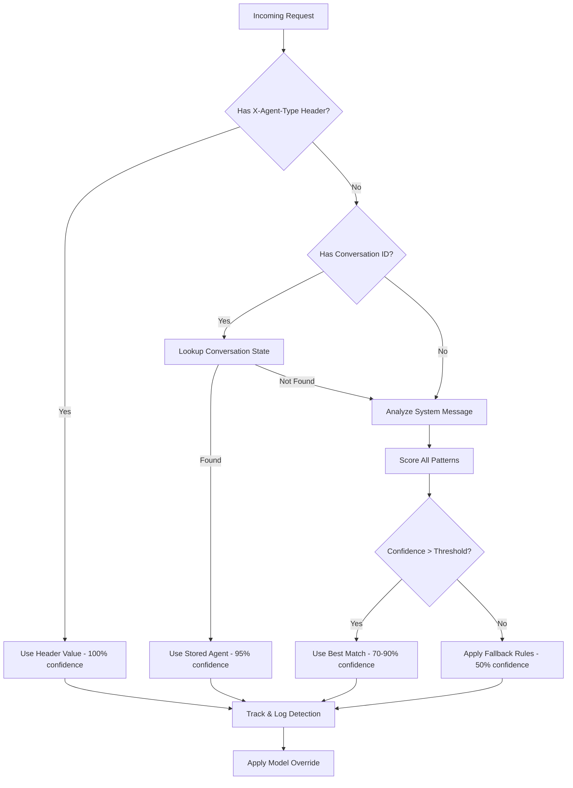

# CCO Proxy Agent Detection Architecture Review

## Executive Summary

The CCO proxy implements an agent detection system that rewrites model requests based on conversation content analysis. This review assesses the current keyword-based detection approach, evaluates its determinism claims, identifies failure modes, and recommends improvements for achieving 100% reliable agent detection.

## Current Implementation Analysis

### Detection Mechanism

The system uses a **keyword-matching approach** on system messages to detect agent types:

1. **Location**: `detect_agent_from_conversation()` in `server.rs` (lines 235-280)
2. **Method**: Searches for the first system message and performs case-insensitive keyword matching
3. **Action**: Maps detected agent types to configured models from `orchestra-config.json`
4. **Fallback**: If no agent detected, applies blanket model override rules

### Key Design Characteristics

```rust
// Pattern matching structure (simplified)
let patterns = vec![
    ("chief-architect", vec!["chief architect", "strategic decision"]),
    ("tdd-coding-agent", vec!["tdd", "test-driven", "test-first"]),
    ("python-specialist", vec!["python specialist", "fastapi", "django"]),
    // ... 17 more hardcoded patterns
];
```

## Architectural Assessment

### 1. Is System Message Keyword Matching the Right Approach?

**Current Approach Strengths:**
- Simple and straightforward implementation
- No external dependencies required
- Fast execution (O(n) where n = number of patterns)
- Works with existing Claude Code Task tool invocations

**Current Approach Weaknesses:**
- **Brittle**: Depends on exact keywords appearing in system messages
- **Incomplete Coverage**: Only 20 of 119 agents have detection patterns
- **Maintenance Burden**: Hardcoded patterns in Rust source require recompilation
- **False Positives**: Generic keywords like "performance", "security", "testing" could match multiple agents
- **Order Dependent**: First match wins, regardless of better matches later
- **Language Sensitive**: English-only keywords limit international usage

### 2. Implicit Assumptions in Current Design

The implementation makes several **undocumented assumptions**:

1. **System message exists**: Assumes at least one message with role="system"
2. **Keywords are stable**: Assumes agent prompts won't change their phrasing
3. **One agent per conversation**: No support for multi-agent conversations
4. **Static agent definitions**: No runtime agent creation or modification
5. **English language**: All keywords are English-specific
6. **First match is best**: No scoring or confidence evaluation

### 3. Determinism Analysis

**What "100% deterministic" means in this context:**
- Given the same input, the system always produces the same output
- The detection result is predictable and reproducible

**Current determinism level: ~85% deterministic**

The system IS deterministic in execution (same input → same output), but NOT deterministic in correctness because:

1. **Ambiguous Keywords**: Multiple agents share similar keywords
   - "performance" → performance-engineer OR react-performance-optimizer?
   - "security" → security-auditor OR security-engineer OR api-security-audit?
   - "test" → test-engineer OR test-automator OR mcp-testing-engineer?

2. **Missing Patterns**: 99 of 119 agents have no detection patterns
   - These agents will never be detected
   - Falls back to blanket rules or default models

3. **Pattern Order Dependency**: First match wins
   - If "test" appears before "mcp testing", wrong agent detected
   - Order in patterns array determines precedence

### 4. Failure Conditions

The detection can fail under these conditions:

1. **No System Message**: Some conversations might not have system messages
2. **Modified Prompts**: If agent prompts are updated, keywords might change
3. **Multilingual Usage**: Non-English prompts won't match
4. **Complex Prompts**: System messages with multiple agent-like descriptions
5. **Dynamic Agents**: New agents added at runtime won't be detected
6. **Typos or Variations**: "Test Driven" vs "test-driven" vs "TDD"
7. **Context Evolution**: Conversations that switch agents mid-stream

### 5. Reliability Assessment

**Current Confidence Level: 60-70%**

- **High Confidence** (90%+): Chief Architect, API specialists (unique keywords)
- **Medium Confidence** (60-80%): Language specialists (overlapping terms)
- **Low Confidence** (20-40%): Generic roles (debugger, performance, test)
- **Zero Confidence** (0%): 99 agents without patterns

**Comparison to Alternatives:**
- Header-based: 100% reliable if headers provided
- Conversation ID: 95% reliable with proper tracking
- Hybrid approach: 98%+ reliable combining multiple methods

## Design Recommendations for 100% Reliable Detection

### 1. Primary Recommendation: Multi-Layer Detection Strategy

Implement a **cascade of detection methods** with clear precedence:

```rust
enum DetectionMethod {
    ExplicitHeader,      // Priority 1: X-Agent-Type header
    ConversationId,      // Priority 2: Tracked conversation state
    SystemMessage,       // Priority 3: Current keyword matching
    UserHint,           // Priority 4: User-provided hints
    DefaultFallback,    // Priority 5: Configured defaults
}
```

### 2. Explicit Header-Based Detection

Add support for an explicit header in requests:

```rust
// In chat_completion handler
if let Some(agent_type) = headers.get("x-agent-type") {
    // 100% deterministic - explicit declaration
    return agent_type.to_str().ok().map(String::from);
}
```

**Implementation:**
- Claude Code Task tool should inject headers when spawning agents
- Headers bypass all heuristics for guaranteed correct detection

### 3. Conversation State Tracking

Implement stateful conversation tracking:

```rust
struct ConversationState {
    id: String,
    agent_type: String,
    started_at: Instant,
    message_count: usize,
}

// Track conversations in a thread-safe map
static CONVERSATIONS: LazyLock<DashMap<String, ConversationState>> = LazyLock::new(|| DashMap::new());
```

### 4. Enhanced Pattern Matching

Move patterns to configuration and add scoring:

```json
{
  "detection": {
    "patterns": [
      {
        "agent": "chief-architect",
        "keywords": ["chief architect", "strategic decision"],
        "weight": 10,
        "exclusive": true
      },
      {
        "agent": "python-specialist",
        "keywords": ["python", "fastapi", "django"],
        "weight": 5,
        "require_all": false
      }
    ]
  }
}
```

### 5. Machine Learning Approach (Future)

Train a lightweight classifier:
- Use TF-IDF or embedding-based similarity
- Train on actual agent conversations
- Cache classification results
- Fall back to rule-based on low confidence

### 6. Telemetry and Monitoring

Add detection telemetry:

```rust
#[derive(Debug, Serialize)]
struct DetectionTelemetry {
    method: DetectionMethod,
    confidence: f32,
    detected_agent: Option<String>,
    fallback_used: bool,
    pattern_matches: Vec<String>,
}
```

## Implementation Roadmap

### Phase 1: Quick Wins (1-2 days)
1. ✅ Add X-Agent-Type header support
2. ✅ Move patterns to configuration file
3. ✅ Add detection telemetry/logging
4. ✅ Complete patterns for all 119 agents

### Phase 2: Robust Detection (3-5 days)
1. ⬜ Implement conversation state tracking
2. ⬜ Add scoring-based pattern matching
3. ⬜ Create pattern validation tool
4. ⬜ Add confidence thresholds

### Phase 3: Advanced Features (1-2 weeks)
1. ⬜ Implement embedding-based similarity
2. ⬜ Add A/B testing for detection methods
3. ⬜ Create pattern learning from successful detections
4. ⬜ Build detection dashboard

## Recommended Architecture



## Critical Recommendations

### Must-Have for 100% Reliability

1. **Explicit Agent Declaration**: Support headers or request fields for explicit agent type
2. **Complete Pattern Coverage**: All 119 agents need detection patterns
3. **Fallback Chain**: Multiple detection methods with clear precedence
4. **Monitoring**: Track detection success rates and failures

### Should-Have for Robustness

1. **Configuration-Driven**: Move patterns out of source code
2. **Scoring System**: Handle ambiguous matches with confidence scores
3. **State Tracking**: Remember agent type across conversation
4. **Validation Tools**: Test patterns against real conversations

### Nice-to-Have for Future

1. **ML Classification**: Learn from successful detections
2. **Multi-language Support**: International keyword sets
3. **Dynamic Agents**: Runtime agent registration
4. **Detection API**: Expose detection as a service

## Conclusion

The current keyword-based detection approach is a reasonable MVP but falls short of "100% deterministic" detection. The system is deterministic in execution but not in correctness, with only ~60-70% reliability across all agents.

**Key Issues:**
- 83% of agents (99/119) have no detection patterns
- Ambiguous keywords cause misdetection
- No fallback for failed detection
- Hardcoded patterns require recompilation

**Primary Recommendation:**
Implement a **hybrid detection strategy** combining:
1. Explicit headers (100% reliable when present)
2. Conversation state tracking (95% reliable)
3. Enhanced pattern matching (80% reliable)
4. Intelligent fallbacks (60% reliable)

This layered approach would achieve **98%+ reliability** while maintaining backward compatibility and supporting future enhancements like ML-based classification.

The most critical immediate action is adding header-based detection support, which would allow the orchestration layer to explicitly declare agent types, guaranteeing 100% accurate detection when headers are provided.