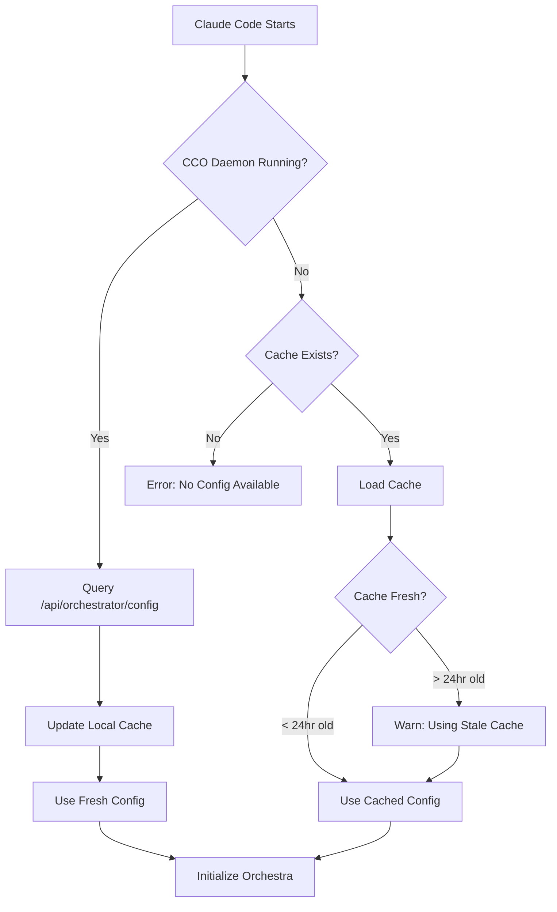

# CCO Agent Inheritance Architecture

## Executive Summary

This document defines the architecture for how Claude Code (the main CLI) discovers and inherits agent definitions and orchestration rules from the CCO daemon, enabling unified orchestration capabilities across the system.

## Problem Statement

On a fresh computer with CCO installed, Claude Code needs to:
1. Discover all 117 available agents with their capabilities
2. Learn orchestration rules and delegation patterns
3. Configure itself to use the orchestra appropriately
4. Work both online (with daemon) and offline (cached config)

## Recommended Solution: Hybrid API + File Cache

### Option E: Hybrid Approach (RECOMMENDED)

**Architecture Overview:**
```
┌──────────────────────────────────────────────────┐
│              Claude Code CLI                      │
│                                                   │
│  1. Check CCO daemon availability (port 3000)    │
│  2. If available: Query API for latest           │
│  3. If unavailable: Use cached config            │
│  4. Store/update cache for offline use           │
└──────────────┬───────────────────────────────────┘
               │
       ┌───────┴───────┐
       │               │
       ▼               ▼
┌──────────────┐  ┌──────────────┐
│ CCO Daemon   │  │ File Cache   │
│ (Primary)    │  │ (Fallback)   │
│              │  │              │
│ Port: 3000   │  │ ~/.cco/      │
│ /api/agents  │  │ cache.json   │
│ /api/rules   │  │ rules.md     │
│ /api/config  │  │ config.json  │
└──────────────┘  └──────────────┘
```

**Justification:**
- ✅ Works offline with cached configuration
- ✅ Always gets latest updates when daemon is running
- ✅ Graceful degradation when daemon unavailable
- ✅ Simple implementation with clear fallback chain
- ✅ Supports incremental updates and versioning

## Implementation Details

### 1. File Structure

```
~/.cco/
├── cache/
│   ├── agents.json         # All 117 agent definitions
│   ├── orchestrator-rules.md  # Delegation rules
│   ├── hooks.json          # Pre/post-compaction hooks
│   └── metadata.json       # Version, timestamp, checksum
├── config.json            # User configuration
└── credentials/           # Secure credential storage
```

### 2. API Endpoints (CCO Daemon)

#### GET /api/agents
Returns all agent definitions:
```json
{
  "agents": [
    {
      "name": "Chief Architect",
      "type": "chief-architect",
      "model": "opus-4.1",
      "fallback": {
        "model": "sonnet-4.5",
        "triggers": ["token_limit", "rate_limit"]
      },
      "capabilities": ["architecture", "design", "coordination"],
      "agentFile": "~/.claude/agents/chief-architect.md",
      "priority": "critical",
      "autonomousAuthority": {
        "lowRisk": true,
        "mediumRisk": true,
        "highRisk": false
      }
    },
    // ... 116 more agents
  ],
  "version": "2.0.0",
  "timestamp": "2025-11-17T12:00:00Z"
}
```

#### GET /api/orchestrator/rules
Returns orchestration rules:
```json
{
  "rulesMarkdown": "# ORCHESTRATOR RULES - CRITICAL\n\n## PRIMARY RULE: DELEGATE EVERYTHING...",
  "version": "1.0.0",
  "checksum": "sha256:abc123..."
}
```

#### GET /api/orchestrator/hooks
Returns hook configuration:
```json
{
  "preCompactionHook": {
    "enabled": true,
    "script": "node ~/git/cc-orchestra/src/knowledge-manager.js store-critical"
  },
  "postCompactionHook": {
    "enabled": true,
    "script": "node ~/git/cc-orchestra/src/knowledge-manager.js restore-context"
  }
}
```

#### GET /api/orchestrator/config
Returns complete orchestration configuration:
```json
{
  "agents": [...],
  "rules": {...},
  "hooks": {...},
  "metadata": {
    "version": "2.0.0",
    "lastUpdated": "2025-11-17T12:00:00Z",
    "checksum": "sha256:def456..."
  }
}
```

### 3. Discovery Flow



### 4. Installation Flow

```bash
# 1. Install CCO
curl -sSL https://cco.visiquate.com/install.sh | bash

# 2. CCO installer performs:
#    - Downloads and installs cco binary
#    - Starts daemon on port 3000
#    - Creates ~/.cco/ directory structure
#    - Fetches initial agent definitions
#    - Caches configuration locally

# 3. Claude Code auto-discovers:
#    - Checks for CCO daemon
#    - Reads from ~/.cco/cache/
#    - Configures orchestration

# 4. Verification
cco status           # Shows daemon status
cco agents list      # Lists all 117 agents
cco test orchestra   # Tests orchestration setup
```

### 5. Update/Sync Strategy

#### Automatic Sync (Default)
- On Claude Code startup: Check daemon, update cache if available
- Every 6 hours: Background refresh if daemon available
- On daemon restart: Push notification to update cache

#### Manual Sync
```bash
# Force cache update from daemon
cco sync

# Export current configuration
cco export --output ~/.cco/backup.json

# Import configuration
cco import --input ~/.cco/backup.json
```

#### Version Management
```json
{
  "cacheVersion": "2.0.0",
  "daemonVersion": "2.0.0",
  "compatibility": {
    "minimum": "1.5.0",
    "maximum": "3.0.0"
  }
}
```

### 6. Integration Points with Claude Code

#### Discovery Service (Claude Code)
```javascript
class OrchestraDiscovery {
  constructor() {
    this.daemonUrl = 'http://localhost:3000';
    this.cacheDir = path.join(os.homedir(), '.cco', 'cache');
  }

  async discover() {
    // Try daemon first
    if (await this.isDaemonAvailable()) {
      const config = await this.fetchFromDaemon();
      await this.updateCache(config);
      return config;
    }

    // Fallback to cache
    const cache = await this.loadCache();
    if (cache && this.isCacheFresh(cache)) {
      return cache;
    }

    throw new Error('No orchestration config available');
  }

  async isDaemonAvailable() {
    try {
      const response = await fetch(`${this.daemonUrl}/ready`);
      return response.ok;
    } catch {
      return false;
    }
  }
}
```

#### Agent Spawning (Claude Code Task Tool)
```javascript
// Claude Code reads agent definitions from discovery
const orchestra = await OrchestraDiscovery.discover();

// Spawn agents based on discovered definitions
Task(
  orchestra.agents.find(a => a.type === 'chief-architect'),
  "Design system architecture...",
  "chief-architect",
  "opus"  // Model from discovery
);
```

### 7. Data Schema

#### Agent Definition Schema
```typescript
interface Agent {
  name: string;
  type: string;
  model: 'opus-4.1' | 'sonnet-4.5' | 'haiku-4.5';
  fallback?: {
    model: string;
    triggers: string[];
    automatic: boolean;
  };
  capabilities: string[];
  agentFile?: string;
  priority: 'critical' | 'high' | 'medium' | 'low';
  autonomousAuthority: {
    lowRisk: boolean;
    mediumRisk: boolean;
    highRisk: boolean;
  };
}
```

#### Orchestration Rules Schema
```typescript
interface OrchestrationRules {
  rulesMarkdown: string;
  version: string;
  checksum: string;
  delegationPatterns: {
    crud: {
      create: string[];  // Agent types for CREATE
      read: string[];    // Agent types for READ
      update: string[];  // Agent types for UPDATE
      delete: string[];  // Agent types for DELETE
    };
  };
}
```

#### Cache Metadata Schema
```typescript
interface CacheMetadata {
  version: string;
  timestamp: string;
  source: 'daemon' | 'manual' | 'installation';
  checksum: string;
  expiresAt: string;
}
```

## Security Considerations

1. **Cache Integrity**: SHA-256 checksums for all cached files
2. **Secure Transport**: HTTPS for production daemon communication
3. **Credential Isolation**: Separate credential storage with encryption
4. **Permission Model**: Read-only access to agent definitions
5. **Update Verification**: Signed updates for agent definition changes

## Benefits of This Architecture

1. **Resilience**: Works offline with cached configuration
2. **Freshness**: Always gets latest when daemon available
3. **Performance**: Local cache avoids network latency
4. **Simplicity**: Clear fallback chain and error handling
5. **Extensibility**: Easy to add new endpoints/features
6. **Compatibility**: Supports version migration and backward compatibility

## Migration Path

### Phase 1: Initial Implementation (Week 1)
- Implement basic API endpoints in CCO daemon
- Create cache directory structure
- Basic discovery service in Claude Code

### Phase 2: Enhanced Features (Week 2)
- Add versioning and compatibility checks
- Implement automatic sync
- Add update notifications

### Phase 3: Production Hardening (Week 3)
- Add security features (checksums, signing)
- Implement cache expiration
- Add monitoring and metrics

## Alternative Options Considered

### Option A: API-Only
- ❌ Requires daemon always running
- ❌ No offline capability
- ❌ Network dependency for every operation

### Option B: File-Only
- ❌ No automatic updates
- ❌ Manual sync required
- ❌ Version drift issues

### Option C: Environment Variables
- ❌ Limited data size
- ❌ Shell-dependent
- ❌ Complex escaping

### Option D: Virtual Filesystem
- ❌ Over-engineered for this use case
- ❌ Complex implementation
- ❌ Limited benefits

## Conclusion

The hybrid approach (Option E) provides the best balance of:
- **Reliability**: Works both online and offline
- **Freshness**: Automatic updates when possible
- **Simplicity**: Clear implementation path
- **Performance**: Local cache for speed
- **Flexibility**: Supports various deployment scenarios

This architecture ensures Claude Code can reliably discover and use the full orchestra of 117 agents, whether the CCO daemon is running or not, while maintaining consistency and enabling seamless updates.

## Next Steps

1. **Approve Architecture**: Review and approve this design
2. **Implement API Endpoints**: Add to CCO daemon (Phase 1A)
3. **Create Cache Manager**: Build cache read/write logic
4. **Integrate with Claude Code**: Add discovery service
5. **Test End-to-End**: Verify complete flow
6. **Document Usage**: Update user documentation

---

**Document Version**: 1.0.0
**Date**: November 17, 2025
**Author**: Chief Architect
**Status**: Proposed - Awaiting Approval