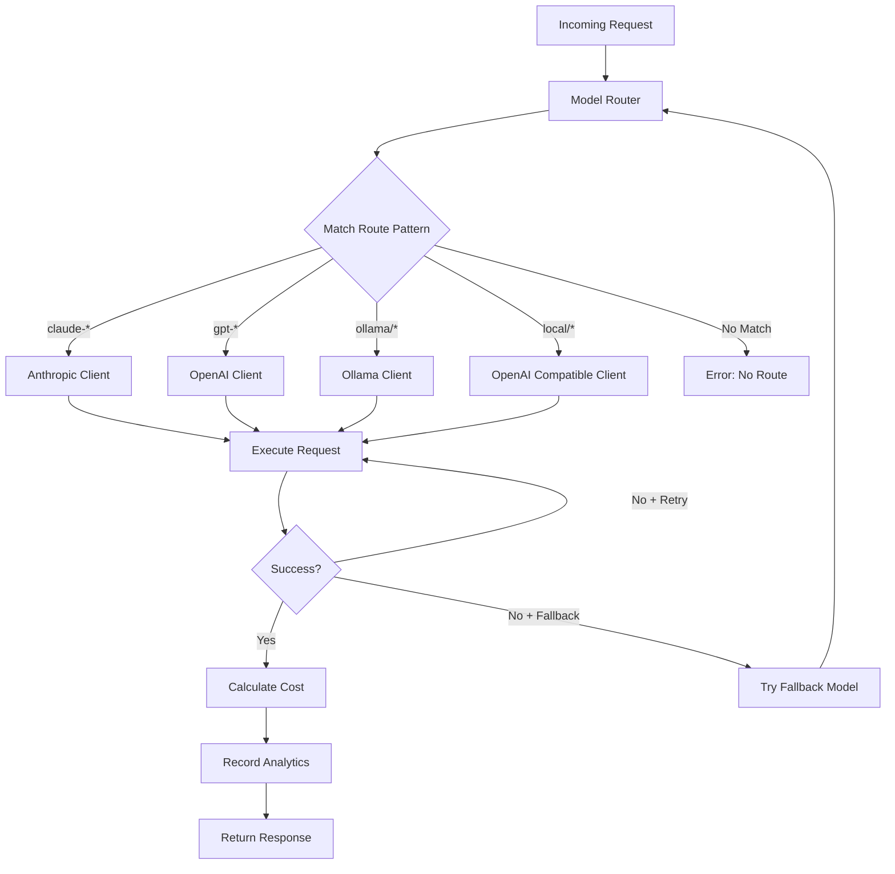

# Multi-Model Routing Architecture for CCO

## Overview
Extensible routing architecture to support both Claude API and self-hosted models (OpenAI API compatible).

## Design Principles

1. **Model Agnostic**: Support any LLM that follows OpenAI or Anthropic API spec
2. **Zero Runtime Cost**: Routing decisions at compile time where possible
3. **Extensible**: Easy to add new model providers
4. **Cost Tracking**: Unified cost calculation across all providers
5. **Fallback Support**: Automatic fallback to alternative models

## Routing Architecture

### Core Router Component

```rust
use std::collections::HashMap;
use async_trait::async_trait;
use serde::{Deserialize, Serialize};

// Router configuration loaded at compile time
#[derive(Debug, Clone, Deserialize, Serialize)]
pub struct RouterConfig {
    pub routes: Vec<RouteRule>,
    pub pricing: HashMap<String, ModelPricing>,
    pub fallback_chain: HashMap<String, Vec<String>>,
}

#[derive(Debug, Clone, Deserialize, Serialize)]
pub struct RouteRule {
    pub pattern: String,              // Regex pattern for model name
    pub provider: ProviderType,       // Anthropic, OpenAI, Ollama, Custom
    pub endpoint: String,              // Base URL
    pub api_key_env: Option<String>,  // Environment variable for API key
    pub timeout_ms: u64,              // Request timeout
    pub max_retries: u32,             // Retry count
}

#[derive(Debug, Clone, Deserialize, Serialize)]
#[serde(rename_all = "lowercase")]
pub enum ProviderType {
    Anthropic,
    OpenAI,
    Ollama,
    LocalAI,
    VLLM,
    TGI,  // Text Generation Inference
    Custom(String),
}

// Main router
pub struct ModelRouter {
    config: RouterConfig,
    routes: Vec<CompiledRoute>,
    clients: HashMap<ProviderType, Box<dyn LLMClient>>,
}

struct CompiledRoute {
    pattern: regex::Regex,
    rule: RouteRule,
}

impl ModelRouter {
    pub fn new(config: RouterConfig) -> Result<Self> {
        let routes = compile_routes(&config.routes)?;
        let clients = initialize_clients(&config)?;

        Ok(Self {
            config,
            routes,
            clients,
        })
    }

    pub async fn route_request(
        &self,
        request: &ChatRequest,
    ) -> Result<ChatResponse> {
        let model = &request.model;

        // Find matching route
        let route = self.routes
            .iter()
            .find(|r| r.pattern.is_match(model))
            .ok_or_else(|| Error::NoRouteFound(model.clone()))?;

        // Get appropriate client
        let client = self.clients
            .get(&route.rule.provider)
            .ok_or_else(|| Error::ClientNotFound)?;

        // Execute request with retry logic
        let response = retry_with_exponential_backoff(
            route.rule.max_retries,
            || client.chat_completion(request, &route.rule),
        ).await?;

        // Calculate costs
        let cost = self.calculate_cost(model, &response)?;

        // Store in analytics
        self.record_analytics(request, &response, cost).await?;

        Ok(response)
    }

    pub fn calculate_cost(
        &self,
        model: &str,
        response: &ChatResponse,
    ) -> Result<Cost> {
        let pricing = self.config.pricing
            .get(model)
            .or_else(|| {
                // Check for pattern match in pricing
                self.find_pricing_by_pattern(model)
            })
            .ok_or_else(|| Error::NoPricingFound(model.to_string()))?;

        if let Some(comparison_model) = &pricing.savings_comparison {
            // Calculate comparative savings
            let comparison_pricing = self.config.pricing
                .get(comparison_model)
                .ok_or_else(|| Error::NoPricingFound(comparison_model.clone()))?;

            let actual_cost = calculate_token_cost(
                response.usage.input_tokens,
                response.usage.output_tokens,
                pricing,
            );

            let would_be_cost = calculate_token_cost(
                response.usage.input_tokens,
                response.usage.output_tokens,
                comparison_pricing,
            );

            Ok(Cost {
                actual: actual_cost,
                would_be: would_be_cost,
                savings: would_be_cost - actual_cost,
            })
        } else {
            // Regular cost calculation
            let cost = calculate_token_cost(
                response.usage.input_tokens,
                response.usage.output_tokens,
                pricing,
            );

            Ok(Cost {
                actual: cost,
                would_be: cost,
                savings: 0.0,
            })
        }
    }
}
```

### Provider Clients

```rust
#[async_trait]
pub trait LLMClient: Send + Sync {
    async fn chat_completion(
        &self,
        request: &ChatRequest,
        route: &RouteRule,
    ) -> Result<ChatResponse>;

    async fn health_check(&self) -> Result<bool>;
}

// Anthropic Client
pub struct AnthropicClient {
    client: reqwest::Client,
}

#[async_trait]
impl LLMClient for AnthropicClient {
    async fn chat_completion(
        &self,
        request: &ChatRequest,
        route: &RouteRule,
    ) -> Result<ChatResponse> {
        let api_key = route.api_key_env
            .as_ref()
            .and_then(|env| std::env::var(env).ok())
            .ok_or_else(|| Error::MissingApiKey)?;

        let anthropic_request = convert_to_anthropic_format(request);

        let response = self.client
            .post(&format!("{}/messages", route.endpoint))
            .header("x-api-key", api_key)
            .header("anthropic-version", "2023-06-01")
            .json(&anthropic_request)
            .timeout(Duration::from_millis(route.timeout_ms))
            .send()
            .await?;

        let anthropic_response: AnthropicResponse = response.json().await?;

        Ok(convert_from_anthropic_format(anthropic_response))
    }

    async fn health_check(&self) -> Result<bool> {
        // Implement health check
        Ok(true)
    }
}

// OpenAI-compatible Client (works with OpenAI, LocalAI, vLLM, etc.)
pub struct OpenAIClient {
    client: reqwest::Client,
}

#[async_trait]
impl LLMClient for OpenAIClient {
    async fn chat_completion(
        &self,
        request: &ChatRequest,
        route: &RouteRule,
    ) -> Result<ChatResponse> {
        let mut headers = reqwest::header::HeaderMap::new();

        if let Some(api_key_env) = &route.api_key_env {
            if let Ok(api_key) = std::env::var(api_key_env) {
                headers.insert(
                    "Authorization",
                    format!("Bearer {}", api_key).parse()?,
                );
            }
        }

        let response = self.client
            .post(&format!("{}/v1/chat/completions", route.endpoint))
            .headers(headers)
            .json(&request)  // Already in OpenAI format
            .timeout(Duration::from_millis(route.timeout_ms))
            .send()
            .await?;

        response.json().await.map_err(Into::into)
    }

    async fn health_check(&self) -> Result<bool> {
        // Check /v1/models endpoint
        Ok(true)
    }
}

// Ollama Client
pub struct OllamaClient {
    client: reqwest::Client,
}

#[async_trait]
impl LLMClient for OllamaClient {
    async fn chat_completion(
        &self,
        request: &ChatRequest,
        route: &RouteRule,
    ) -> Result<ChatResponse> {
        let ollama_request = OllamaRequest {
            model: request.model.strip_prefix("ollama/").unwrap_or(&request.model),
            messages: &request.messages,
            stream: false,
        };

        let response = self.client
            .post(&format!("{}/api/chat", route.endpoint))
            .json(&ollama_request)
            .timeout(Duration::from_millis(route.timeout_ms))
            .send()
            .await?;

        let ollama_response: OllamaResponse = response.json().await?;

        Ok(convert_from_ollama_format(ollama_response))
    }

    async fn health_check(&self) -> Result<bool> {
        // Check Ollama API endpoint
        Ok(true)
    }
}
```

## Routing Configuration

### Embedded Configuration (config/model-routing.json)

```json
{
  "routes": [
    {
      "pattern": "^claude-",
      "provider": "anthropic",
      "endpoint": "https://api.anthropic.com/v1",
      "api_key_env": "ANTHROPIC_API_KEY",
      "timeout_ms": 60000,
      "max_retries": 3
    },
    {
      "pattern": "^gpt-",
      "provider": "openai",
      "endpoint": "https://api.openai.com",
      "api_key_env": "OPENAI_API_KEY",
      "timeout_ms": 60000,
      "max_retries": 3
    },
    {
      "pattern": "^o1-",
      "provider": "openai",
      "endpoint": "https://api.openai.com",
      "api_key_env": "OPENAI_API_KEY",
      "timeout_ms": 120000,
      "max_retries": 2
    },
    {
      "pattern": "^ollama/",
      "provider": "ollama",
      "endpoint": "http://localhost:11434",
      "api_key_env": null,
      "timeout_ms": 120000,
      "max_retries": 2
    },
    {
      "pattern": "^local/",
      "provider": "openai",
      "endpoint": "http://localhost:8000",
      "api_key_env": "LOCAL_API_KEY",
      "timeout_ms": 120000,
      "max_retries": 2
    },
    {
      "pattern": "^vllm/",
      "provider": "openai",
      "endpoint": "http://localhost:8001",
      "api_key_env": null,
      "timeout_ms": 120000,
      "max_retries": 2
    },
    {
      "pattern": "^tgi/",
      "provider": "tgi",
      "endpoint": "http://localhost:8080",
      "api_key_env": null,
      "timeout_ms": 120000,
      "max_retries": 2
    },
    {
      "pattern": "^groq/",
      "provider": "openai",
      "endpoint": "https://api.groq.com/openai",
      "api_key_env": "GROQ_API_KEY",
      "timeout_ms": 30000,
      "max_retries": 3
    },
    {
      "pattern": "^together/",
      "provider": "openai",
      "endpoint": "https://api.together.xyz",
      "api_key_env": "TOGETHER_API_KEY",
      "timeout_ms": 60000,
      "max_retries": 3
    }
  ],
  "fallback_chain": {
    "claude-opus-4": ["claude-sonnet-3.5", "gpt-4"],
    "claude-sonnet-3.5": ["claude-haiku", "gpt-4-turbo"],
    "gpt-4": ["gpt-4-turbo", "claude-sonnet-3.5"],
    "ollama/llama3-70b": ["ollama/llama3-8b", "claude-haiku"]
  }
}
```

### Pricing Configuration (config/model-pricing.json)

```json
{
  "pricing": {
    "claude-opus-4": {
      "input": 15.0,
      "output": 75.0,
      "cache_read": 1.5,
      "cache_write": 18.75
    },
    "claude-sonnet-3.5": {
      "input": 3.0,
      "output": 15.0,
      "cache_read": 0.3,
      "cache_write": 3.75
    },
    "claude-haiku": {
      "input": 0.25,
      "output": 1.25,
      "cache_read": 0.05,
      "cache_write": 0.30
    },
    "gpt-4": {
      "input": 30.0,
      "output": 60.0
    },
    "gpt-4-turbo": {
      "input": 10.0,
      "output": 30.0
    },
    "gpt-3.5-turbo": {
      "input": 0.5,
      "output": 1.5
    },
    "o1-preview": {
      "input": 15.0,
      "output": 60.0
    },
    "ollama/llama3-70b": {
      "input": 0.0,
      "output": 0.0,
      "savings_comparison": "claude-sonnet-3.5",
      "description": "Self-hosted Llama 3 70B"
    },
    "ollama/llama3-8b": {
      "input": 0.0,
      "output": 0.0,
      "savings_comparison": "claude-haiku",
      "description": "Self-hosted Llama 3 8B"
    },
    "ollama/mixtral-8x7b": {
      "input": 0.0,
      "output": 0.0,
      "savings_comparison": "gpt-3.5-turbo",
      "description": "Self-hosted Mixtral 8x7B"
    },
    "local/custom-model": {
      "input": 0.01,
      "output": 0.01,
      "description": "Custom self-hosted model with minimal compute cost"
    },
    "vllm/llama2-70b": {
      "input": 0.0,
      "output": 0.0,
      "savings_comparison": "claude-sonnet-3.5",
      "description": "vLLM-served Llama 2 70B"
    },
    "groq/llama3-70b": {
      "input": 0.59,
      "output": 0.79,
      "description": "Groq Cloud Llama 3 70B"
    },
    "together/llama3-70b": {
      "input": 0.9,
      "output": 0.9,
      "description": "Together AI Llama 3 70B"
    }
  }
}
```

## Request Flow



## Cost Calculation for Self-Hosted Models

```rust
pub struct CostCalculator {
    pricing: HashMap<String, ModelPricing>,
}

impl CostCalculator {
    pub fn calculate_cost(
        &self,
        model: &str,
        input_tokens: u32,
        output_tokens: u32,
    ) -> CostResult {
        let pricing = self.pricing.get(model)?;

        if pricing.input == 0.0 && pricing.output == 0.0 {
            // Self-hosted model with comparison
            if let Some(comparison_model) = &pricing.savings_comparison {
                let comparison_pricing = self.pricing.get(comparison_model)?;

                let would_be_cost = Self::calculate_token_cost(
                    input_tokens,
                    output_tokens,
                    comparison_pricing,
                );

                CostResult {
                    actual_cost: 0.0,
                    would_be_cost,
                    savings: would_be_cost,
                    comparison_model: Some(comparison_model.clone()),
                }
            } else {
                // Free self-hosted model
                CostResult {
                    actual_cost: 0.0,
                    would_be_cost: 0.0,
                    savings: 0.0,
                    comparison_model: None,
                }
            }
        } else {
            // Regular priced model
            let cost = Self::calculate_token_cost(
                input_tokens,
                output_tokens,
                pricing,
            );

            CostResult {
                actual_cost: cost,
                would_be_cost: cost,
                savings: 0.0,
                comparison_model: None,
            }
        }
    }

    fn calculate_token_cost(
        input_tokens: u32,
        output_tokens: u32,
        pricing: &ModelPricing,
    ) -> f64 {
        let input_cost = (input_tokens as f64 / 1_000_000.0) * pricing.input;
        let output_cost = (output_tokens as f64 / 1_000_000.0) * pricing.output;
        input_cost + output_cost
    }
}
```

## Dashboard Display for Multi-Model Usage

```
┌─────────────────────────────────────────────────────────────────────┐
│ Model Usage & Cost Analysis                                           │
├─────────────────────────────────────────────────────────────────────┤
│ Provider       Model                Calls    Cost      Savings       │
├────────────────────────────────────────────────────────────────────┤
│ Anthropic      claude-opus-4         250    $45.67    -             │
│                claude-sonnet-3.5     890    $23.45    -             │
│                claude-haiku        1,234    $3.21     -             │
├────────────────────────────────────────────────────────────────────┤
│ OpenAI         gpt-4                 125    $38.90    -             │
│                gpt-4-turbo           456    $12.34    -             │
├────────────────────────────────────────────────────────────────────┤
│ Self-Hosted    ollama/llama3-70b     789    $0.00     $23.67*       │
│                ollama/mixtral-8x7b   432    $0.00     $6.48*        │
│                vllm/llama2-70b       234    $0.00     $7.02*        │
├────────────────────────────────────────────────────────────────────┤
│ Cache          Moka Cache Hits     5,432    $0.00     $163.45       │
├────────────────────────────────────────────────────────────────────┤
│ TOTALS                             9,842    $123.57   $200.62       │
│                                                                      │
│ * Savings compared to equivalent commercial model                    │
└─────────────────────────────────────────────────────────────────────┘
```

## Implementation Phases

### Phase 1: Core Routing (Week 1)
- Implement ModelRouter with Anthropic support
- Basic cost calculation
- SQLite integration

### Phase 2: Multi-Provider Support (Week 2)
- Add OpenAI client
- Add Ollama client
- Implement fallback logic

### Phase 3: Advanced Features (Week 3)
- Cache integration
- Savings calculation
- Dashboard updates

### Phase 4: Self-Hosted Models (Week 4)
- vLLM integration
- TGI integration
- LocalAI support

## Error Handling & Fallback

```rust
pub struct FallbackManager {
    chains: HashMap<String, Vec<String>>,
}

impl FallbackManager {
    pub async fn execute_with_fallback<F, Fut>(
        &self,
        primary_model: &str,
        operation: F,
    ) -> Result<ChatResponse>
    where
        F: Fn(String) -> Fut,
        Fut: Future<Output = Result<ChatResponse>>,
    {
        // Try primary model
        match operation(primary_model.to_string()).await {
            Ok(response) => return Ok(response),
            Err(e) => {
                log::warn!("Primary model {} failed: {}", primary_model, e);
            }
        }

        // Try fallback chain
        if let Some(fallbacks) = self.chains.get(primary_model) {
            for fallback_model in fallbacks {
                log::info!("Trying fallback model: {}", fallback_model);

                match operation(fallback_model.clone()).await {
                    Ok(response) => {
                        log::info!("Fallback {} succeeded", fallback_model);
                        return Ok(response);
                    }
                    Err(e) => {
                        log::warn!("Fallback {} failed: {}", fallback_model, e);
                    }
                }
            }
        }

        Err(Error::AllModelsFailed)
    }
}
```

## Security Considerations

1. **API Key Management**:
   - Never hardcode API keys
   - Use environment variables
   - Rotate keys regularly
   - Audit key usage

2. **Request Validation**:
   - Validate model names
   - Check token limits
   - Sanitize prompts
   - Rate limiting per model

3. **Network Security**:
   - Use HTTPS for external APIs
   - Validate SSL certificates
   - Implement request timeouts
   - Circuit breaker pattern

4. **Cost Controls**:
   - Per-project budget limits
   - Model usage quotas
   - Alert on unusual spending
   - Cost approval for expensive models