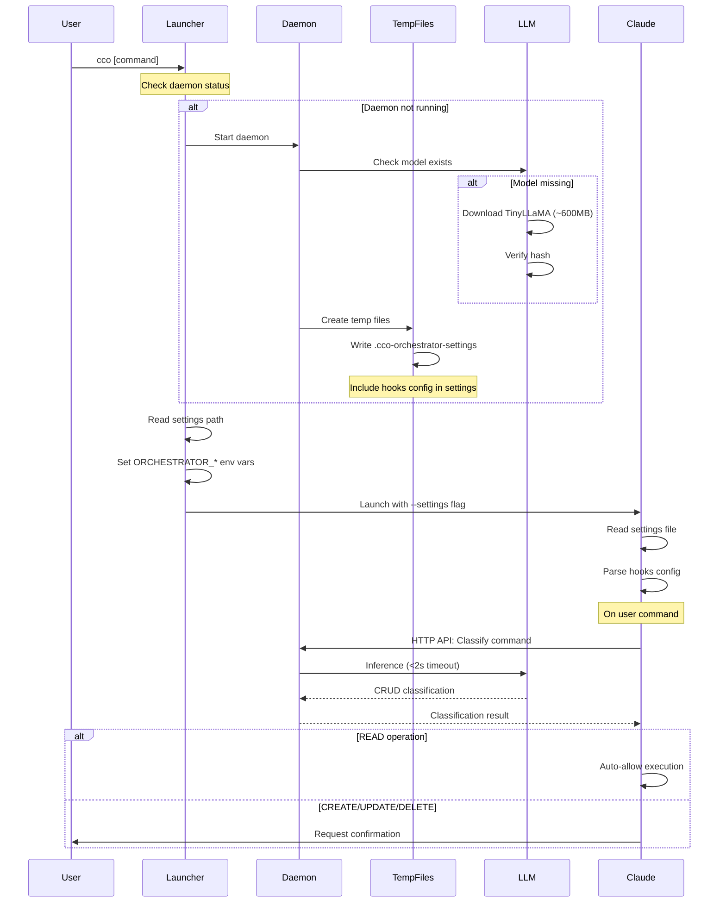

# Phase 1 Revised Hooks Architecture - Embedded LLM with Ephemeral Config

## Executive Summary

Phase 1 implements a **lightweight, embedded CRUD classification system** using TinyLLaMA (1.1B parameters) directly integrated into the CCO daemon. The system classifies user commands as READ, CREATE, UPDATE, or DELETE operations, enabling intelligent permission gating without external dependencies.

**Key Changes from Original Design:**
- **Embedded LLM** (TinyLLaMA via GGML) instead of Ollama
- **Ephemeral hooks config** in tmpfs settings file
- **Model bundled/downloaded** on first run (~600MB)
- **Fast inference** (<2 seconds) with minimal memory overhead

## Architecture Overview

### System Components

```mermaid
graph TD
    User[User: cco command] --> Launcher[CCO Launcher]
    Launcher --> Daemon[CCO Daemon]

    subgraph Daemon Process
        DaemonCore[Daemon Core]
        TinyLLM[TinyLLaMA Model<br/>~600MB Q4 GGML]
        TempFiles[Temp File Manager]
        HooksRegistry[Hooks Registry]

        DaemonCore --> TempFiles
        DaemonCore --> HooksRegistry
        HooksRegistry --> TinyLLM
    end

    TempFiles --> Settings[/tmp/.cco-orchestrator-settings<br/>Contains hooks config]

    Launcher --> Claude[Claude Code]
    Settings -.->|--settings flag| Claude

    subgraph Classification Flow
        Claude --> ReadHooks[Read Hooks Config]
        ReadHooks --> Classify[Classify Command]
        Classify --> Decision{CRUD Type?}
        Decision -->|READ| AllowAuto[Auto-Allow]
        Decision -->|C/U/D| RequireConfirm[Require Confirmation]
    end
```

## Detailed Implementation

### 1. Embedded LLM Integration

#### Model Selection
- **Primary Choice**: TinyLLaMA 1.1B Chat v1.0
  - Size: ~600MB (Q4_K_M quantization)
  - Speed: <2s inference on CPU
  - Quality: Sufficient for CRUD classification
- **Alternative**: Phi-2 (2.7B)
  - Size: ~1.5GB (Q4 quantization)
  - Better accuracy but slower

#### Rust Integration
```rust
// Dependencies in Cargo.toml
[dependencies]
llm = "0.1"  // GGML inference support
tokio = { version = "1", features = ["rt-multi-thread", "macros"] }
indicatif = "0.17"  // Progress bars for model download
sha2 = "0.10"  // Model verification
```

#### Model Management Module
```rust
// src/daemon/hooks/llm.rs
pub struct EmbeddedLLM {
    model: Option<llm::Model>,
    model_path: PathBuf,
    config: LlmConfig,
}

impl EmbeddedLLM {
    /// Initialize and load model (lazy loading)
    pub async fn new(config: LlmConfig) -> Result<Self> {
        let model_path = Self::get_model_path(&config)?;

        // Download if missing
        if !model_path.exists() {
            Self::download_model(&config, &model_path).await?;
        }

        Ok(Self {
            model: None,  // Lazy load on first use
            model_path,
            config,
        })
    }

    /// Download model with progress indication
    async fn download_model(config: &LlmConfig, path: &Path) -> Result<()> {
        println!("Downloading CRUD classifier model (first-time setup)...");

        let url = "https://huggingface.co/TheBloke/TinyLlama-1.1B-Chat-v1.0-GGUF/resolve/main/tinyllama-1.1b-chat-v1.0.Q4_K_M.gguf";

        // Download with progress bar
        let response = reqwest::get(url).await?;
        let total_size = response.content_length().unwrap_or(600_000_000);

        let pb = ProgressBar::new(total_size);
        pb.set_style(ProgressStyle::default_bar()
            .template("[{elapsed_precise}] [{bar:40.cyan/blue}] {bytes}/{total_bytes} ({eta})")
            .progress_chars("#>-"));

        // Stream download with progress
        let mut file = File::create(path)?;
        let mut downloaded = 0u64;
        let mut stream = response.bytes_stream();

        while let Some(chunk) = stream.next().await {
            let chunk = chunk?;
            file.write_all(&chunk)?;
            downloaded += chunk.len() as u64;
            pb.set_position(downloaded);
        }

        pb.finish_with_message("Model downloaded successfully");

        // Verify hash
        Self::verify_model_hash(path)?;

        Ok(())
    }

    /// Classify command with timeout enforcement
    pub async fn classify_command(&mut self, command: &str) -> Result<CrudClassification> {
        // Lazy load model on first use
        if self.model.is_none() {
            self.load_model().await?;
        }

        // Run inference in blocking task (CPU-bound)
        let model = self.model.as_ref().unwrap().clone();
        let prompt = Self::build_classification_prompt(command);
        let config = self.config.clone();

        // Enforce 2-second timeout
        let result = tokio::time::timeout(
            Duration::from_millis(config.inference_timeout_ms),
            tokio::task::spawn_blocking(move || {
                Self::run_inference(&model, &prompt, &config)
            })
        ).await;

        match result {
            Ok(Ok(Ok(classification))) => Ok(classification),
            Ok(Ok(Err(e))) => Err(e),
            Ok(Err(e)) => Err(anyhow!("Inference panic: {}", e)),
            Err(_) => Err(anyhow!("Inference timeout (>{}ms)", config.inference_timeout_ms)),
        }
    }

    /// Build classification prompt
    fn build_classification_prompt(command: &str) -> String {
        format!(
            "Classify this command as READ, CREATE, UPDATE, or DELETE:\n\
             Command: {}\n\
             Classification (one word only):",
            command
        )
    }

    /// Run actual inference
    fn run_inference(model: &llm::Model, prompt: &str, config: &LlmConfig) -> Result<CrudClassification> {
        let mut session = model.start_session(Default::default());

        let inference_params = llm::InferenceParameters {
            temperature: config.temperature,
            top_k: 40,
            top_p: 0.95,
            repeat_penalty: 1.1,
            max_tokens: 10,  // We only need one word
        };

        let output = session.infer(prompt, &inference_params)?;

        // Parse output to CRUD classification
        let classification = output.trim().to_uppercase();

        match classification.as_str() {
            "READ" => Ok(CrudClassification::Read),
            "CREATE" => Ok(CrudClassification::Create),
            "UPDATE" => Ok(CrudClassification::Update),
            "DELETE" => Ok(CrudClassification::Delete),
            _ => {
                // Fallback: Conservative classification as CREATE (safer)
                warn!("Unclear classification '{}', defaulting to CREATE", classification);
                Ok(CrudClassification::Create)
            }
        }
    }
}
```

### 2. Ephemeral Configuration Integration

#### Updated Settings Structure
```rust
// src/daemon/temp_files.rs - Updated generate_settings()
fn generate_settings(&self) -> Result<Vec<u8>> {
    let settings = json!({
        "version": env!("CARGO_PKG_VERSION"),
        "orchestration": {
            "enabled": true,
            "api_url": "http://localhost:3000"
        },
        "agents": {
            "sealed_file": self.agents_path.to_string_lossy()
        },
        "rules": {
            "sealed_file": self.rules_path.to_string_lossy()
        },
        "hooks": {
            "enabled": true,
            "llm": {
                "model_type": "tinyllama",
                "model_name": "tinyllama-1.1b-chat-v1.0.Q4_K_M",
                "model_path": "~/.cco/models/tinyllama-1.1b-chat-v1.0.Q4_K_M.gguf",
                "model_size": "600MB",
                "quantization": "Q4_K_M",
                "loaded": self.is_model_loaded(),
                "inference_timeout_ms": 2000,
                "temperature": 0.1  // Low temperature for consistent classification
            },
            "permissions": {
                "auto_allow_read": true,
                "require_confirmation_cud": true,
                "dangerously_skip_permissions": false
            },
            "active_hooks": ["command_classifier"],
            "sealed_file": self.hooks_path.to_string_lossy()
        },
        "temp_dir": env::temp_dir().to_string_lossy()
    });

    Ok(serde_json::to_vec_pretty(&settings)?)
}
```

### 3. Data Flow Sequence



### 4. Performance Characteristics

#### Model Performance
- **Model Size**: ~600MB (Q4_K_M quantized)
- **Memory Usage**:
  - Idle: ~50MB (model not loaded)
  - Active: ~500-600MB (model in memory)
  - Peak during inference: +100-200MB
- **Load Time**: 3-5 seconds (first load from disk)
- **Inference Time**:
  - Average: 500ms-1s
  - Maximum (timeout): 2s
  - Fallback on timeout: Reject command (safe default)

#### Resource Management
```rust
// Automatic model unloading on memory pressure
impl EmbeddedLLM {
    pub async fn check_memory_pressure(&mut self) -> Result<()> {
        let available = sys_info::mem_info()?.avail;

        // Unload if less than 500MB available
        if available < 500_000 && self.model.is_some() {
            info!("Memory pressure detected, unloading LLM model");
            self.model = None;
        }

        Ok(())
    }
}
```

### 5. Safety Guarantees

#### Fault Isolation
- Model runs in `spawn_blocking` task (panic isolation)
- 2-second hard timeout on inference
- Automatic fallback to "CREATE" on unclear classification (safest default)
- Model unloading on memory pressure

#### Permission Enforcement
```json
{
  "permissions": {
    "auto_allow_read": true,        // READ ops proceed without confirmation
    "require_confirmation_cud": true, // C/U/D require user approval
    "dangerously_skip_permissions": false  // Never bypass in production
  }
}
```

### 6. First-Run Experience

```
$ cco
⚙️  Starting daemon...
📥 Downloading CRUD classifier model (first-time setup)...
[00:45] [########################################] 600MB/600MB (eta 0s)
✅ Model downloaded successfully
✅ Daemon started
✅ Orchestrator settings found
✅ Orchestration environment configured
🚀 Launching Claude Code with orchestration support...
```

### 7. Configuration Schema

#### Complete Hooks Configuration
```json
{
  "hooks": {
    "enabled": true,
    "llm": {
      "model_type": "tinyllama",
      "model_name": "tinyllama-1.1b-chat-v1.0.Q4_K_M",
      "model_path": "~/.cco/models/tinyllama-1.1b-chat-v1.0.Q4_K_M.gguf",
      "model_size": "600MB",
      "quantization": "Q4_K_M",
      "loaded": true,
      "inference_timeout_ms": 2000,
      "temperature": 0.1,
      "max_tokens": 10,
      "top_k": 40,
      "top_p": 0.95,
      "repeat_penalty": 1.1
    },
    "permissions": {
      "auto_allow_read": true,
      "require_confirmation_cud": true,
      "dangerously_skip_permissions": false
    },
    "active_hooks": ["command_classifier"],
    "callbacks": {
      "pre_command": ["classify_crud"],
      "post_command": [],
      "post_execution": []
    }
  }
}
```

### 8. Implementation Checklist

#### Phase 1A - Core Infrastructure
- [ ] Add `llm` crate dependency for GGML support
- [ ] Implement `src/daemon/hooks/llm.rs` module
- [ ] Add model download logic with progress bars
- [ ] Implement lazy model loading
- [ ] Add inference with timeout enforcement

#### Phase 1B - Integration
- [ ] Update `temp_files.rs` to include hooks config in settings
- [ ] Add HTTP endpoint for classification: `POST /api/classify`
- [ ] Implement memory pressure monitoring
- [ ] Add model unload/reload logic
- [ ] Create tests for classification accuracy

#### Phase 1C - Safety & Polish
- [ ] Add model hash verification
- [ ] Implement graceful degradation on model failure
- [ ] Add metrics for inference time/success rate
- [ ] Document troubleshooting guide
- [ ] Performance profiling and optimization

### 9. Testing Strategy

#### Unit Tests
```rust
#[cfg(test)]
mod tests {
    #[tokio::test]
    async fn test_classify_read_operations() {
        let mut llm = EmbeddedLLM::new(config).await.unwrap();

        assert_eq!(llm.classify_command("ls -la").await.unwrap(), CrudClassification::Read);
        assert_eq!(llm.classify_command("cat file.txt").await.unwrap(), CrudClassification::Read);
        assert_eq!(llm.classify_command("git status").await.unwrap(), CrudClassification::Read);
    }

    #[tokio::test]
    async fn test_classify_create_operations() {
        let mut llm = EmbeddedLLM::new(config).await.unwrap();

        assert_eq!(llm.classify_command("touch newfile").await.unwrap(), CrudClassification::Create);
        assert_eq!(llm.classify_command("mkdir directory").await.unwrap(), CrudClassification::Create);
    }

    #[tokio::test]
    async fn test_inference_timeout() {
        let mut config = LlmConfig::default();
        config.inference_timeout_ms = 1; // Force timeout

        let mut llm = EmbeddedLLM::new(config).await.unwrap();
        let result = llm.classify_command("test command").await;

        assert!(result.is_err());
        assert!(result.unwrap_err().to_string().contains("timeout"));
    }
}
```

### 10. Migration Path

#### From Ollama to Embedded
1. Remove Ollama dependencies
2. Add GGML/llm crate
3. Implement model download
4. Update hooks config structure
5. Test classification accuracy
6. Profile performance

#### Rollback Strategy
- Keep Ollama code in separate branch
- Feature flag for model selection
- Config option to disable embedded LLM

## Advantages of Revised Architecture

1. **No External Dependencies**: Model runs in-process
2. **Predictable Performance**: No network latency to Ollama
3. **Smaller Footprint**: TinyLLaMA is only ~600MB
4. **Better Control**: Direct timeout and memory management
5. **Offline Operation**: Works without internet after initial download
6. **Simpler Deployment**: No separate Ollama service to manage

## Trade-offs

1. **Initial Download**: ~600MB download on first run
2. **Memory Usage**: 500-600MB when model loaded
3. **CPU Usage**: Brief spike during inference
4. **Model Quality**: TinyLLaMA less capable than larger models
5. **Update Complexity**: Model updates require new downloads

## Future Enhancements

### Phase 2 - Advanced Classification
- Support multiple models (Phi-2, StableLM)
- Fine-tuning on command patterns
- Confidence scoring
- Command intent extraction

### Phase 3 - Distributed Inference
- Optional remote inference API
- Model sharing between CCO instances
- GPU acceleration support
- Model versioning and updates

## Conclusion

This revised architecture provides a **self-contained, efficient CRUD classification system** that integrates seamlessly with the existing CCO daemon. By using an embedded TinyLLaMA model and ephemeral configuration, we achieve fast, reliable command classification without external dependencies while maintaining the security benefits of permission gating.