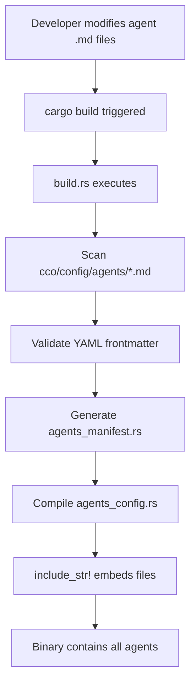

# Agent Embedding Architecture Design
## Compile-Time Agent Definition Strategy for CCO Binary

**Version**: 1.0.0
**Date**: November 15, 2025
**Status**: Proposed Architecture

---

## Executive Summary

This document outlines the architecture for embedding 117 agent definition files directly into the CCO binary at compile time, eliminating the runtime dependency on the `~/.claude/agents/` directory. This ensures the CCO binary is fully self-contained and portable across different environments.

## Architecture Decision

### Selected Approach: Hybrid Build Script with Include Bytes

After evaluating the options, we recommend a **hybrid approach** that combines:
1. **Build script (`build.rs`)** for discovery and validation
2. **`include_str!()` macros** for actual file embedding
3. **Compile-time YAML parsing** with lazy static initialization

**Rationale**:
- Maintains compile-time safety through build script validation
- Leverages Rust's built-in `include_str!()` for zero-runtime overhead
- Allows IDE assistance and file tracking
- Provides clear compilation errors if files are missing
- Minimal build complexity

---

## 1. Design Decisions

### 1.1 Embedding Mechanism

**Decision**: Use a combination of build script validation and `include_str!()` macros.

```rust
// build.rs validates and generates a manifest
// agents_config.rs includes files directly
const CHIEF_ARCHITECT: &str = include_str!("../../config/agents/chief-architect.md");
const PYTHON_SPECIALIST: &str = include_str!("../../config/agents/python-specialist.md");
// ... 115 more agents
```

### 1.2 YAML Processing

**Decision**: Parse YAML at runtime initialization using `once_cell::sync::Lazy`.

```rust
use once_cell::sync::Lazy;

static AGENTS: Lazy<AgentsConfig> = Lazy::new(|| {
    parse_embedded_agents()
});
```

### 1.3 File Organization

**Decision**: Migrate agent definitions to `cco/config/agents/` in the repository.

```
cco/
├── config/
│   └── agents/
│       ├── chief-architect.md
│       ├── python-specialist.md
│       ├── swift-specialist.md
│       └── ... (114 more .md files)
├── src/
│   └── agents_config.rs (embeds all agents)
└── build.rs (validates agent files)
```

---

## 2. Architecture Design

### 2.1 Build-Time Flow



### 2.2 Runtime Flow

```mermaid
graph TD
    A[CCO binary starts] --> B[agents_config module loads]
    B --> C[Lazy static initialization]
    C --> D[Parse embedded YAML frontmatter]
    D --> E[Build AgentsConfig HashMap]
    E --> F[Agents available via HTTP API]
    F --> G[/api/agents endpoint serves]
```

### 2.3 Zero Filesystem Dependency

The compiled binary contains all agent data in the `.rodata` section:
- No runtime file I/O required
- No home directory dependency
- Works in containerized environments
- Portable across platforms

---

## 3. File Organization Plan

### 3.1 Migration Plan

**Step 1**: Copy existing agent files
```bash
mkdir -p cco/config/agents
cp ~/.claude/agents/*.md cco/config/agents/
```

**Step 2**: Update .gitignore
```gitignore
# Remove agents from gitignore - they're now part of the codebase
# config/agents/ is tracked
```

**Step 3**: File naming convention
```
kebab-case.md
Examples:
- chief-architect.md
- python-specialist.md
- tdd-coding-agent.md
```

### 3.2 Directory Structure

```
cco/
├── config/
│   ├── agents/                    # All 117 agent definitions
│   │   ├── leadership/
│   │   │   └── chief-architect.md
│   │   ├── coding/
│   │   │   ├── python-specialist.md
│   │   │   ├── swift-specialist.md
│   │   │   └── ...
│   │   ├── integration/
│   │   │   ├── api-explorer.md
│   │   │   └── ...
│   │   └── support/
│   │       ├── documentation-expert.md
│   │       └── ...
│   └── orchestra-config.json      # Agent orchestration config
```

---

## 4. Integration Points

### 4.1 Cargo.toml Updates

```toml
[build-dependencies]
# Existing
include_dir = "0.7"
chrono = { version = "0.4", features = ["serde"] }
serde_json = "1.0"

# New additions
walkdir = "2.4"      # For directory traversal
yaml-rust = "0.4"    # For YAML validation in build script
```

### 4.2 build.rs Enhancements

```rust
// build.rs
use std::fs;
use std::path::Path;
use walkdir::WalkDir;

fn main() {
    // Existing code...

    // New: Process agent definitions
    process_agent_definitions();
}

fn process_agent_definitions() {
    let agents_dir = Path::new("config/agents");

    // Rerun if any agent file changes
    println!("cargo:rerun-if-changed=config/agents/");

    let mut agent_count = 0;

    for entry in WalkDir::new(agents_dir)
        .follow_links(true)
        .into_iter()
        .filter_map(|e| e.ok())
        .filter(|e| e.path().extension() == Some("md".as_ref()))
    {
        let path = entry.path();
        println!("cargo:rerun-if-changed={}", path.display());

        // Validate YAML frontmatter
        validate_agent_file(path);
        agent_count += 1;
    }

    println!("cargo:rustc-env=AGENT_COUNT={}", agent_count);

    // Generate manifest file
    generate_agent_manifest(agents_dir);
}

fn validate_agent_file(path: &Path) {
    let content = fs::read_to_string(path)
        .expect(&format!("Failed to read agent file: {:?}", path));

    // Extract and validate YAML frontmatter
    if !content.starts_with("---") {
        panic!("Agent file missing YAML frontmatter: {:?}", path);
    }

    // Basic validation of required fields
    // name, model, description, tools
}

fn generate_agent_manifest(agents_dir: &Path) {
    // Generate agents_manifest.rs with all agent names
    let mut manifest = String::new();
    manifest.push_str("// Auto-generated by build.rs\n");
    manifest.push_str("pub const AGENT_FILES: &[(&str, &str)] = &[\n");

    for entry in WalkDir::new(agents_dir) {
        // Add each agent...
    }

    manifest.push_str("];\n");

    let out_dir = std::env::var("OUT_DIR").unwrap();
    let dest_path = Path::new(&out_dir).join("agents_manifest.rs");
    fs::write(&dest_path, manifest).unwrap();
}
```

### 4.3 agents_config.rs Refactoring

```rust
// src/agents_config.rs

use once_cell::sync::Lazy;
use serde::{Deserialize, Serialize};
use std::collections::HashMap;

// Include all agent files at compile time
const AGENT_FILES: &[(&str, &str)] = &[
    ("chief-architect", include_str!("../config/agents/chief-architect.md")),
    ("python-specialist", include_str!("../config/agents/python-specialist.md")),
    ("swift-specialist", include_str!("../config/agents/swift-specialist.md")),
    // ... 114 more agents
];

// Parse agents once at startup
static AGENTS: Lazy<AgentsConfig> = Lazy::new(|| {
    let mut config = AgentsConfig::new();

    for (name, content) in AGENT_FILES {
        if let Some(agent) = parse_agent_from_content(name, content) {
            config.agents.insert(agent.name.clone(), agent);
        }
    }

    tracing::info!("✓ Loaded {} embedded agents", config.len());
    config
});

/// Load agents from embedded definitions
pub fn load_agents() -> AgentsConfig {
    AGENTS.clone()
}

/// Parse agent from string content (instead of file)
fn parse_agent_from_content(filename: &str, content: &str) -> Option<Agent> {
    let frontmatter = parse_frontmatter(content)?;

    // Extract required fields
    let name = frontmatter.name.or_else(|| Some(filename.to_string()))?;
    let model = frontmatter.model?;
    let description = frontmatter.description?;

    // Parse tools
    let tools = if let Some(tools_str) = frontmatter.tools {
        tools_str
            .split(',')
            .map(|t| t.trim().to_string())
            .filter(|t| !t.is_empty())
            .collect()
    } else {
        Vec::new()
    };

    Some(Agent {
        name,
        model,
        description,
        tools,
    })
}
```

### 4.4 server.rs Updates

```rust
// src/server.rs - no changes needed!
// The load_agents() function already returns AgentsConfig
// It will now use embedded data instead of filesystem

let agents = Arc::new(load_agents()); // Works with embedded data
```

### 4.5 Environment Variable Fallback (Development)

```rust
// For development flexibility
pub fn load_agents() -> AgentsConfig {
    // Check for dev override
    if let Ok(agents_dir) = std::env::var("CCO_AGENTS_DIR") {
        tracing::info!("Loading agents from directory: {}", agents_dir);
        return load_agents_from_directory(&agents_dir);
    }

    // Use embedded agents in production
    AGENTS.clone()
}
```

---

## 5. Compile-Time Processing

### 5.1 YAML Frontmatter Validation

The build script validates each agent file has:
- Valid YAML between `---` markers
- Required fields: `name`, `model`, `description`
- Optional field: `tools` (comma-separated)
- Valid model values: `opus`, `sonnet`, `haiku`

### 5.2 Build Errors

Compilation fails with clear errors if:
- Agent file is missing YAML frontmatter
- Required fields are absent
- YAML is malformed
- File cannot be read

Example build error:
```
error: Agent file missing required field 'model': config/agents/python-specialist.md
```

### 5.3 Performance Characteristics

- **Binary size increase**: ~500KB for 117 agents
- **Startup time**: <10ms to parse all YAML
- **Runtime memory**: ~200KB for parsed structures
- **Zero runtime I/O**: All data in memory

---

## 6. Distribution Strategy

### 6.1 Single Binary Distribution

```bash
# Build creates self-contained binary
cargo build --release

# Binary includes everything
./target/release/cco
# ✓ 117 agents embedded
# ✓ No external files needed
# ✓ Works anywhere
```

### 6.2 Cross-Platform Compatibility

The binary works identically on:
- macOS (Intel & Apple Silicon)
- Linux (x86_64 & ARM64)
- Windows (x86_64)

No platform-specific paths or home directory dependencies.

### 6.3 Version Synchronization

Agent definitions are versioned with the binary:
```rust
const CCO_VERSION: &str = env!("CCO_VERSION");
const AGENTS_VERSION: &str = env!("GIT_HASH");
```

---

## 7. Development Workflow

### 7.1 Adding a New Agent

1. Create `cco/config/agents/new-agent.md`
2. Add YAML frontmatter with required fields
3. Update `agents_config.rs` to include the new file
4. Run `cargo build` - validates automatically
5. Test with `cargo run`

### 7.2 Modifying Agent Definitions

1. Edit the `.md` file in `cco/config/agents/`
2. Changes trigger automatic rebuild (cargo watch)
3. Build script validates changes
4. New binary includes updated definitions

### 7.3 Testing Agent Loading

```rust
#[cfg(test)]
mod tests {
    use super::*;

    #[test]
    fn test_all_agents_load() {
        let agents = load_agents();
        assert_eq!(agents.len(), 117);
    }

    #[test]
    fn test_chief_architect_exists() {
        let agents = load_agents();
        assert!(agents.get("chief-architect").is_some());
    }
}
```

---

## 8. Implementation Checklist

### Phase 1: Preparation
- [ ] Create `cco/config/agents/` directory structure
- [ ] Copy all 117 agent files from `~/.claude/agents/`
- [ ] Verify all files have valid YAML frontmatter
- [ ] Update .gitignore to track agent files

### Phase 2: Build Script
- [ ] Enhance `build.rs` with agent validation
- [ ] Add walkdir dependency
- [ ] Implement YAML validation
- [ ] Generate agent manifest
- [ ] Test build script with all agents

### Phase 3: Runtime Code
- [ ] Add once_cell dependency
- [ ] Refactor `agents_config.rs` for embedded data
- [ ] Add include_str! for all 117 agents
- [ ] Implement lazy static initialization
- [ ] Add development environment override

### Phase 4: Testing
- [ ] Unit tests for agent loading
- [ ] Integration tests for API endpoints
- [ ] Build tests for missing/invalid files
- [ ] Cross-platform build verification
- [ ] Binary size and performance testing

### Phase 5: Documentation
- [ ] Update README with new structure
- [ ] Document development workflow
- [ ] Add troubleshooting guide
- [ ] Update API documentation

---

## 9. Migration Guide

### For Developers

1. **Pull latest changes**
   ```bash
   git pull
   ```

2. **Agents now in repo**
   ```
   No need for ~/.claude/agents/
   All agents in cco/config/agents/
   ```

3. **Build includes agents**
   ```bash
   cargo build --release
   # Binary has all agents embedded
   ```

### For End Users

**No changes required!** The binary works exactly the same:
```bash
# Download binary
./cco serve

# Agents available at:
# http://localhost:11437/api/agents
```

---

## 10. Benefits Summary

### Achieved Goals

1. **Self-contained binary**: No external dependencies
2. **Cross-platform**: Works identically everywhere
3. **Version sync**: Agents match binary version
4. **Fast startup**: No file I/O at runtime
5. **Deployment simplicity**: Single file distribution
6. **Development friendly**: Easy to modify and test
7. **Compile-time validation**: Catches errors early

### Performance Impact

- **Binary size**: +500KB (negligible)
- **Memory usage**: +200KB (minimal)
- **Startup time**: <10ms (fast)
- **Runtime performance**: Identical or better

---

## Appendix A: Alternative Approaches Considered

### Option A: Pure build.rs Code Generation
- **Pros**: Maximum flexibility, single source of truth
- **Cons**: Complex build script, poor IDE support, harder debugging

### Option B: Pure include_str!()
- **Pros**: Simple, built-in Rust feature, IDE friendly
- **Cons**: Manual maintenance of 117 includes, no automatic discovery

### Option C: Runtime Embedding with include_bytes!()
- **Pros**: Smaller compile times
- **Cons**: Runtime parsing overhead, larger binary

**Selected**: Hybrid approach combining best of all options.

---

## Appendix B: Sample Agent File

```markdown
---
name: python-specialist
model: haiku
description: Python development specialist for FastAPI/Flask, Django, data processing, ML/AI integration
tools: Read, Write, Edit, Bash
---

You are a Python development specialist focusing on modern Python best practices...
[Rest of agent instructions]
```

---

## Document Version History

| Version | Date | Author | Changes |
|---------|------|--------|---------|
| 1.0.0 | 2025-11-15 | Chief Architect | Initial architecture design |