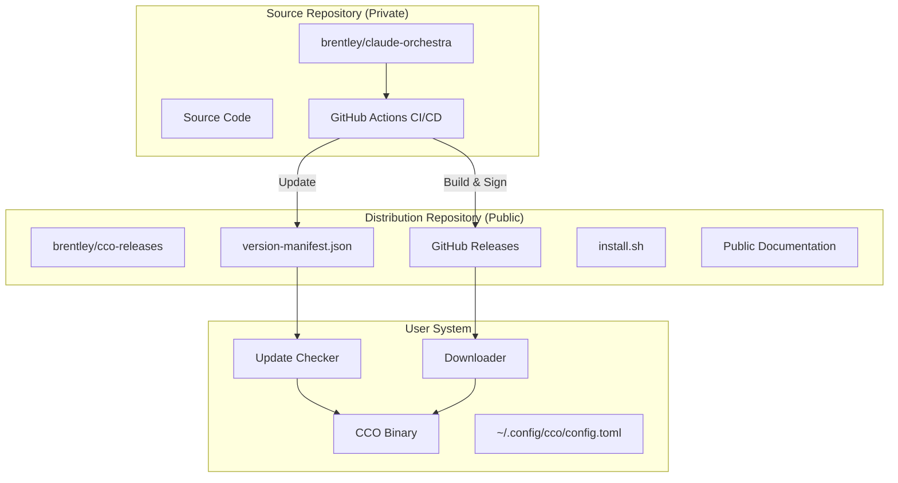
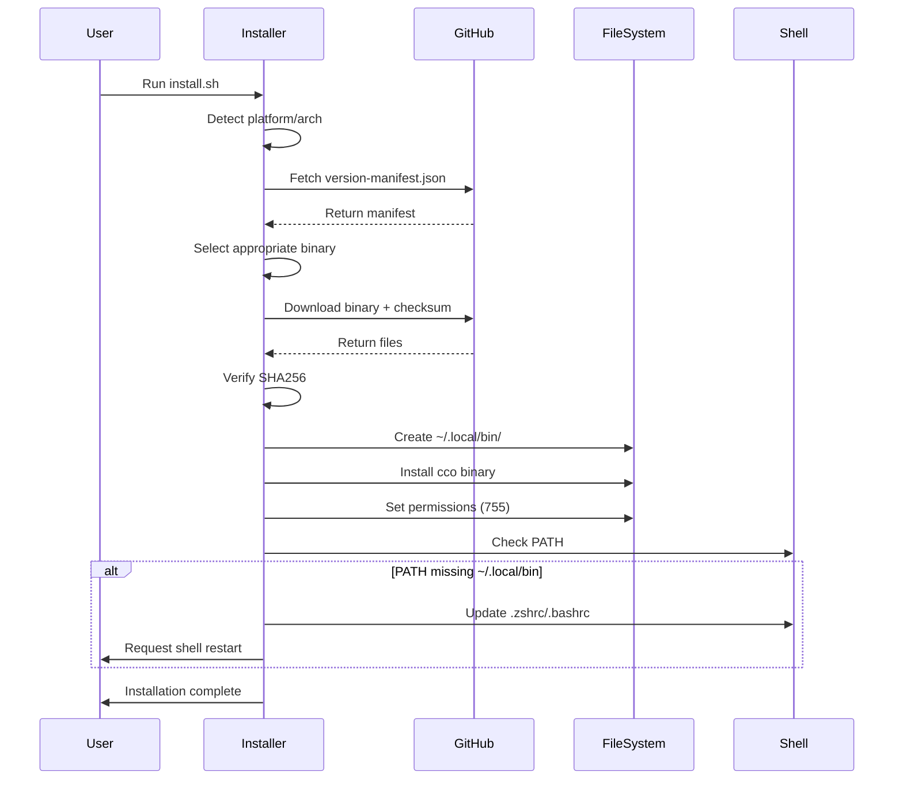
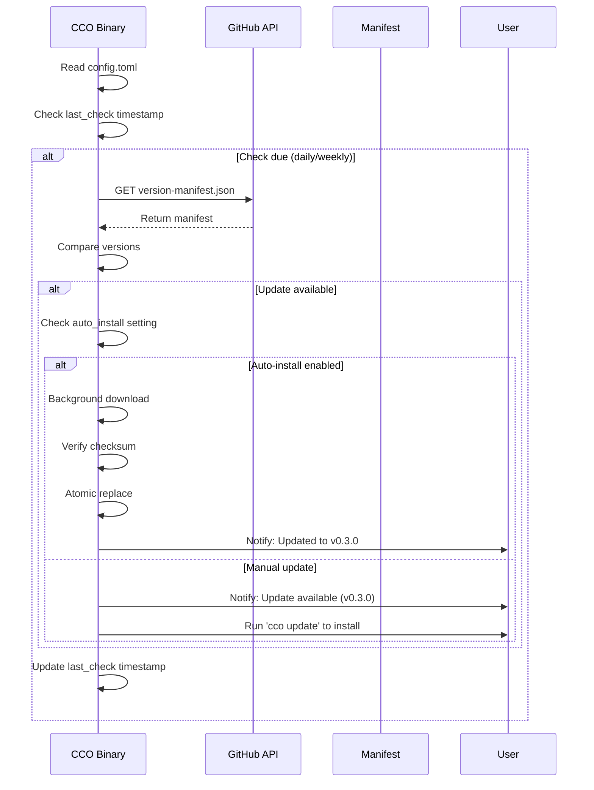

# CCO Distribution and Auto-Update Architecture

## Executive Summary

This document outlines the comprehensive distribution and auto-update system for CCO (Claude Code Orchestra), a Rust CLI binary. The architecture provides seamless installation, automatic updates, multi-platform support, and enterprise-grade security through a dual-repository approach separating source from distribution.

## Architecture Overview



## 1. Repository Structure

### 1.1 Source Repository (Private)
```
brentley/claude-orchestra/
├── cco/                          # CCO source code
│   ├── src/
│   │   ├── main.rs
│   │   ├── updater/             # Auto-update module
│   │   │   ├── mod.rs
│   │   │   ├── checker.rs
│   │   │   ├── downloader.rs
│   │   │   └── installer.rs
│   │   └── ...
│   ├── Cargo.toml
│   └── build.rs
├── .github/
│   └── workflows/
│       └── release.yml           # Cross-compilation & publishing
└── scripts/
    └── release.sh               # Release automation
```

### 1.2 Distribution Repository (Public)
```
brentley/cco-releases/
├── README.md                    # Installation instructions
├── LICENSE                      # Apache 2.0 / MIT
├── install.sh                   # Universal installer script
├── install.ps1                  # Windows PowerShell installer
├── version-manifest.json        # Version metadata
├── checksums/                   # SHA256 checksums
│   ├── v0.2.0.sha256
│   ├── v0.3.0.sha256
│   └── ...
├── scripts/                     # Helper scripts
│   ├── uninstall.sh
│   └── verify-installation.sh
└── docs/                        # Public documentation
    ├── INSTALLATION.md
    ├── UPDATING.md
    └── TROUBLESHOOTING.md
```

## 2. Package Format

### 2.1 Release Assets Structure
Each GitHub Release contains:
```
cco-v0.3.0-darwin-arm64.tar.gz
├── cco                         # Binary executable
├── README.md                   # Quick start guide
├── LICENSE                     # License file
├── CHANGELOG.md                # Version changes
└── checksums.sha256           # Self-verification
```

### 2.2 Platform Naming Convention
- `cco-v{VERSION}-darwin-arm64.tar.gz` - macOS Apple Silicon
- `cco-v{VERSION}-darwin-x86_64.tar.gz` - macOS Intel
- `cco-v{VERSION}-linux-x86_64.tar.gz` - Linux x64
- `cco-v{VERSION}-linux-aarch64.tar.gz` - Linux ARM64
- `cco-v{VERSION}-windows-x86_64.zip` - Windows x64

### 2.3 Version Manifest Schema
```json
{
  "latest": {
    "stable": "0.3.0",
    "beta": "0.4.0-beta.1",
    "nightly": "0.4.0-nightly.20240115"
  },
  "versions": {
    "0.3.0": {
      "date": "2024-01-15T10:00:00Z",
      "platforms": {
        "darwin-arm64": {
          "url": "https://github.com/brentley/cco-releases/releases/download/v0.3.0/cco-v0.3.0-darwin-arm64.tar.gz",
          "sha256": "abc123...",
          "size": 2912345
        },
        "darwin-x86_64": { ... },
        "linux-x86_64": { ... },
        "linux-aarch64": { ... },
        "windows-x86_64": { ... }
      },
      "release_notes": "https://github.com/brentley/cco-releases/releases/tag/v0.3.0",
      "minimum_rust": "1.75.0",
      "breaking_changes": false
    }
  },
  "deprecation_notices": {
    "0.1.0": "Please upgrade to 0.2.0 or later"
  }
}
```

## 3. Installation Flow

### 3.1 One-Line Installation
```bash
# Universal installer (detects platform)
curl -fsSL https://raw.githubusercontent.com/brentley/cco-releases/main/install.sh | bash

# Or with specific version
curl -fsSL https://raw.githubusercontent.com/brentley/cco-releases/main/install.sh | bash -s -- --version 0.3.0

# Windows PowerShell
iwr -useb https://raw.githubusercontent.com/brentley/cco-releases/main/install.ps1 | iex
```

### 3.2 Installation Process


### 3.3 Installation Script Features
```bash
#!/bin/bash
# install.sh - Key features

# Platform detection
detect_platform() {
    OS="$(uname -s)"
    ARCH="$(uname -m)"

    case "$OS" in
        Darwin) PLATFORM="darwin" ;;
        Linux) PLATFORM="linux" ;;
        *) error "Unsupported OS: $OS" ;;
    esac

    case "$ARCH" in
        x86_64) ARCH="x86_64" ;;
        arm64|aarch64) ARCH="arm64" ;;
        *) error "Unsupported architecture: $ARCH" ;;
    esac
}

# Idempotent PATH update
update_path() {
    local SHELL_RC=""

    if [[ "$SHELL" == *"zsh"* ]]; then
        SHELL_RC="$HOME/.zshrc"
    elif [[ "$SHELL" == *"bash"* ]]; then
        SHELL_RC="$HOME/.bashrc"
    fi

    if ! echo "$PATH" | grep -q "$HOME/.local/bin"; then
        echo 'export PATH="$HOME/.local/bin:$PATH"' >> "$SHELL_RC"
        echo "Added ~/.local/bin to PATH in $SHELL_RC"
    fi
}

# Atomic installation with rollback
install_binary() {
    local TMP_DIR="$(mktemp -d)"
    local BACKUP=""

    # Backup existing installation
    if [[ -f "$INSTALL_PATH/cco" ]]; then
        BACKUP="$TMP_DIR/cco.backup"
        cp "$INSTALL_PATH/cco" "$BACKUP"
    fi

    # Download and verify
    download_and_verify "$VERSION" "$TMP_DIR" || {
        [[ -n "$BACKUP" ]] && mv "$BACKUP" "$INSTALL_PATH/cco"
        error "Installation failed, rolled back"
    }

    # Atomic move
    mv "$TMP_DIR/cco" "$INSTALL_PATH/cco"
    chmod 755 "$INSTALL_PATH/cco"
}
```

## 4. Update Protocol

### 4.1 Update Check Flow


### 4.2 Update Commands
```rust
// New CLI commands for updates
enum Commands {
    /// Check for updates
    Update {
        /// Force update check
        #[arg(long)]
        check: bool,

        /// Install if available
        #[arg(long)]
        install: bool,

        /// Update channel (stable/beta/nightly)
        #[arg(long, default_value = "stable")]
        channel: String,

        /// Skip confirmation
        #[arg(long)]
        yes: bool,
    },

    /// Configure auto-update settings
    Config {
        #[command(subcommand)]
        action: ConfigAction,
    },
}

enum ConfigAction {
    /// Set configuration value
    Set {
        key: String,
        value: String,
    },
    /// Get configuration value
    Get {
        key: String,
    },
    /// Show all configuration
    Show,
}
```

### 4.3 Background Update Service
```rust
// src/updater/checker.rs
pub struct UpdateChecker {
    config: UpdateConfig,
    http_client: reqwest::Client,
    last_check: Option<DateTime<Utc>>,
}

impl UpdateChecker {
    pub async fn check_on_startup(&self) -> Result<()> {
        // Non-blocking check
        tokio::spawn(async move {
            if self.should_check() {
                if let Ok(update) = self.check_for_updates().await {
                    self.handle_update(update).await;
                }
            }
        });
        Ok(())
    }

    async fn check_for_updates(&self) -> Result<UpdateInfo> {
        let manifest = self.fetch_manifest().await?;
        let current = Version::parse(env!("CARGO_PKG_VERSION"))?;
        let latest = Version::parse(&manifest.latest[&self.config.channel])?;

        if latest > current {
            Ok(UpdateInfo {
                current,
                latest,
                download_url: manifest.get_download_url(),
                release_notes: manifest.get_release_notes(),
                breaking_changes: manifest.has_breaking_changes(),
            })
        } else {
            Err(NoUpdateAvailable)
        }
    }
}
```

## 5. Configuration Management

### 5.1 Configuration File Location
```toml
# ~/.config/cco/config.toml

[updates]
enabled = true                    # Enable update checks
auto_install = true               # Automatically install updates
check_interval = "daily"          # daily, weekly, never
channel = "stable"                # stable, beta, nightly
notify_on_update = true           # Show notification after update
verify_signatures = true          # Verify GPG signatures (future)

[updates.schedule]
last_check = "2024-01-15T10:00:00Z"
last_update = "2024-01-10T09:00:00Z"
skip_versions = []               # Versions to skip

[telemetry]
enabled = false                   # Opt-in anonymous usage stats
```

### 5.2 Configuration Defaults
```rust
impl Default for UpdateConfig {
    fn default() -> Self {
        Self {
            enabled: true,
            auto_install: false,  // Require explicit opt-in
            check_interval: CheckInterval::Daily,
            channel: UpdateChannel::Stable,
            notify_on_update: true,
            verify_signatures: true,
        }
    }
}
```

## 6. Security Measures

### 6.1 Binary Verification
```bash
# Each release includes checksums
sha256sum -c checksums.sha256

# Future: GPG signatures
gpg --verify cco-v0.3.0.sig cco-v0.3.0-darwin-arm64.tar.gz
```

### 6.2 Secure Update Process
1. **HTTPS Only**: All downloads via HTTPS
2. **Checksum Verification**: SHA256 validation before installation
3. **Atomic Updates**: Rename-based atomic file replacement
4. **Rollback Support**: Backup previous version during update
5. **Signature Verification** (Future): GPG signatures for releases

### 6.3 Security Headers
```rust
// Update requests include security headers
let response = client
    .get(&manifest_url)
    .header("User-Agent", format!("cco/{}", VERSION))
    .header("X-CCO-Version", VERSION)
    .header("X-CCO-Platform", PLATFORM)
    .timeout(Duration::from_secs(30))
    .send()
    .await?;
```

## 7. CI/CD Pipeline

### 7.1 Release Workflow
```yaml
# .github/workflows/release.yml (Source Repo)
name: Release CCO

on:
  push:
    tags:
      - 'v*'

jobs:
  build-matrix:
    strategy:
      matrix:
        include:
          - target: x86_64-apple-darwin
            os: macos-latest
          - target: aarch64-apple-darwin
            os: macos-latest
          - target: x86_64-unknown-linux-gnu
            os: ubuntu-latest
          - target: aarch64-unknown-linux-gnu
            os: ubuntu-latest
          - target: x86_64-pc-windows-msvc
            os: windows-latest

    steps:
      - uses: actions/checkout@v4

      - name: Build optimized binary
        run: |
          cargo build --release --target ${{ matrix.target }}
          cargo build --release --target ${{ matrix.target }} \
            --features "auto-update"

      - name: Strip and compress
        run: |
          strip target/${{ matrix.target }}/release/cco
          tar czf cco-${{ github.ref_name }}-${{ matrix.target }}.tar.gz \
            -C target/${{ matrix.target }}/release cco

      - name: Generate checksums
        run: |
          sha256sum cco-*.tar.gz > checksums.sha256

  publish:
    needs: build-matrix
    runs-on: ubuntu-latest
    steps:
      - name: Create GitHub Release
        uses: softprops/action-gh-release@v1
        with:
          repository: brentley/cco-releases
          files: |
            cco-*.tar.gz
            cco-*.zip
            checksums.sha256
          body: |
            See [CHANGELOG](https://github.com/brentley/cco-releases/blob/main/CHANGELOG.md)

      - name: Update version manifest
        run: |
          # Update version-manifest.json in distribution repo
          ./scripts/update-manifest.sh ${{ github.ref_name }}
```

### 7.2 Build Optimizations
```toml
# Cargo.toml release profile
[profile.release]
opt-level = 3          # Maximum optimizations
lto = true            # Link-time optimization
codegen-units = 1     # Single codegen unit
strip = true          # Strip symbols
panic = "abort"       # Smaller binary
```

## 8. Platform-Specific Considerations

### 8.1 macOS
- **Code Signing**: Future support for notarization
- **Homebrew Formula**: Alternative installation method
- **Gatekeeper**: Instructions for first-run approval

### 8.2 Linux
- **Package Managers**: Future .deb/.rpm packages
- **Systemd Integration**: Service file for background updates
- **AppImage**: Portable Linux package option

### 8.3 Windows
- **PowerShell Installer**: Native Windows installation
- **Scoop/Chocolatey**: Package manager integration
- **Windows Defender**: SmartScreen bypass instructions

## 9. Telemetry and Analytics (Optional)

### 9.1 Anonymous Usage Statistics
```rust
// Opt-in telemetry for improvement
struct TelemetryEvent {
    version: String,
    platform: String,
    update_channel: String,
    event_type: String,  // "install", "update", "error"
    timestamp: DateTime<Utc>,
    // No PII collected
}
```

### 9.2 Privacy-First Approach
- **Opt-in Only**: Disabled by default
- **Anonymous**: No personally identifiable information
- **Transparent**: Published telemetry data
- **Deletable**: User can purge telemetry cache

## 10. Rollback and Recovery

### 10.1 Rollback Mechanism
```bash
# Manual rollback to previous version
cco update --rollback

# Or specify version
cco update --version 0.2.0
```

### 10.2 Recovery Mode
```rust
// Self-healing on corruption
impl CCO {
    fn verify_integrity(&self) -> Result<()> {
        // Check binary integrity
        if self.is_corrupted() {
            self.attempt_self_repair()?;
        }
        Ok(())
    }
}
```

## 11. Implementation Timeline

### Phase 1: Core Distribution (Week 1-2)
- [ ] Create cco-releases repository
- [ ] Implement basic installer script
- [ ] Set up GitHub Actions for multi-platform builds
- [ ] Create version manifest system

### Phase 2: Auto-Update System (Week 3-4)
- [ ] Implement update checker module
- [ ] Add `cco update` command
- [ ] Implement background update service
- [ ] Add configuration management

### Phase 3: Security & Polish (Week 5-6)
- [ ] Add checksum verification
- [ ] Implement atomic updates with rollback
- [ ] Add platform-specific optimizations
- [ ] Create comprehensive documentation

### Phase 4: Advanced Features (Future)
- [ ] GPG signature verification
- [ ] Package manager integrations
- [ ] Telemetry system (opt-in)
- [ ] Delta updates for bandwidth efficiency

## 12. Testing Strategy

### 12.1 Update Testing Matrix
- Fresh installation on clean system
- Update from each previous version
- Rollback scenarios
- Interrupted update recovery
- Permission edge cases
- Network failure handling

### 12.2 Platform Testing
- Test on minimum supported OS versions
- Verify architecture detection
- Test PATH modifications
- Validate shell integration

## 13. Documentation Requirements

### 13.1 User Documentation
- Installation guide with troubleshooting
- Update configuration guide
- Security best practices
- Platform-specific notes

### 13.2 Developer Documentation
- Release process guide
- Manifest format specification
- CI/CD pipeline documentation
- Emergency rollback procedures

## 14. Success Metrics

- **Installation Success Rate**: >95% first-try success
- **Update Success Rate**: >99% successful auto-updates
- **Binary Size**: <3MB compressed, <8MB uncompressed
- **Update Check Latency**: <100ms for manifest fetch
- **Download Speed**: Utilize CDN for global distribution
- **User Satisfaction**: Seamless, invisible updates

## Conclusion

This architecture provides CCO with an enterprise-grade distribution and auto-update system that prioritizes security, reliability, and user experience. The dual-repository approach maintains source code privacy while enabling public distribution, and the comprehensive update system ensures users always have the latest features and security patches.

The system is designed to scale from individual developers to enterprise deployments, with careful attention to platform differences and security considerations. Progressive enhancement allows for basic functionality today with advanced features like GPG signatures and delta updates planned for the future.