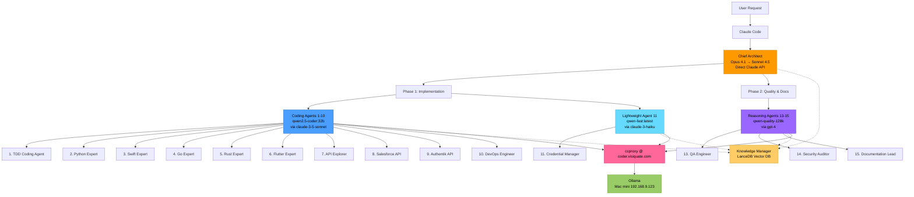
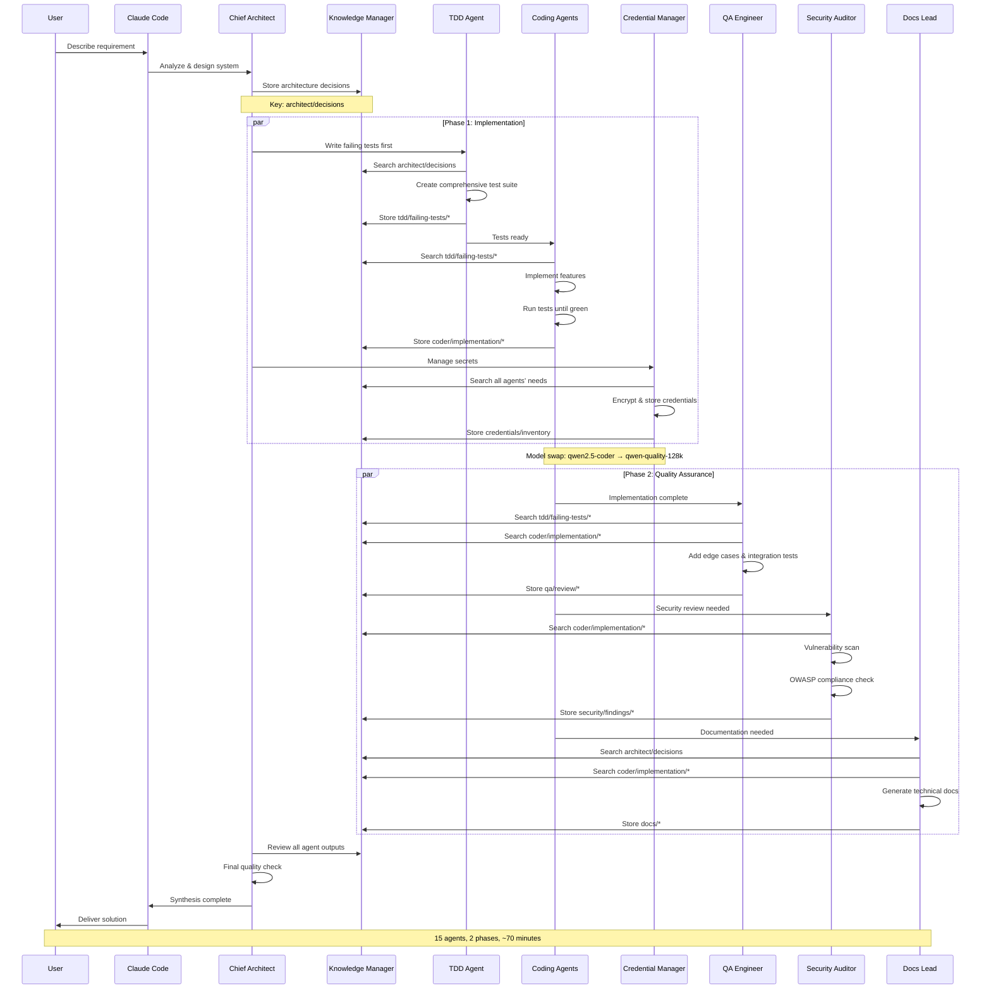
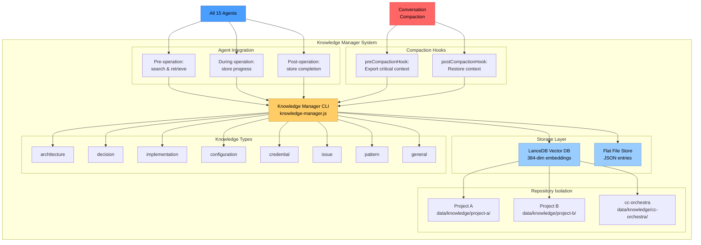
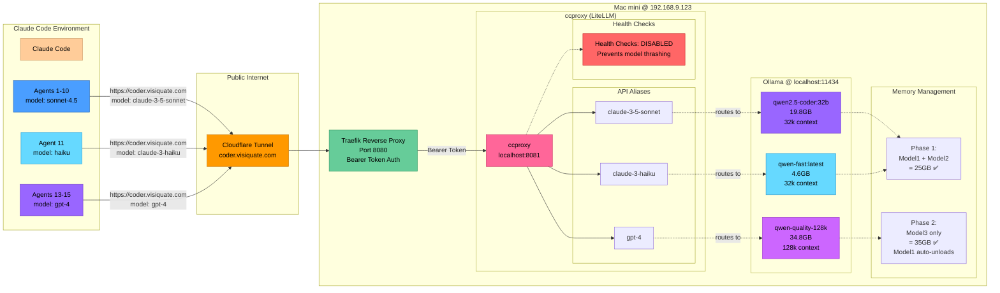
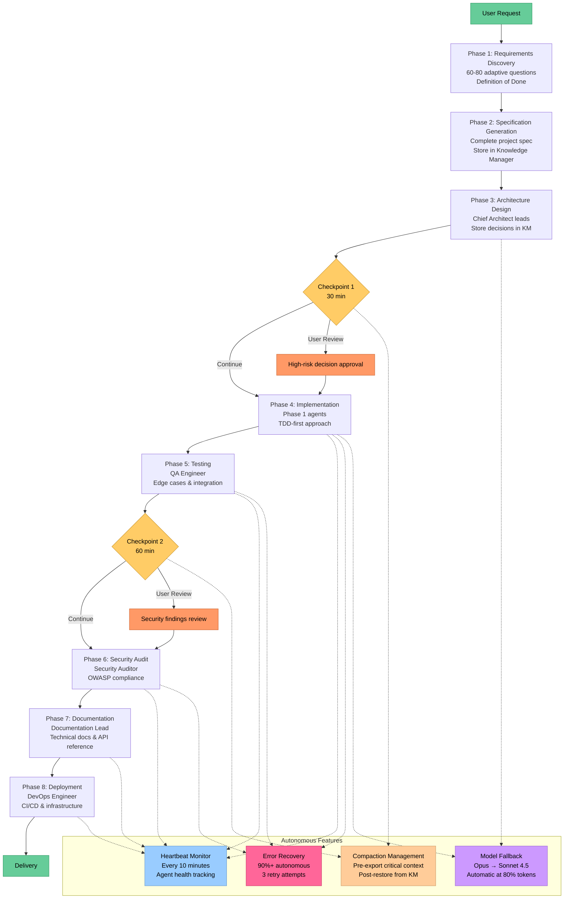
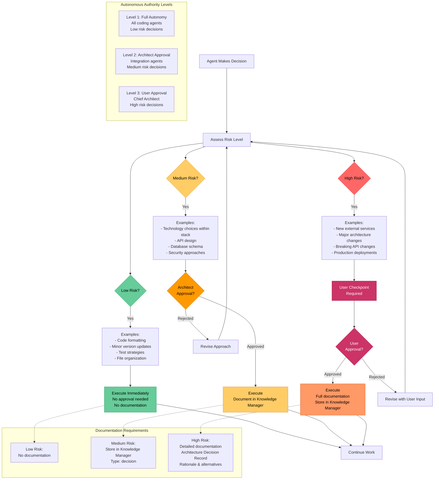

# Claude Orchestra Architecture Diagrams

This document provides comprehensive visual representations of the Claude Orchestra system architecture, agent coordination, and deployment infrastructure.

## Table of Contents

1. [High-Level System Architecture](#1-high-level-system-architecture)
2. [Agent Coordination Flow](#2-agent-coordination-flow)
3. [Knowledge Manager Architecture](#3-knowledge-manager-architecture)
4. [ccproxy Model Routing](#4-ccproxy-model-routing)
5. [Autonomous Operation Workflow](#5-autonomous-operation-workflow)
6. [Cross-Repository Deployment](#6-cross-repository-deployment)
7. [Agent Phase Architecture](#7-agent-phase-architecture)
8. [Decision Authority Matrix](#8-decision-authority-matrix)

---

## 1. High-Level System Architecture

This diagram shows the overall architecture of the Claude Orchestra system with 15 specialized agents, the Chief Architect, and the model routing infrastructure through ccproxy.



**Key Components:**
- **Chief Architect**: Strategic leadership using Claude API (Opus 4.1 with Sonnet 4.5 fallback)
- **Phase 1 Coding Agents**: 10 agents using qwen2.5-coder (32B) for TDD and implementation
- **Phase 1 Lightweight Agent**: 1 agent using qwen-fast (7B) for credential management
- **Phase 2 Reasoning Agents**: 3 agents using qwen-quality-128k (32B) for QA, security, and docs
- **Knowledge Manager**: Persistent memory with LanceDB vector search
- **ccproxy**: LiteLLM proxy routing API calls to local Ollama models

---

## 2. Agent Coordination Flow

This sequence diagram shows how agents coordinate through the Knowledge Manager from user request to final delivery.



**Coordination Highlights:**
- All agents query Knowledge Manager before starting work
- Phase 1 runs concurrently (11 agents with 2 models loaded)
- Model swap happens between Phase 1 and Phase 2
- Phase 2 runs concurrently (3 agents with 1 model)
- Architect oversees entire lifecycle

---

## 3. Knowledge Manager Architecture

This diagram illustrates the Knowledge Manager's structure with LanceDB vector database, per-repository isolation, and compaction resilience.



**Knowledge Manager Features:**
- **Vector Search**: 384-dimensional embeddings for semantic retrieval
- **Per-Repository Context**: Isolated knowledge bases per project
- **Knowledge Types**: 8 categories for structured storage
- **Agent Protocol**: Before/during/after hooks for all agents
- **Compaction Resilience**: Zero data loss across conversation compactions
- **LanceDB Backend**: High-performance vector database
- **Flat File Backup**: JSON entries for portability

---

## 4. ccproxy Model Routing

This diagram shows how API calls route from Claude Code through ccproxy to Ollama models with bearer token authentication.



**Routing Details:**
- **API Aliases**: ccproxy exposes 3 OpenAI-compatible endpoints
- **Model Mapping**:
  - `claude-3-5-sonnet` → qwen2.5-coder:32b-instruct (Agents 1-10)
  - `claude-3-haiku` → qwen-fast:latest (Agent 11)
  - `gpt-4` → qwen-quality-128k:latest (Agents 13-15)
- **Security**: Bearer token authentication via Traefik
- **Public Access**: Cloudflare tunnel to internal Mac mini
- **Health Checks**: Disabled to prevent model thrashing
- **Memory Strategy**: Phase 1 (25GB) → Phase 2 (35GB)

---

## 5. Autonomous Operation Workflow

This diagram shows the 8-phase autonomous workflow with checkpoints, heartbeats, error recovery, and compaction management.



**Autonomous Operation Capabilities:**
- **Target Duration**: 4-8 hours without user intervention
- **Checkpoints**: Every 30-60 minutes for progress tracking
- **Heartbeat**: Every 10 minutes for agent health monitoring
- **Error Recovery**: 90%+ errors handled autonomously (3 retry attempts)
- **Model Fallback**: Automatic Opus → Sonnet 4.5 at 80% token usage
- **Compaction Resilience**: Zero data loss via Knowledge Manager hooks
- **Decision Authority**: Clear matrix for autonomous vs. user approval

---

## 6. Cross-Repository Deployment

This diagram illustrates how the orchestra deploys from a global configuration to work in any project directory with auto-detection.

```mermaid
graph TB
    subgraph "Global Configuration"
        GlobalCLAUDE[~/.claude/CLAUDE.md<br/>Global instructions<br/>15-agent roster<br/>Trigger patterns]

        ArmyRepo[/Users/brent/git/cc-orchestra/<br/>Army configuration<br/>Knowledge Manager<br/>Agent definitions]

        Config[config/orchestra-config.json<br/>Agent roles & models<br/>ccproxy mappings<br/>Autonomous settings]
    end

    subgraph "Project Directories"
        ProjA[~/git/project-a/<br/>Python API]
        ProjB[~/git/project-b/<br/>Flutter + Go]
        ProjC[~/git/project-c/<br/>Enterprise integration]
    end

    subgraph "Project Customization"
        CustomA[project-a/CLAUDE.md<br/>Tech stack: Python<br/>Agents: Python, QA, Security]

        CustomB[project-b/CLAUDE.md<br/>Tech stack: Flutter + Go<br/>Agents: Flutter, Go, DevOps]

        CustomC[project-c/CLAUDE.md<br/>Tech stack: Salesforce + Authentik<br/>Agents: All 15]
    end

    subgraph "Auto-Detection Logic"
        Trigger[Trigger Pattern Detection<br/>- Full-stack apps<br/>- Multi-technology<br/>- Enterprise integration<br/>- DevOps tasks]

        Bypass[Bypass Patterns<br/>- Single file changes<br/>- Simple queries<br/>- Basic operations]
    end

    User[User Request] --> CC[Claude Code]
    CC --> Trigger
    CC --> Bypass

    Trigger -->|Complex task| GlobalCLAUDE
    GlobalCLAUDE --> ArmyRepo
    ArmyRepo --> Config

    Config -->|Deploy agents to| ProjA
    Config -->|Deploy agents to| ProjB
    Config -->|Deploy agents to| ProjC

    ProjA --> CustomA
    ProjB --> CustomB
    ProjC --> CustomC

    CustomA -.->|Override defaults| Config
    CustomB -.->|Override defaults| Config
    CustomC -.->|Override defaults| Config

    KM[Knowledge Manager<br/>Per-repo context<br/>data/knowledge/project-x/]

    ProjA --> KM
    ProjB --> KM
    ProjC --> KM

    Bypass -->|Simple task| Direct[Direct execution<br/>No army deployment]

    style GlobalCLAUDE fill:#ff9900,stroke:#cc7700,color:#000
    style ArmyRepo fill:#ffcc66,stroke:#cc9933,color:#000
    style Config fill:#ffcc99,stroke:#cc9966,color:#000
    style Trigger fill:#66cc99,stroke:#339966,color:#000
    style Bypass fill:#ff6666,stroke:#cc3333,color:#000
    style KM fill:#99ccff,stroke:#6699cc,color:#000
```

**Cross-Repository Features:**
- **Global Config**: Army configuration lives in `/Users/brent/git/cc-orchestra/`
- **Works Anywhere**: Deploys to current working directory
- **Auto-Detection**: Smart trigger patterns activate army automatically
- **Project Customization**: Local `CLAUDE.md` overrides defaults
- **Per-Repo Context**: Isolated Knowledge Manager databases
- **Consistent Quality**: Same standards across all projects

---

## 7. Agent Phase Architecture

This diagram shows the two-phase execution model with memory management and model loading/unloading strategy.

```mermaid
graph TB
    subgraph "Phase 0: Independent"
        Arch[Chief Architect<br/>claude-opus-4-1<br/>→ claude-sonnet-4-5<br/>Direct Claude API]
    end

    subgraph "Phase 1: Implementation (11 agents, ~25GB)"
        subgraph "qwen2.5-coder:32b-instruct (~20GB)"
            TDD[1. TDD Coding Agent<br/>Test-first specialist]
            Python[2. Python Expert<br/>FastAPI, ML/AI]
            Swift[3. Swift Expert<br/>iOS, SwiftUI]
            Go[4. Go Expert<br/>Microservices]
            Rust[5. Rust Expert<br/>Systems programming]
            Flutter[6. Flutter Expert<br/>Cross-platform mobile]
            API[7. API Explorer<br/>Third-party APIs]
            SF[8. Salesforce API<br/>CRM integration]
            Auth[9. Authentik API<br/>OAuth2/OIDC]
            DevOps[10. DevOps Engineer<br/>Docker, K8s, AWS]
        end

        subgraph "qwen-fast:latest (~5GB)"
            Creds[11. Credential Manager<br/>Secrets management]
        end

        Note1[Both models loaded<br/>simultaneously in memory]
    end

    ModelSwap[Model Swap Event<br/>qwen2.5-coder unloads<br/>qwen-quality-128k loads<br/>~40 seconds]

    subgraph "Phase 2: Quality & Documentation (3 agents, ~35GB)"
        subgraph "qwen-quality-128k:latest (~35GB)"
            QA[13. QA Engineer<br/>Integration & E2E tests<br/>Autonomous fixing]
            Sec[14. Security Auditor<br/>Vulnerability scanning<br/>OWASP compliance]
            Docs[15. Documentation Lead<br/>Technical docs<br/>API reference]
        end

        Note2[Single model<br/>Deep reasoning<br/>128k context]
    end

    User[User Requirement] --> Arch
    Arch -->|Store decisions| KM[Knowledge Manager]

    Arch --> TDD
    TDD --> Python
    TDD --> Swift
    TDD --> Go
    TDD --> Rust
    TDD --> Flutter
    TDD --> SF
    TDD --> Auth

    Arch --> API
    Arch --> DevOps
    Arch --> Creds

    Python -.->|Coordinate via| KM
    Swift -.->|Coordinate via| KM
    Go -.->|Coordinate via| KM
    Rust -.->|Coordinate via| KM
    Flutter -.->|Coordinate via| KM
    API -.->|Coordinate via| KM
    SF -.->|Coordinate via| KM
    Auth -.->|Coordinate via| KM
    DevOps -.->|Coordinate via| KM
    Creds -.->|Coordinate via| KM

    Python --> ModelSwap
    Swift --> ModelSwap
    Go --> ModelSwap
    Rust --> ModelSwap
    Flutter --> ModelSwap
    API --> ModelSwap
    SF --> ModelSwap
    Auth --> ModelSwap
    DevOps --> ModelSwap
    Creds --> ModelSwap

    ModelSwap --> QA
    ModelSwap --> Sec
    ModelSwap --> Docs

    QA -.->|Coordinate via| KM
    Sec -.->|Coordinate via| KM
    Docs -.->|Coordinate via| KM

    QA --> Complete[Delivery]
    Sec --> Complete
    Docs --> Complete

    style Arch fill:#ff9900,stroke:#cc7700,color:#000
    style TDD fill:#66ccff,stroke:#3399cc,color:#000
    style Python fill:#4a9eff,stroke:#2e6cbb,color:#000
    style Swift fill:#4a9eff,stroke:#2e6cbb,color:#000
    style Go fill:#4a9eff,stroke:#2e6cbb,color:#000
    style Rust fill:#4a9eff,stroke:#2e6cbb,color:#000
    style Flutter fill:#4a9eff,stroke:#2e6cbb,color:#000
    style API fill:#4a9eff,stroke:#2e6cbb,color:#000
    style SF fill:#4a9eff,stroke:#2e6cbb,color:#000
    style Auth fill:#4a9eff,stroke:#2e6cbb,color:#000
    style DevOps fill:#4a9eff,stroke:#2e6cbb,color:#000
    style Creds fill:#66d9ff,stroke:#3399cc,color:#000
    style ModelSwap fill:#ff6666,stroke:#cc3333,color:#000
    style QA fill:#9966ff,stroke:#7744cc,color:#000
    style Sec fill:#9966ff,stroke:#7744cc,color:#000
    style Docs fill:#9966ff,stroke:#7744cc,color:#000
    style KM fill:#ffcc66,stroke:#cc9933,color:#000
    style Complete fill:#66cc99,stroke:#339966,color:#000
```



**Phase Execution Details:**
- **Phase 0**: Chief Architect uses Claude API independently
- **Phase 1**: 11 agents run concurrently (10 coding + 1 credentials)
  - 2 models loaded simultaneously: qwen2.5-coder (20GB) + qwen-fast (5GB) = 25GB
  - Duration: ~30 minutes
- **Model Swap**: qwen2.5-coder unloads, qwen-quality-128k loads (~40s)
- **Phase 2**: 3 reasoning agents run concurrently
  - 1 model: qwen-quality-128k (35GB)
  - Duration: ~30 minutes
- **Total Time**: ~70 minutes for full pipeline

---

## 8. Decision Authority Matrix

This flowchart shows the decision-making process with clear authority levels and documentation requirements.



**Authority Matrix Summary:**

| Risk Level | Approval Required | Documentation | Examples | Autonomous |
|------------|------------------|---------------|----------|------------|
| **Low** | None | No | Code formatting, minor updates, test strategies | Yes ✅ |
| **Medium** | Architect | Yes (KM) | API design, database schema, tech choices | With approval ⚠️ |
| **High** | User | Yes (Full ADR) | External services, major changes, production deploys | No ❌ |

**Key Principles:**
- **Low Risk**: Agents execute immediately without approval
- **Medium Risk**: Architect reviews and approves before execution
- **High Risk**: User checkpoint required with full documentation
- **Documentation**: Stored in Knowledge Manager for all medium/high risk decisions
- **Escalation**: 3 consecutive errors escalate to next authority level

---

## Summary

These architecture diagrams provide comprehensive visual documentation of the Claude Orchestra system:

1. **High-Level System**: 15 agents, 3 model tiers, Knowledge Manager coordination
2. **Coordination Flow**: TDD-first workflow with parallel execution and checkpoints
3. **Knowledge Manager**: LanceDB vector database with per-repository isolation
4. **ccproxy Routing**: API aliases to local Ollama models with bearer auth
5. **Autonomous Operation**: 8-phase workflow with 4-8 hour target duration
6. **Cross-Repository**: Global config deploys to any project directory
7. **Phase Architecture**: 2-phase execution with memory-aware model loading
8. **Decision Authority**: Clear matrix for autonomous vs. supervised decisions

All diagrams are rendered using Mermaid syntax and can be embedded in any Markdown-compatible documentation system.

---

**Document Version**: 1.0
**Last Updated**: 2025-11-10
**Status**: Complete and current with deployed system
