# Maximum Delegation Strategy: Avoiding Compaction Loss

**✅ IMPLEMENTATION STATUS**: LanceDB integration completed! See [KNOWLEDGE_MANAGER_GUIDE.md](./KNOWLEDGE_MANAGER_GUIDE.md) for full documentation.

## The Problem

**Current Challenge:**
- Claude (orchestrator) does too much work directly
- Uses up context window quickly
- Hits compaction limits
- **Critical knowledge gets lost during compaction**

**Goal:**
- Minimize orchestrator's direct work
- Delegate everything to specialized agents
- Preserve knowledge across compactions
- Only coordinate and synthesize results

---

## Core Principle: "Delegate Everything, Coordinate Only"

### What the Orchestrator (Claude) Should Do:
✅ Understand user requirements
✅ Break down into tasks
✅ Spawn specialized agents
✅ Review agent results
✅ Synthesize final output
✅ Coordinate between agents

### What the Orchestrator Should NOT Do:
❌ Write code directly
❌ Read large files
❌ Implement features
❌ Search codebases extensively
❌ Run tests
❌ Generate documentation
❌ Any task that consumes significant context

---

## Delegation Rules

### Rule 1: Always Use Agents for Work

**Instead of:**
```javascript
// Orchestrator reads files and implements
Read("app.py")
// ... analyze and write code ...
Write("app.py", updatedCode)
```

**Do this:**
```javascript
// Spawn agent to do the work
Task("Python Specialist",
  "Read app.py, analyze the authentication flow, and add rate limiting to the login endpoint. Report back what you changed and why.",
  "python-pro")
```

### Rule 2: Batch Related Tasks to Same Agent

**Instead of:**
```javascript
// Multiple separate tasks
Task("Agent", "Task 1")
Task("Agent", "Task 2")
Task("Agent", "Task 3")
```

**Do this:**
```javascript
// Single agent with comprehensive instructions
Task("Python Specialist",
  "Complete the following tasks:
  1. Add rate limiting to login endpoint
  2. Implement password reset flow
  3. Add email verification
  4. Write tests for all new features

  Report back: What you implemented, any issues, test results.",
  "python-pro")
```

### Rule 3: Use Research Agents for Exploration

**Instead of:**
```javascript
// Orchestrator explores codebase
Glob("**/*.py")
Read("file1.py")
Read("file2.py")
// ... lots of file reads ...
```

**Do this:**
```javascript
// Research agent explores and summarizes
Task("Code Researcher",
  "Explore the Python codebase and provide a summary of:
  - Authentication implementation (which files, how it works)
  - API endpoint structure
  - Database models
  - Configuration patterns

  Return a concise summary with file paths and key functions.",
  "technical-researcher")
```

### Rule 4: Let Agents Make Implementation Decisions

**Instead of:**
```javascript
// Orchestrator decides implementation details
Task("Agent", "Use FastAPI with Pydantic validators. Create models in models.py...")
```

**Do this:**
```javascript
// Agent makes technical decisions
Task("Python Specialist",
  "Implement user authentication with the following requirements:
  - JWT tokens
  - Password hashing
  - Email verification
  - Rate limiting

  You decide: framework choices, file organization, libraries.
  Report back: Your architectural decisions and why.",
  "python-pro")
```

### Rule 5: Request Results, Not Step-by-Step Updates

**Instead of:**
```javascript
// Orchestrator micromanages
Task("Agent", "First create the model...")
// Wait for response
Task("Agent", "Now create the controller...")
// Wait for response
```

**Do this:**
```javascript
// Agent does complete feature
Task("Python Specialist",
  "Implement complete user authentication feature:
  - Models, controllers, routes
  - Tests, documentation
  - Database migrations

  Work autonomously. Report back when done with:
  - What you built
  - Files changed
  - Test results
  - Any issues encountered",
  "python-pro")
```

---

## Knowledge Retention Strategy

### Problem: Compaction Loses Context

When Claude's context fills up, compaction summarizes the conversation, losing:
- Detailed architectural decisions
- Implementation patterns discovered
- Configuration details
- Credential locations
- Bug fixes and their reasons

### Solution: Multi-Layer Knowledge Preservation

## Layer 1: Knowledge Manager

**Use Knowledge Manager for critical decisions:**

```bash
# Before compaction - store critical knowledge
node ~/git/cc-orchestra/src/knowledge-manager.js store \
  "Architecture: JWT auth with refresh tokens in app/auth/jwt.py, 30-day key rotation. Decided by Chief Architect for security+UX balance" \
  --type decision --agent architect

node ~/git/cc-orchestra/src/knowledge-manager.js store \
  "Config: PostgreSQL with connection pooling, Alembic migrations in config/database.py" \
  --type decision --agent architect

node ~/git/cc-orchestra/src/knowledge-manager.js store \
  "Pattern: Custom exceptions with error codes in app/exceptions.py, using RFC 7807 Problem Details" \
  --type decision --agent architect
```

**After compaction - retrieve knowledge:**

```bash
# Agents search Knowledge Manager for critical context
node ~/git/cc-orchestra/src/knowledge-manager.js search "architecture decisions"
node ~/git/cc-orchestra/src/knowledge-manager.js search "configuration"
node ~/git/cc-orchestra/src/knowledge-manager.js search "patterns"
```

**Orchestrator should:**
1. Before spawning agents after compaction → retrieve all Knowledge Manager entries
2. Include knowledge summary in agent instructions
3. Agents should always search Knowledge Manager before implementing

## Layer 2: LanceDB RAG Integration ✅ **IMPLEMENTED**

**Status**: Fully implemented and tested. See [KNOWLEDGE_MANAGER_GUIDE.md](./KNOWLEDGE_MANAGER_GUIDE.md)

**Why LanceDB?**
- ✅ Vector database for semantic search across Claude API calls
- ✅ Fast similarity search (~10-50ms)
- ✅ Works with embeddings (384 dimensions)
- ✅ Persistent storage across sessions and compactions
- ✅ Per-repository context isolation
- ✅ Integrated with orchestra orchestrator and direct Anthropic Claude API

**Architecture:**

```mermaid
graph TD
    Orchestrator["Claude Orchestra Orchestrator<br/>(Coordinates agents, minimal direct work)"]

    BeforeWork["Before Work:<br/>Retrieve Context"]
    AfterWork["After Work:<br/>Store Knowledge"]

    LanceDB["LanceDB<br/>Embeddings: Decisions, Patterns,<br/>Configurations, Architectures"]

    SemanticSearch["Semantic Search & Retrieval<br/>'How did we implement auth?'<br/>→ Retrieves relevant decisions"]

    Orchestrator --> BeforeWork
    Orchestrator --> AfterWork

    BeforeWork --> LanceDB
    AfterWork --> LanceDB

    LanceDB --> SemanticSearch
```



**Implementation Plan:**

### Step 1: Install LanceDB
```bash
npm install vectordb
# or
pip install lancedb
```

### Step 2: Create Knowledge Storage Agent

```javascript
// New agent: Knowledge Manager
{
  "name": "Knowledge Manager",
  "type": "knowledge-manager",
  "model": "haiku",
  "role": "Knowledge capture and retrieval with LanceDB",
  "responsibilities": [
    "Store critical decisions in LanceDB before compaction",
    "Retrieve relevant context when agents spawn",
    "Maintain knowledge base of patterns and decisions",
    "Generate embeddings for semantic search",
    "Compress and store conversation context"
  ]
}
```

### Step 3: Pre-Compaction Hook

```javascript
// Hook that runs when context is 80% full
async function preCompactionHook() {
  // 1. Identify critical knowledge in conversation
  const criticalKnowledge = extractCriticalKnowledge(conversation);

  // 2. Generate embeddings
  const embeddings = await generateEmbeddings(criticalKnowledge);

  // 3. Store in LanceDB
  await lancedb.store({
    project_id: currentProject,
    session_id: sessionId,
    knowledge: criticalKnowledge,
    embeddings: embeddings,
    timestamp: Date.now()
  });

  // 4. Also store in MCP memory
  await mcpMemory.store(criticalKnowledge);
}
```

### Step 4: Post-Compaction Retrieval

```javascript
// After compaction, retrieve context
async function postCompactionRetrieve(query) {
  // 1. Search LanceDB for relevant context
  const results = await lancedb.search(query, {
    project_id: currentProject,
    limit: 10,
    threshold: 0.7
  });

  // 2. Retrieve from MCP memory
  const mcpContext = await mcpMemory.retrieve("*");

  // 3. Combine and return
  return {
    lancedb: results,
    mcp: mcpContext
  };
}
```

### Step 5: Agent Instructions After Compaction

```javascript
Task("Python Specialist",
  `CONTEXT RECOVERED FROM PREVIOUS SESSION:

  ${retrievedContext}

  NEW TASK: ${userRequirement}

  Review the context above before starting work.
  Follow established patterns and decisions.`,
  "python-pro")
```

## Layer 3: Persistent Documentation

**Technical Writer maintains live documentation:**

```javascript
// After each major decision or implementation
Task("Technical Writer",
  "Update architecture documentation with:
  - Decision: ${decision}
  - Implementation: ${implementation}
  - Reasoning: ${reasoning}
  - Location: ${files}

  Store in: docs/architecture/decisions.md",
  "technical-writer")
```

**This creates a persistent record that survives compactions.**

---

## Complete Delegation Workflow

### 1. User Makes Request

```
User: "Add OAuth2 authentication with Google and GitHub"
```

### 2. Orchestrator Analyzes (Minimal Context Use)

```javascript
// Orchestrator thinks (internally, not writing code):
// - This needs: Architecture design, Python implementation,
//   security review, documentation
// - Spawn: Architect, Python Expert, Security, Technical Writer
```

### 3. Spawn All Agents in Parallel

```javascript
[Single Message]:

// Retrieve existing context
const context = await retrieveContext("authentication");

// Spawn all agents with context
Task("Chief Architect",
  `${context}

  Design OAuth2 flow for Google + GitHub:
  - Token flow
  - Refresh strategy
  - User profile sync
  - Session management

  Store decisions in memory.
  Report: Architecture summary, security considerations.`,
  "backend-architect", "opus")

Task("Python Specialist",
  `${context}

  Implement OAuth2 with Google + GitHub:
  - Follow Architect's design (check memory)
  - Use authlib library
  - Implement callback handlers
  - User profile storage
  - Tests with mocking

  Report: Files created, how to test, any issues.`,
  "python-pro")

Task("Security Auditor",
  `${context}

  Review OAuth2 implementation:
  - Check Architect's design for security
  - Review Python Expert's code
  - Verify CSRF protection
  - Check token storage
  - Validate redirect URIs

  Report: Security findings, recommendations.`,
  "security-auditor")

Task("Technical Writer",
  `${context}

  Document OAuth2 integration:
  - User guide: How to sign in with Google/GitHub
  - Developer guide: How OAuth flow works
  - Configuration guide: Setting up credentials

  Report: Documentation complete.`,
  "technical-writer")

// Store knowledge hook
storeKnowledge({
  decision: "OAuth2 with Google + GitHub",
  pattern: "Token-based authentication",
  timestamp: Date.now()
})
```

### 4. Orchestrator Reviews Results (Minimal Work)

```javascript
// Agents report back:
// - Architect: "Designed OAuth2 flow, stored in memory"
// - Python: "Implemented in app/auth/oauth.py, tests pass"
// - Security: "Found 2 issues, fixed by Python Expert"
// - Writer: "Docs at docs/authentication/oauth.md"

// Orchestrator synthesizes (uses minimal context):
"OAuth2 authentication complete:
- Architecture: Secure token flow with refresh
- Implementation: app/auth/oauth.py
- Security: Reviewed and approved
- Documentation: Complete
- Tests: Passing"
```

### 5. Store Knowledge for Future

```javascript
// Store in LanceDB
await lancedb.store({
  type: "implementation",
  feature: "OAuth2 Google + GitHub",
  files: ["app/auth/oauth.py", "docs/authentication/oauth.md"],
  patterns: ["token-based auth", "refresh tokens", "CSRF protection"],
  decisions: architectDecisions,
  timestamp: Date.now()
});

// Also store in MCP
await mcpMemory.store("oauth2/implementation", implementation);
```

---

## Specific Recommendations

### 1. Create Knowledge Manager Agent

Add to `orchestra-config.json`:

```json
{
  "name": "Knowledge Manager",
  "type": "knowledge-manager",
  "model": "haiku",
  "role": "Knowledge capture and retrieval",
  "responsibilities": [
    "Store critical decisions in LanceDB",
    "Retrieve context after compaction",
    "Maintain searchable knowledge base",
    "Generate embeddings for semantic search",
    "Coordinate with all agents on knowledge storage"
  ]
}
```

### 2. Integrate LanceDB

```bash
# Install
npm install vectordb

# Create knowledge database
node -e "
const lancedb = require('vectordb');
const db = await lancedb.connect('data/knowledge.lance');
await db.createTable('decisions', [
  { vector: Array(1536), text: 'string', metadata: {} }
]);
"
```

### 3. Pre-Compaction Hook

Add to orchestrator:

```javascript
async function beforeCompaction() {
  console.log("Context at 80% - storing knowledge...");

  // Extract all important decisions from conversation
  const knowledge = extractKnowledge(conversation);

  // Store in LanceDB with embeddings
  await storeInLanceDB(knowledge);

  // Store in MCP memory
  await storeInMCP(knowledge);

  console.log("Knowledge preserved for post-compaction retrieval");
}
```

### 4. Post-Compaction Retrieval

Add to agent spawn:

```javascript
async function spawnAgentWithContext(agentType, task) {
  // Retrieve relevant context
  const context = await retrieveContext(task);

  // Include in agent instructions
  const fullTask = `
RECOVERED CONTEXT:
${context}

NEW TASK:
${task}

Review context before proceeding. Follow established patterns.
  `;

  return Task(agentType, fullTask, ...);
}
```

### 5. Measure Success

Track metrics:
- Context usage before/after delegation
- Number of compactions (should decrease)
- Knowledge successfully retrieved after compaction
- Agent autonomy (% of work delegated)

**Target:**
- 90%+ of work delegated to agents
- Orchestrator uses <20% of context
- Zero knowledge loss across compactions

---

## Summary

### Delegation Strategy:
✅ **Spawn agents for all work** - Never implement directly
✅ **Batch related tasks** - Single agent, comprehensive instructions
✅ **Request results only** - Don't micromanage
✅ **Let agents decide** - Implementation details left to specialists
✅ **Use research agents** - For exploration and analysis

### Knowledge Retention:
✅ **Layer 1**: MCP memory for critical decisions
✅ **Layer 2**: LanceDB RAG for semantic search (recommended)
✅ **Layer 3**: Persistent documentation files
✅ **Pre-compaction hooks**: Capture knowledge before loss
✅ **Post-compaction retrieval**: Restore context automatically

### Result:
- 🎯 Minimal orchestrator context usage
- 🧠 Zero knowledge loss across compactions
- 🚀 Faster development with autonomous agents
- 💾 Persistent, searchable knowledge base
- ⚡ Semantic search for relevant context

**✅ COMPLETED**: LanceDB integration implemented with per-repository contexts, semantic search, and automatic pre/post-compaction hooks.

**Files Created**:
- `src/knowledge-manager.js` - Core Knowledge Manager implementation
- `docs/KNOWLEDGE_MANAGER_GUIDE.md` - Complete usage guide
- Configuration in `config/orchestra-config.json` → `knowledgeManager` section
- Integrated with `src/orchestra-conductor.js`

**Quick Start**:
```bash
# Test the Knowledge Manager
node src/knowledge-manager.js test

# View statistics
node src/knowledge-manager.js stats

# Search knowledge
node src/knowledge-manager.js search "authentication"
```

**Next Steps**: Review [KNOWLEDGE_MANAGER_GUIDE.md](./KNOWLEDGE_MANAGER_GUIDE.md) for complete documentation and best practices.
