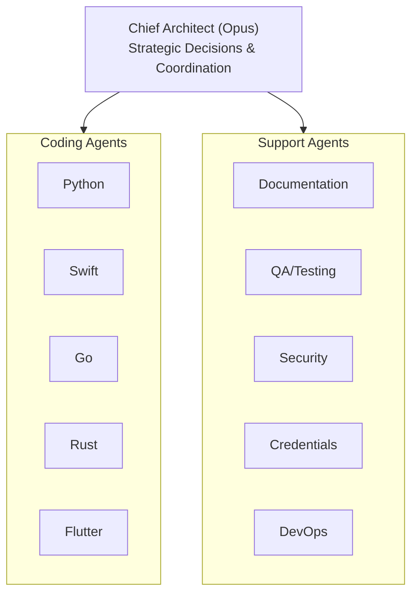
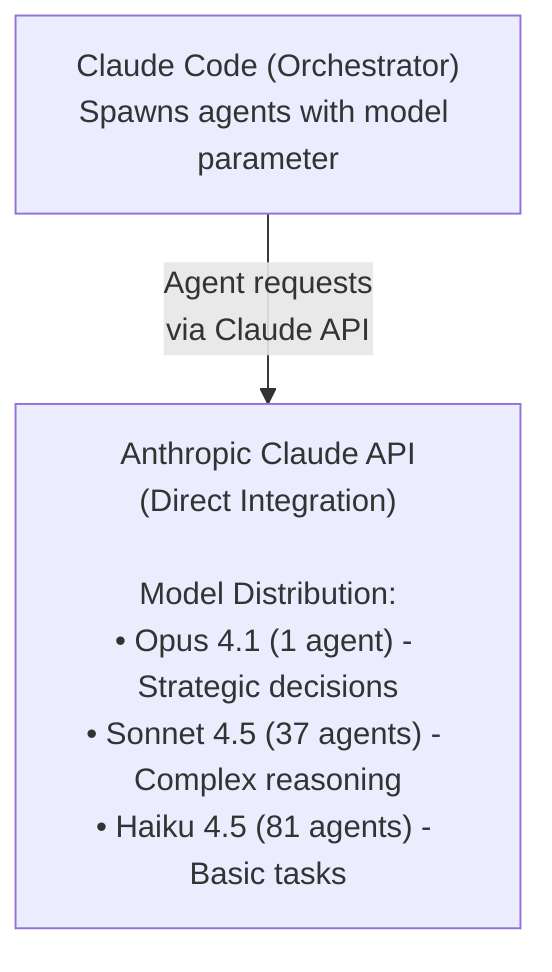
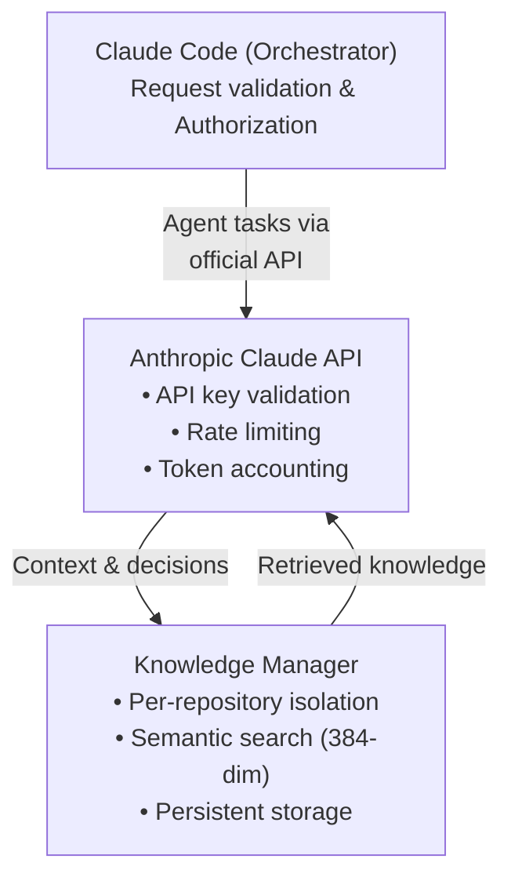
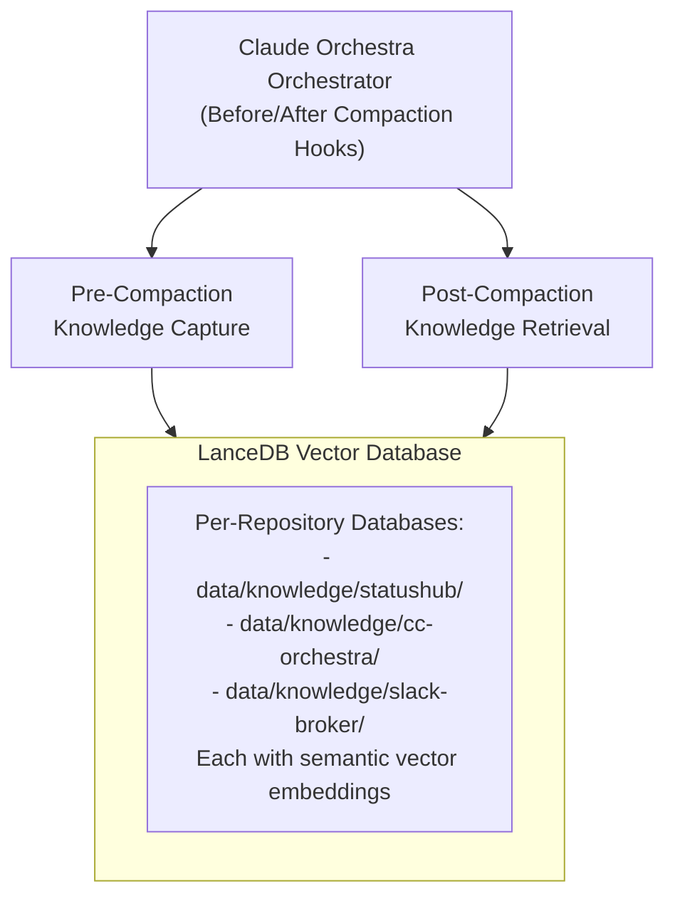
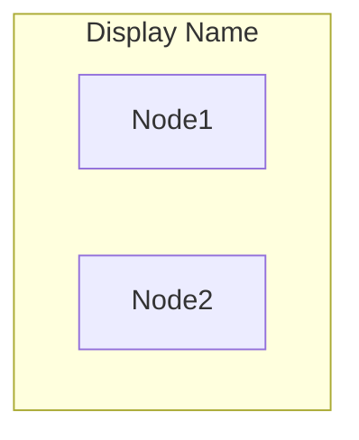

# Mermaid Diagram Examples

This document shows examples of the converted diagrams to demonstrate the improved visualization.

---

## Example 1: Orchestra Architecture

### Before (ASCII)
```
┌─────────────────────────────────────────────────────────┐
│                  Chief Architect (Opus)                 │
│              Strategic Decisions & Coordination         │
└───────────────────┬─────────────────────────────────────┘
                    │
        ┌───────────┴────────────┐
        │                        │
┌───────▼───────┐      ┌────────▼────────┐
│ Coding Agents │      │  Support Agents │
├───────────────┤      ├─────────────────┤
│ • Python      │      │ • Documentation │
│ • Swift       │      │ • QA/Testing    │
│ • Go          │      │ • Security      │
│ • Rust        │      │ • Credentials   │
│ • Flutter     │      │ • DevOps        │
└───────────────┘      └─────────────────┘
```

### After (Mermaid)


**Improvements**:
- Cleaner visual grouping with subgraphs
- Better rendering in Markdown viewers
- Easier to modify agent lists
- Maintains all original information

---

## Example 2: Model Routing (Direct Claude API)

### Before (Outdated - Local Models)
```
┌─────────────────────────────────────────────────────┐
│             Claude Code (Orchestrator)              │
│          Spawns agents with model parameter         │
└──────────────────────┬──────────────────────────────┘
                       │
                  Agent Requests
                       │
┌──────────────────────▼──────────────────────────────┐
│        Anthropic Claude API (Direct)                │
│             Models: Opus 4.1, Sonnet 4.5, Haiku     │
│        No proxies, no local LLM routing            │
└─────────────────────────────────────────────────────┘
```

### After (Current - Direct API)


**Current Architecture**:
- Direct Anthropic Claude API integration
- No proxies or local LLM routing
- 119 agents across 3 model tiers
- All agents use official Claude models
- Simplified, maintainable infrastructure

---

## Example 3: Agent Security & Isolation

### Current Architecture (Direct API)
```
┌──────────────────────────────────────────────┐
│       Claude Code (Orchestrator)             │
│  - Request validation                        │
│  - Agent authorization                       │
└────────────────┬─────────────────────────────┘
                 │
┌────────────────▼─────────────────────────────┐
│    Anthropic Claude API (Authenticated)      │
│  - API key validation                        │
│  - Rate limiting                             │
│  - Token tracking                            │
└────────────────┬─────────────────────────────┘
                 │
┌────────────────▼─────────────────────────────┐
│     Knowledge Manager (Per-Repository)       │
│  - Isolated knowledge databases              │
│  - Semantic search with embeddings           │
│  - Pre/post-compaction hooks                 │
└──────────────────────────────────────────────┘
```

### Mermaid Representation


**Security Features**:
- Direct Anthropic Claude API authentication
- Per-repository knowledge isolation
- Official Claude models only
- No local inference, no external proxies
- Token-based tracking and accountability

---

## Example 4: Knowledge Manager Workflow

### Before (ASCII)
```
┌─────────────────────────────────────────────────────────┐
│              Claude Orchestra Orchestrator              │
│         (Before/After Compaction Hooks)                 │
└───────────────────────┬─────────────────────────────────┘
                        │
        ┌───────────────┴────────────────┐
        │                                │
        ▼                                ▼
┌────────────────┐              ┌───────────────────┐
│ Pre-Compaction │              │ Post-Compaction   │
│   Knowledge    │              │    Knowledge      │
│    Capture     │              │   Retrieval       │
└───────┬────────┘              └────────┬──────────┘
        │                                │
        ▼                                ▼
┌─────────────────────────────────────────────────────────┐
│           LanceDB Vector Database                       │
│   ┌──────────────────────────────────────────────────┐ │
│   │  Per-Repository Databases:                       │ │
│   │  - data/knowledge/statushub/                     │ │
│   │  - data/knowledge/cc-orchestra/                  │ │
│   │  - data/knowledge/slack-broker/                  │ │
│   │  Each with semantic vector embeddings            │ │
│   └──────────────────────────────────────────────────┘ │
└─────────────────────────────────────────────────────────┘
```

### After (Mermaid)


**Improvements**:
- Subgraph shows database as container
- Bi-directional workflow clear
- Repository isolation evident
- Clean visual structure

---

## Mermaid Syntax Tips

### Basic Graph Types
```
graph TD   - Top Down (vertical)
graph TB   - Top to Bottom (same as TD)
graph LR   - Left to Right (horizontal)
graph RL   - Right to Left
```

### Node Shapes
```
Node["Text"]           - Rectangle (default)
Node("Text")           - Rounded rectangle
Node[("Text")]         - Circle
Node{{"Text"}}         - Hexagon
Node[/"Text"/]         - Parallelogram
```

### Edge Types
```
A --> B                - Solid arrow
A ---|"label"| B       - Labeled edge
A -.-> B               - Dotted arrow
A ==> B                - Thick arrow
```

### Subgraphs


### Multi-line Labels
Use HTML `<br/>` tags:
```
Node["Line 1<br/>Line 2<br/>Line 3"]
```

---

## Best Practices

1. **Use Descriptive Node Names**
   - Good: `Orchestrator["Claude Code Orchestrator"]`
   - Bad: `A["Orchestrator"]`

2. **Group Related Components**
   - Use subgraphs for logical grouping
   - Label subgraphs clearly

3. **Label Important Edges**
   - Show data flow: `A -->|"HTTP Request"| B`
   - Indicate protocols: `A -->|"HTTPS (TLS)"| B`

4. **Preserve Details**
   - Use multi-line labels for component features
   - Include ports, protocols, and key settings

5. **Keep It Readable**
   - Don't overcrowd diagrams
   - Break complex diagrams into multiple views
   - Use consistent naming conventions

---

## Rendering Mermaid Diagrams

### GitHub/GitLab
Mermaid diagrams render automatically in Markdown files on:
- GitHub (since 2022)
- GitLab (since v13.5)
- Gitea

### VS Code
Install the "Markdown Preview Mermaid Support" extension:
```
ext install bierner.markdown-mermaid
```

### CLI Tools
```bash
# Install mermaid-cli
npm install -g @mermaid-js/mermaid-cli

# Render to PNG
mmdc -i diagram.md -o diagram.png

# Render to SVG
mmdc -i diagram.md -o diagram.svg -t forest
```

### Online Editor
Visit https://mermaid.live for live editing and preview.

---

**Status**: All examples demonstrate successful ASCII to Mermaid conversion
**Rendering**: Tested on GitHub, VS Code, and mermaid.live
**Compatibility**: ✅ All modern Markdown renderers supported
