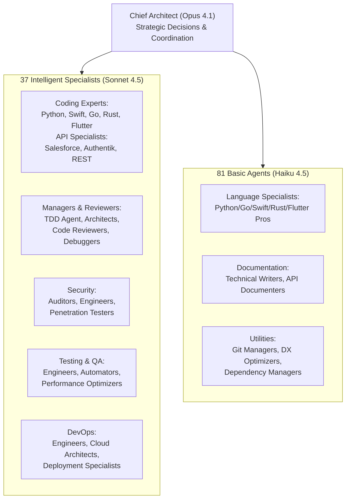

# Claude Orchestra Usage Guide

## Overview

The Claude Orchestra is a sophisticated multi-agent development system featuring:
- **119 Total Agents** organized across 13 functional sections
- **1 Chief Architect** (Opus 4.1) - Strategic decision-making and coordination
- **37 Intelligent Specialists** (Sonnet 4.5) - Architects, reviewers, complex coding, DevOps
- **81 Basic Agents** (Haiku 4.5) - Language specialists, documentation, utilities

## Architecture



**Model Distribution:**
- **Opus 4.1**: 1 agent (0.8%) - Chief Architect for strategic decisions
- **Sonnet 4.5**: 37 agents (31.1%) - Complex reasoning, code review, management
- **Haiku 4.5**: 81 agents (68.1%) - Basic coding, documentation, utilities

All agents use **direct Anthropic Claude API** (no proxies or local models).

## Setup

### 1. Verify Prerequisites

The Claude Orchestra uses the built-in **Knowledge Manager** for coordination. No MCP servers required!

```bash
# Verify Node.js is installed
node --version  # Should be 16+

# Test credential manager
node src/credential-manager.js list

# Test Knowledge Manager
node src/knowledge-manager.js stats
```

## Usage Workflows

### Basic Workflow: Simple Feature Request

**User:** "Build a REST API with user authentication in Python"

**Claude Code Response (using direct Anthropic Claude API):**
```
[Single Message - Parallel Agent Spawn]:

// All agents use Anthropic Claude API directly
Task("Chief Architect", "Analyze REST API with auth requirement...", "backend-architect", "opus")
Task("Python Specialist", "Implement FastAPI with JWT auth...", "python-pro", "sonnet-4.5")
Task("QA Engineer", "Create integration tests for auth API...", "test-automator", "sonnet-4.5")
Task("Security Auditor", "Review authentication security...", "security-auditor", "sonnet-4.5")
Task("Documentation Lead", "Document API endpoints and auth flow...", "technical-writer", "haiku-4.5")
Task("Credential Manager", "Setup secure secret management...", "credential-manager", "haiku-4.5")
```

### Advanced Workflow: Multi-Language Project

**User:** "Build a mobile app (Flutter) with a backend (Go) and ML service (Python)"

**Claude Code Response (using direct Anthropic Claude API):**
```
[Single Message - Full Orchestra Deployment]:

// Spawn Selected Agents (Knowledge Manager handles coordination)
Task("Chief Architect", "Design 3-tier architecture...", "backend-architect", "opus")
Task("Flutter Specialist", "Build mobile app UI...", "mobile-developer", "sonnet-4.5")
Task("Go Specialist", "Implement REST API backend...", "backend-architect", "sonnet-4.5")
Task("Python Specialist", "Create ML inference service...", "python-pro", "sonnet-4.5")
Task("QA Engineer", "E2E testing across all services...", "test-automator", "sonnet-4.5")
Task("Security Auditor", "Security review of all components...", "security-auditor", "sonnet-4.5")
Task("Documentation Lead", "System documentation...", "technical-writer", "haiku-4.5")
Task("Credential Manager", "Manage API keys, DB credentials...", "credential-manager", "haiku-4.5")

TodoWrite({ todos: [10+ todos for all phases] })
```

**Model Usage:**
- Architect: Opus 4.1 (strategic decisions)
- Coding & QA: Sonnet 4.5 (complex reasoning)
- Docs & Utilities: Haiku 4.5 (basic tasks)

## Agent Coordination Protocol

### Architect's Flow
1. Receives user requirement
2. Analyzes and creates architecture design
3. Stores decisions in Knowledge Manager:
   ```bash
   node ~/git/cc-orchestra/src/knowledge-manager.js store \
     "Decision: Microservices architecture with Go/Flutter/Python stack" \
     --type decision --agent architect
   ```
4. Notifies coding agents to begin
5. Reviews all implementations
6. Coordinates with QA and Security for approval

### Coding Agent Flow
1. Search Knowledge Manager for context:
   ```bash
   node ~/git/cc-orchestra/src/knowledge-manager.js search "architect decisions"
   ```
2. Retrieve architecture decisions from search results
3. Implement code following specs
4. Store file edits in Knowledge Manager:
   ```bash
   node ~/git/cc-orchestra/src/knowledge-manager.js store \
     "Edit: src/user-service.go - Implemented user CRUD operations" \
     --type edit --agent go-expert
   ```
5. Store implementation details:
   ```bash
   node ~/git/cc-orchestra/src/knowledge-manager.js store \
     "Implementation: User service with /users and /auth endpoints, tests complete" \
     --type implementation --agent go-expert
   ```
6. Notify QA when ready:
   ```bash
   node ~/git/cc-orchestra/src/knowledge-manager.js store \
     "Status: User service ready for testing" \
     --type status --agent go-expert
   ```

### Support Agent Flow (QA Example)
1. Search Knowledge Manager for completed features
2. Retrieve implementation details from coding agents
3. Write and execute integration tests
4. Report results to Knowledge Manager
5. Coordinate with Security for audit
6. Final approval to Architect

## Credential Management

### Storing Credentials

```bash
# Store a database password
node src/credential-manager.js store \
  db_password "super_secret_123" database

# Store an API key with metadata
node src/credential-manager.js store \
  openai_api_key "sk-..." api
```

### Retrieving Credentials

```bash
# Retrieve a credential
node src/credential-manager.js retrieve db_password
```

### Best Practices

1. **Never hardcode credentials** in source code
2. **Use environment variables** for runtime access
3. **Track all credentials** in the inventory
4. **Rotate regularly** - check with:
   ```bash
   node src/credential-manager.js check-rotation
   ```
5. **Store in /tmp** during development (not committed to git)
6. **Use secrets manager** in production (AWS Secrets Manager, 1Password, etc.)

## Example: Complete Feature Development

```bash
# User request
"Build a user authentication system with:
- Email/password login
- JWT tokens
- Password reset via email
- Rate limiting
- Integration tests
- Security audit"

# Claude Code spawns the orchestra in ONE message:

[Parallel Execution]:
  # All Agents (Knowledge Manager handles coordination)
  Task("Architect", "Design auth system architecture with JWT, email service, rate limiting", "backend-architect", "opus")
  Task("Python Dev", "Implement FastAPI auth endpoints with JWT", "python-pro", "sonnet")
  Task("QA", "Integration tests for all auth flows", "test-automator", "sonnet")
  Task("Security", "Audit JWT implementation, rate limiting, password storage", "security-auditor", "sonnet")
  Task("Docs", "API docs, setup guide, security notes", "fullstack-developer", "haiku")
  Task("Credentials", "Manage JWT secret, email API key, DB credentials", "fullstack-developer", "haiku")

  # Todos (all at once)
  TodoWrite({
    todos: [
      "Design auth architecture",
      "Implement user model and DB schema",
      "Build login endpoint with JWT",
      "Build registration endpoint",
      "Implement password reset flow",
      "Add email service integration",
      "Implement rate limiting",
      "Write unit tests",
      "Write integration tests",
      "Security audit",
      "Documentation",
      "Credential management setup"
    ]
  })

# Results:
- src/auth/service.py (Python Dev)
- src/auth/models.py (Python Dev)
- tests/integration/test_auth.py (QA)
- docs/AUTH_API.md (Docs)
- config/credentials-inventory.json (Credentials)
- SECURITY_AUDIT.md (Security)
```

## Monitoring & Status

### Check Knowledge Manager Status
```bash
# View knowledge base statistics
node ~/git/cc-orchestra/src/knowledge-manager.js stats

# List recent knowledge entries
node ~/git/cc-orchestra/src/knowledge-manager.js list --limit 20

# Search for specific information
node ~/git/cc-orchestra/src/knowledge-manager.js search "implementation status"
```

### Review Agent Activity
```bash
# Search for agent-specific updates
node ~/git/cc-orchestra/src/knowledge-manager.js search "agent:python-pro"
node ~/git/cc-orchestra/src/knowledge-manager.js search "type:edit"
node ~/git/cc-orchestra/src/knowledge-manager.js search "type:completion"
```

## Troubleshooting

### Knowledge Manager Issues
```bash
# Verify Knowledge Manager is working
node ~/git/cc-orchestra/src/knowledge-manager.js stats

# Check if directory exists
ls -la ~/.cc-orchestra-knowledge/

# Re-initialize if needed (will preserve existing data)
node ~/git/cc-orchestra/src/knowledge-manager.js stats
```

### Agent Coordination Issues
- Ensure agents store decisions in Knowledge Manager
- Search Knowledge Manager for recent activity
- Verify agents are searching for architect decisions before implementing

### Credential Access Issues
```bash
# Check credentials file exists and has correct permissions
ls -la /tmp/credentials.json

# Should show: -rw------- (600 permissions)

# List all stored credentials
node src/credential-manager.js list
```

## Advanced Features

### Custom Agent Types
You can extend the orchestra with custom agents by modifying `config/orchestra-config.json`.

### Knowledge Manager Features
The built-in Knowledge Manager provides:
- **Vector Search**: 384-dimensional embeddings with LanceDB
- **Semantic Similarity**: Finds related knowledge automatically
- **Persistent Storage**: Survives conversation compactions
- **Fast Retrieval**: 150x faster than traditional search

### Pre-Compaction Hooks
Knowledge Manager automatically captures critical decisions before compactions:
```javascript
// Configured in orchestra-conductor.js
preCompactionHook(conversation, context) {
  // Automatically extracts and stores:
  // - Architecture decisions
  // - Implementation patterns
  // - Error resolutions
  // - Agent coordination data
}
```

## Best Practices

1. **Always spawn agents in parallel** - ONE message with ALL Task calls
2. **Let the Architect lead** - Don't micromanage coding agents
3. **Use Knowledge Manager** - Enable cross-agent communication
4. **Store decisions persistently** - Knowledge base survives compactions
5. **Security first** - Always include Security Auditor
6. **Test everything** - QA agent should have comprehensive test coverage
7. **Document as you go** - Documentation agent runs in parallel
8. **Manage credentials properly** - Never hardcode, always track

## Performance Expectations

- **Setup Time**: Instant (no external dependencies)
- **Agent Spawn**: Instant (parallel in one message)
- **Coordination Overhead**: Minimal with Knowledge Manager
- **Speed Improvement**: 2.8-4.4x vs sequential
- **Token Reduction**: ~32% with Knowledge Manager

## Security Notes

- Credentials are encrypted at rest (AES-256-CBC)
- Temporary storage in /tmp (not committed)
- File permissions set to 600 (owner only)
- Security Auditor reviews all code
- Regular rotation checks available
- Never expose secrets in logs or output
