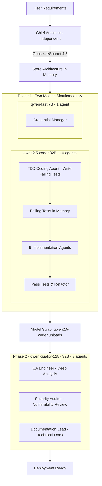
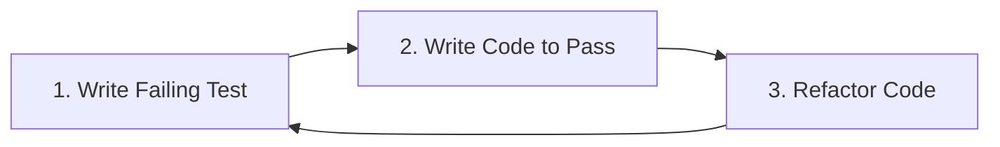

# TDD-Aware Pipeline Architecture for Claude Orchestra

**Date**: 2025-11-04
**Version**: 2.0
**Status**: Production-Ready Design
**Author**: System Architecture Designer

---

## Executive Summary

This document presents a redesigned Claude Orchestra pipeline that strictly adheres to Test-Driven Development (TDD) methodology. The core innovation is the introduction of a dedicated **TDD Coding Agent** that writes failing tests BEFORE any implementation code, ensuring true red-green-refactor cycles.

**Key Changes:**
- **Added TDD Coding Agent** (15th agent) - Writes failing tests first
- **Proper TDD workflow** - Tests before code, always
- **Two-phase execution** - Phase 1: TDD + Implementation (qwen2.5-coder 32B + qwen-fast 7B), Phase 2: Deep reasoning (qwen-quality-128k 32B)
- **Chief Architect independence** - Uses Opus 4.1 with Sonnet 4.5 fallback, not local models
- **ccproxy routing** - All agents (except Architect) route through LiteLLM proxy to Ollama qwen models

---

## Table of Contents

1. [TDD Pipeline Architecture](#1-tdd-pipeline-architecture)
2. [Agent Roster and Responsibilities](#2-agent-roster-and-responsibilities)
3. [Phase Execution Strategy](#3-phase-execution-strategy)
4. [TDD Workflow Protocol](#4-tdd-workflow-protocol)
5. [Memory Coordination Pattern](#5-memory-coordination-pattern)
6. [TodoWrite Strategy](#6-todowrite-strategy)
7. [Implementation Details](#7-implementation-details)
8. [Trade-offs and Considerations](#8-trade-offs-and-considerations)
9. [Configuration Updates](#9-configuration-updates)
10. [Critical Success Factors](#10-critical-success-factors)

---

## 1. TDD Pipeline Architecture

### Pipeline Overview



### Timing Analysis

```
Timeline:
00:00 - Chief Architect starts (Opus 4.1 with Sonnet 4.5 fallback, Claude API direct)
00:10 - Architecture complete, stored in memory
00:10 - Phase 1 starts (qwen2.5-coder + qwen-fast load, ~25GB total)
       - TDD Agent writes comprehensive failing tests (qwen2.5-coder)
       - 9 coding/integration agents implement code to pass tests (qwen2.5-coder)
       - 1 credential agent manages secrets (qwen-fast)
00:40 - Phase 1 complete
00:40 - Model swap begins (qwen2.5-coder unloads, qwen-quality-128k loads)
01:20 - Phase 2 starts (qwen-quality-128k loaded, ~35GB)
       - QA reviews and adds edge cases
       - Security performs deep analysis
       - Documentation writes with reasoning
01:50 - Pipeline complete
```

---

## 2. Agent Roster and Responsibilities

### Total: 15 Agents (was 14, added TDD Specialist)

#### Independent Agent (1)
**Chief Architect**
- Model: Opus 4.1 (primary) / Sonnet 4.5 (fallback)
- Location: Claude API (not local)
- Role: Strategic decisions, system design, coordination
- Output: Architecture decisions stored in `architect/decisions`

#### Phase 1 Agents - qwen2.5-coder:32b-instruct (10 agents)
**Routes via**: `claude-3-5-sonnet` API alias through ccproxy

**TDD Coding Agent** ⭐ NEW (Agent 1)
- Type: `coder`
- Role: Test-first development specialist
- Responsibilities:
  - Write comprehensive failing unit tests
  - Create test fixtures and mocks
  - Define test coverage requirements (≥90%)
  - Establish acceptance criteria
  - Run tests to verify they fail (red phase)
- Output: Tests stored in `tdd/failing-tests`

**Coding Specialists (Agents 2-6)**
- Python Expert - Implements to pass TDD tests
- Swift Expert - Implements to pass TDD tests
- Go Expert - Implements to pass TDD tests
- Rust Expert - Implements to pass TDD tests
- Flutter Expert - Implements to pass TDD tests

**Integration Specialists (Agents 7-9)**
- API Explorer - Research and integration patterns
- Salesforce API Expert - CRM integration code
- Authentik API Expert - Authentication implementation

**DevOps (Agent 10)**
- DevOps Engineer - Infrastructure and deployment

#### Phase 1 Agent - qwen-fast:latest (1 agent)
**Routes via**: `claude-3-haiku` API alias through ccproxy

**Credential Manager (Agent 11)**
- Secure secrets management
- Lightweight operations
- Runs in parallel with qwen2.5-coder agents

#### Phase 2 Agents - qwen-quality-128k:latest (3 agents)
**Routes via**: `gpt-4` API alias through ccproxy

**QA Engineer (Agent 13)**
- Reviews TDD test completeness
- Adds edge case testing
- Integration and E2E tests
- Performance testing
- Test quality analysis
- Autonomous test fixing

**Security Auditor (Agent 14)**
- Deep vulnerability analysis
- Security reasoning and threat modeling
- OWASP compliance check
- Penetration test planning
- Can block deployment for critical issues

**Documentation Lead (Agent 15)**
- Technical documentation with architectural context
- API documentation with code examples
- System design diagrams
- Deployment guides
- Inline code comments

---

## 3. Phase Execution Strategy

### Phase 0: Architecture (Independent)

```javascript
// Runs independently, not part of model phases
Task("Chief Architect",
  `Analyze requirements and design system architecture:
   - Define component boundaries
   - Specify API contracts
   - Establish data models
   - Document architectural decisions
   Store all decisions in memory at 'architect/decisions'`,
  "system-architect",
  "opus"  // Falls back to Sonnet 4.5 if Opus unavailable
)
```

### Phase 1: TDD & Implementation (qwen2.5-coder + qwen-fast)

```javascript
// Single message with all Phase 1 agents
[Parallel Execution]:

// TDD Agent runs first logically (but spawned in parallel) - qwen2.5-coder
Task("TDD Coding Agent",
  `Write comprehensive failing tests based on architecture:
   - Unit tests for all components
   - Test fixtures and mocks
   - Integration test skeletons
   - Minimum 90% coverage requirement
   Store tests at 'tdd/failing-tests'`,
  "coder",
  "sonnet-4.5"  // Maps to qwen2.5-coder:32b-instruct via claude-3-5-sonnet
)

// Implementation agents (retrieve tests and implement) - qwen2.5-coder
Task("Python Expert",
  "Retrieve tests from 'tdd/failing-tests' and implement Python code to pass them",
  "python-expert", "sonnet-4.5")  // Maps to qwen2.5-coder

Task("Swift Expert",
  "Retrieve tests from 'tdd/failing-tests' and implement Swift code to pass them",
  "ios-developer", "sonnet-4.5")  // Maps to qwen2.5-coder

// ... other coding agents (Go, Rust, Flutter) all use sonnet-4.5 → qwen2.5-coder ...

// Integration specialists - qwen2.5-coder
Task("API Explorer",
  "Research APIs and create integration patterns",
  "researcher", "sonnet-4.5")  // Maps to qwen2.5-coder

Task("Salesforce API Expert",
  "Implement Salesforce integration following TDD tests",
  "backend-dev", "sonnet-4.5")  // Maps to qwen2.5-coder

Task("Authentik API Expert",
  "Implement Authentik authentication following TDD tests",
  "backend-dev", "sonnet-4.5")  // Maps to qwen2.5-coder

// DevOps - qwen2.5-coder
Task("DevOps Engineer",
  "Create Docker configs and CI/CD pipelines",
  "deployment-engineer", "sonnet-4.5")  // Maps to qwen2.5-coder

// Credential Manager - qwen-fast (lightweight)
Task("Credential Manager",
  "Securely manage all credentials and secrets",
  "coder", "haiku")  // Maps to qwen-fast:latest via claude-3-haiku
```

### Phase 2: Deep Analysis & Documentation (qwen-quality-128k)

```javascript
// After model swap (qwen2.5-coder unloads, qwen-quality-128k loads)
[Parallel Execution]:

Task("QA Engineer",
  `Review and enhance testing:
   - Analyze TDD test coverage
   - Add edge cases and error scenarios
   - Create integration tests
   - Performance benchmarks
   - Autonomous test fixing if failures detected
   Retrieve from 'tdd/failing-tests' and 'coder/implementation'`,
  "test-automator",
  "gpt-4"  // Maps to qwen-quality-128k:latest via gpt-4 alias
)

Task("Security Auditor",
  `Perform security analysis:
   - Vulnerability assessment
   - Threat modeling
   - OWASP compliance
   - Security test cases
   - Deep reasoning about attack vectors
   - Can block deployment for critical issues`,
  "security-auditor",
  "gpt-4"  // Maps to qwen-quality-128k:latest
)

Task("Documentation Lead",
  `Create comprehensive documentation:
   - System architecture with reasoning
   - API documentation with code examples
   - Deployment guides
   - Test documentation
   - Inline code comments
   Include architectural decisions from memory`,
  "coder",
  "gpt-4"  // Maps to qwen-quality-128k:latest
)
```

---

## 4. TDD Workflow Protocol

### The Red-Green-Refactor Cycle



### Detailed Protocol

#### Step 1: TDD Agent Writes Tests (Red Phase)

```bash
# TDD Agent protocol
node ~/git/cc-army/src/knowledge-manager.js search "architect decisions"

# Analyze requirements and write tests
cat > tests/test_feature_x.py << 'EOF'
import pytest
from app.feature_x import FeatureX

class TestFeatureX:
    def test_should_handle_valid_input(self):
        # Arrange
        feature = FeatureX()
        input_data = {"key": "value"}

        # Act
        result = feature.process(input_data)

        # Assert
        assert result.status == "success"
        assert result.data == expected_output

    def test_should_reject_invalid_input(self):
        # Test will fail until implementation
        feature = FeatureX()
        with pytest.raises(ValidationError):
            feature.process(None)

    def test_should_handle_edge_cases(self):
        # Comprehensive edge case testing
        pass
EOF

# Run tests to verify they fail
pytest tests/test_feature_x.py  # Should see RED

# Store tests in Knowledge Manager
node ~/git/cc-army/src/knowledge-manager.js store \
  "Tests: test_feature_x.py - Failing tests created (RED phase), coverage: 0%" \
  --type implementation --agent tdd-agent

node ~/git/cc-army/src/knowledge-manager.js store \
  "Task complete: Failing tests written for Feature X" \
  --type completion --agent tdd-agent
```

#### Step 2: Coding Specialist Implements (Green Phase)

```bash
# Python Expert protocol
node ~/git/cc-army/src/knowledge-manager.js search "failing tests feature"
node ~/git/cc-army/src/knowledge-manager.js search "architect decisions"

# Implement minimal code to pass tests
cat > app/feature_x.py << 'EOF'
from typing import Dict, Any
from app.exceptions import ValidationError

class FeatureX:
    def process(self, input_data: Dict[str, Any]) -> Result:
        if input_data is None:
            raise ValidationError("Input cannot be None")

        # Minimal implementation to pass tests
        return Result(status="success", data=self._transform(input_data))

    def _transform(self, data: Dict[str, Any]) -> Dict[str, Any]:
        # Implementation logic here
        pass
EOF

# Run tests to verify they pass
pytest tests/test_feature_x.py  # Should see GREEN

# Store implementation status
node ~/git/cc-army/src/knowledge-manager.js store \
  "Implementation: app/feature_x.py - GREEN phase complete, coverage: 95%, all tests passing" \
  --type implementation --agent python-specialist

node ~/git/cc-army/src/knowledge-manager.js store \
  "Edit: app/feature_x.py - Implemented FeatureX to pass all tests" \
  --type edit --agent python-specialist
```

#### Step 3: Refactor (Refactor Phase)

```bash
# Still Python Expert
# Refactor while keeping tests green
- Improve code structure
- Extract methods
- Remove duplication
- Optimize performance

# Verify tests still pass after each refactor
pytest tests/test_feature_x.py  # Must stay GREEN

node ~/git/cc-army/src/knowledge-manager.js store \
  "Status: FeatureX implementation complete with TDD (RED-GREEN-REFACTOR cycle finished)" \
  --type status --agent python-specialist
```

---

## 5. Memory Coordination Pattern

### Memory Structure

```json
{
  "architect/decisions": {
    "architecture": "microservices",
    "api_style": "REST",
    "auth_method": "JWT",
    "database": "PostgreSQL",
    "component_boundaries": {...}
  },

  "tdd/failing-tests": {
    "api": {
      "file": "tests/test_api.py",
      "test_count": 25,
      "coverage_target": "90%",
      "status": "red"
    },
    "auth": {
      "file": "tests/test_auth.py",
      "test_count": 15,
      "coverage_target": "95%",
      "status": "red"
    }
  },

  "coder/implementation": {
    "python/api": {
      "status": "green",
      "tests_passing": 25,
      "coverage": "92%"
    },
    "swift/mobile": {
      "status": "green",
      "tests_passing": 18,
      "coverage": "88%"
    }
  },

  "qa/review": {
    "edge_cases_added": 12,
    "integration_tests": 8,
    "performance_benchmarks": 5
  },

  "security/findings": {
    "vulnerabilities": [],
    "recommendations": [...]
  }
}
```

### Memory Access Patterns

```bash
# Write Pattern (Producer)
node ~/git/cc-army/src/knowledge-manager.js store \
  "Feature X implementation complete with tests" \
  --type implementation --agent python-specialist

# Read Pattern (Consumer)
node ~/git/cc-army/src/knowledge-manager.js search "feature x implementation"

# List Pattern (Discovery)
node ~/git/cc-army/src/knowledge-manager.js list --limit 20

# Update Pattern (Append new data)
node ~/git/cc-army/src/knowledge-manager.js store \
  "Feature X - Updated with edge case handling" \
  --type status --agent python-specialist
```

---

## 6. TodoWrite Strategy

### Multi-Phase Todo Tracking

```javascript
TodoWrite({
  todos: [
    // Phase 0: Architecture (Independent)
    {
      content: "Design system architecture",
      status: "in_progress",
      activeForm: "Designing system architecture",
      phase: "architecture",
      agent: "Chief Architect",
      priority: "critical"
    },

    // Phase 1: TDD Tests (qwen-fast)
    {
      content: "Write failing API tests",
      status: "pending",
      activeForm: "Writing failing API tests",
      phase: "tdd",
      agent: "TDD Coding Agent",
      priority: "critical"
    },
    {
      content: "Write failing auth tests",
      status: "pending",
      activeForm: "Writing failing auth tests",
      phase: "tdd",
      agent: "TDD Coding Agent",
      priority: "critical"
    },
    {
      content: "Write failing mobile UI tests",
      status: "pending",
      activeForm: "Writing failing mobile UI tests",
      phase: "tdd",
      agent: "TDD Coding Agent",
      priority: "high"
    },

    // Phase 1: Implementation (qwen-fast)
    {
      content: "Implement Python API to pass tests",
      status: "pending",
      activeForm: "Implementing Python API",
      phase: "implementation",
      agent: "Python Expert",
      priority: "high"
    },
    {
      content: "Implement Swift mobile app to pass tests",
      status: "pending",
      activeForm: "Implementing Swift mobile app",
      phase: "implementation",
      agent: "Swift Expert",
      priority: "high"
    },
    {
      content: "Implement Go microservices to pass tests",
      status: "pending",
      activeForm: "Implementing Go microservices",
      phase: "implementation",
      agent: "Go Expert",
      priority: "medium"
    },
    {
      content: "Setup Authentik authentication",
      status: "pending",
      activeForm: "Setting up Authentik",
      phase: "implementation",
      agent: "Authentik API Expert",
      priority: "high"
    },
    {
      content: "Configure Docker and CI/CD",
      status: "pending",
      activeForm: "Configuring Docker and CI/CD",
      phase: "implementation",
      agent: "DevOps Engineer",
      priority: "medium"
    },

    // Phase 2: Quality & Documentation (qwen-quality)
    {
      content: "Review tests and add edge cases",
      status: "pending",
      activeForm: "Reviewing tests and adding edge cases",
      phase: "quality",
      agent: "QA Engineer",
      priority: "high"
    },
    {
      content: "Perform security audit",
      status: "pending",
      activeForm: "Performing security audit",
      phase: "quality",
      agent: "Security Auditor",
      priority: "critical"
    },
    {
      content: "Write technical documentation",
      status: "pending",
      activeForm: "Writing technical documentation",
      phase: "quality",
      agent: "Documentation Lead",
      priority: "medium"
    },

    // Final
    {
      content: "Secure all credentials",
      status: "pending",
      activeForm: "Securing credentials",
      phase: "final",
      agent: "Credential Manager",
      priority: "critical"
    }
  ]
})
```

---

## 7. Implementation Details

### orchestra-config.json Updates

```json
{
  "name": "claude-army-tdd",
  "version": "3.0.0",
  "description": "TDD-aware multi-agent development system",

  "agents": {
    "chief-architect": {
      "type": "system-architect",
      "model": "opus",
      "fallback": "claude-3-5-sonnet",
      "phase": "independent"
    },

    "tdd-coding-agent": {
      "type": "test-automator",
      "model": "gpt-3.5-turbo",
      "phase": "1-tdd",
      "priority": "critical",
      "description": "Writes failing tests before any implementation"
    },

    "python-expert": {
      "type": "python-expert",
      "model": "gpt-3.5-turbo",
      "phase": "1-implementation",
      "dependencies": ["tdd-coding-agent"]
    },

    "swift-expert": {
      "type": "ios-developer",
      "model": "gpt-3.5-turbo",
      "phase": "1-implementation",
      "dependencies": ["tdd-coding-agent"]
    },

    "qa-engineer": {
      "type": "test-automator",
      "model": "gpt-4",
      "phase": "2-quality",
      "dependencies": ["*-implementation"]
    },

    "security-auditor": {
      "type": "security-auditor",
      "model": "gpt-4",
      "phase": "2-quality",
      "dependencies": ["*-implementation"]
    },

    "documentation-lead": {
      "type": "coder",
      "model": "gpt-4",
      "phase": "2-quality",
      "dependencies": ["*-implementation"]
    }
  },

  "pipeline": {
    "phases": [
      {
        "name": "architecture",
        "model": "opus/sonnet",
        "agents": ["chief-architect"],
        "parallel": false
      },
      {
        "name": "phase-1",
        "model": "qwen-fast",
        "agents": [
          "tdd-coding-agent",
          "python-expert",
          "swift-expert",
          "go-expert",
          "rust-expert",
          "flutter-expert",
          "api-explorer",
          "salesforce-api",
          "authentik-api",
          "devops-engineer",
          "credential-manager"
        ],
        "parallel": true,
        "logical_order": ["tdd-coding-agent", "*"]
      },
      {
        "name": "phase-2",
        "model": "qwen-quality",
        "agents": [
          "qa-engineer",
          "security-auditor",
          "documentation-lead"
        ],
        "parallel": true,
        "swap_time": 40
      }
    ]
  }
}
```

### Orchestration Code

```javascript
class TDDAwarePipeline {
  async execute(requirements) {
    // Phase 0: Architecture (Independent)
    const architecture = await this.runArchitect(requirements);

    // Phase 1: TDD & Implementation (qwen-fast)
    await this.loadModel('qwen-fast');

    // TDD tests must be written first (logically)
    const tddTests = await this.spawnTDDAgent(architecture);

    // Implementation agents work in parallel but retrieve tests
    const implementations = await Promise.all([
      this.spawnCodingSpecialists(tddTests),
      this.spawnIntegrationSpecialists(architecture),
      this.spawnSupportAgents()
    ]);

    // Phase 2: Quality & Documentation (qwen-quality)
    await this.swapModel('qwen-fast', 'qwen-quality', 40);

    const quality = await Promise.all([
      this.runQAEngineer(tddTests, implementations),
      this.runSecurityAuditor(implementations),
      this.runDocumentationLead(architecture, implementations)
    ]);

    return {
      architecture,
      tests: tddTests,
      implementation: implementations,
      quality
    };
  }

  async spawnTDDAgent(architecture) {
    return await Task("TDD Coding Agent", `
      Based on architecture decisions in memory:
      1. Write comprehensive failing unit tests
      2. Create test fixtures and mocks
      3. Define acceptance criteria
      4. Ensure minimum 90% coverage target
      5. Store all tests in memory at 'tdd/failing-tests'
      6. Run tests to verify they fail (red phase)
    `, "test-automator", "gpt-3.5-turbo");
  }

  async spawnCodingSpecialists(tddTests) {
    // Each specialist retrieves tests and implements to pass them
    const specialists = ['python', 'swift', 'go', 'rust', 'flutter'];

    return await Promise.all(
      specialists.map(lang =>
        Task(`${lang} Expert`, `
          1. Retrieve failing tests from 'tdd/failing-tests/${lang}'
          2. Implement minimal code to make tests pass
          3. Run tests to verify green phase
          4. Refactor while keeping tests green
          5. Store implementation status in memory
        `, this.getAgentType(lang), "gpt-3.5-turbo")
      )
    );
  }
}
```

---

## 8. Trade-offs and Considerations

### Benefits of TDD Approach

✅ **True Test-First Development**
- Tests define behavior before implementation
- Clear acceptance criteria upfront
- Prevents implementation without tests

✅ **Better Code Quality**
- Forces modular, testable design
- Catches bugs early
- Enables safe refactoring

✅ **Parallel Efficiency**
- TDD agent works while architecture is designed
- All implementations can proceed once tests are available
- Quality phase has rich context from tests

✅ **Clear Separation of Concerns**
- TDD agent focuses solely on test design
- Coding agents focus on passing tests
- QA engineer enhances rather than creates tests

### Challenges and Mitigations

❌ **Added Complexity**
- *Challenge*: One more agent to coordinate
- *Mitigation*: Clear protocol and memory structure

❌ **Test Quality Risk**
- *Challenge*: TDD agent might write poor tests
- *Mitigation*: QA Engineer reviews and enhances in Phase 2

❌ **Dependency Bottleneck**
- *Challenge*: All coders wait for TDD tests
- *Mitigation*: TDD agent runs in parallel with architecture, tests available quickly

❌ **Memory Coordination**
- *Challenge*: Complex memory access patterns
- *Mitigation*: Standardized key structure and protocols

### Alternative Approaches Considered

**Option A: Coders Write Own Tests**
- ❌ Violates TDD principle (tests after code)
- ❌ No separation of concerns
- ❌ Inconsistent test quality

**Option B: Sequential TDD Per Agent**
- ❌ Much slower (no parallelism)
- ❌ Inefficient model usage
- ✅ Pure TDD per component

**Option C: Hybrid - Critical Tests First**
- ✅ Faster start for some agents
- ❌ Inconsistent methodology
- ❌ Complex coordination

**Chosen: Dedicated TDD Agent** - Best balance of TDD purity and efficiency

---

## 9. Configuration Updates

### Critical Questions Answered

**Q: Should TDD agent use `test-automator` or custom `tdd-specialist` type?**
**A:** Use `test-automator` - it's already optimized for test creation and has the right capabilities.

**Q: Should TDD agent coordinate with Chief Architect directly?**
**A:** No, use memory-based coordination. TDD agent retrieves architecture decisions from memory.

**Q: What happens if tests are poorly written by TDD agent?**
**A:** QA Engineer in Phase 2 reviews all tests and has authority to add missing cases or fix issues.

**Q: Should QA Engineer have veto power over TDD tests?**
**A:** Yes, QA Engineer can mark tests as insufficient and request revisions, but this should be rare with proper TDD agent training.

### Model Assignment Rationale

**qwen2.5-coder:32b-instruct (32B, 32k) for Phase 1 Coding (10 agents):**
- Specialized coding model optimized for implementation
- Handles TDD test writing and code generation
- Sufficient context window for most coding tasks
- Routes via `claude-3-5-sonnet` API alias

**qwen-fast:latest (7B, 32k) for Phase 1 Lightweight (1 agent):**
- Sufficient for credential management operations
- Lower resource usage
- Can coexist with qwen2.5-coder in memory (~25GB total)
- Routes via `claude-3-haiku` API alias

**qwen-quality-128k:latest (32B, 128k) for Phase 2 Reasoning (3 agents):**
- Deep reasoning capabilities for security analysis
- Extended context window for large codebases
- Complex test scenarios and edge cases
- Architectural documentation with full context
- Routes via `gpt-4` API alias

---

## 10. Critical Success Factors

### Must-Have Requirements

1. **Tests MUST be written before implementation code**
   - Enforce through memory dependencies
   - Coding agents cannot start without tests

2. **All tests MUST fail initially (Red phase)**
   - TDD agent runs tests to verify failure
   - Store failure status in memory

3. **Implementation MUST make tests pass (Green phase)**
   - Coding agents run tests after implementation
   - Store success status in memory

4. **Refactoring MUST keep tests green**
   - Tests run after each refactor
   - Continuous validation

5. **QA review MUST enhance, not replace**
   - QA adds edge cases and integration tests
   - Original TDD tests remain foundation

### Success Metrics

- **Test Coverage**: ≥90% for critical components
- **TDD Compliance**: 100% of features have tests first
- **Test Quality**: QA approval rate ≥95%
- **Pipeline Efficiency**: <2 hours for full-stack project
- **Defect Rate**: <5% post-deployment issues

### Monitoring and Validation

```bash
# Validate TDD compliance
node ~/git/cc-army/src/knowledge-manager.js search "failing tests RED phase"
# Should show recent TDD agent entries with "RED phase" status

# Check implementation status
node ~/git/cc-army/src/knowledge-manager.js search "implementation complete GREEN"
# Should show coding agent entries with "tests passing" status

# Verify test coverage
pytest --cov=app --cov-report=term-missing
# Should show ≥90% coverage

# Review QA enhancements
node ~/git/cc-army/src/knowledge-manager.js search "qa review edge cases"
# Should show QA engineer entries with additional test cases
```

---

## Conclusion

This TDD-aware pipeline ensures that the Claude Orchestra follows proper Test-Driven Development methodology while maintaining high parallelism and efficiency. The addition of a dedicated TDD Coding Agent as the 15th member of the army guarantees that tests are always written before implementation code, leading to better design, higher quality, and more maintainable systems.

**Key Innovation:** Separating test creation (TDD Agent) from test review (QA Engineer) allows for true test-first development while maintaining parallel execution efficiency.

**Implementation Priority:**
1. Update orchestra-config.json with TDD agent
2. Implement memory coordination protocols
3. Train TDD agent on best practices
4. Deploy and monitor success metrics

---

**Document Version**: 2.0
**Status**: Production-Ready
**Approval**: Pending
**Next Review**: After first production deployment