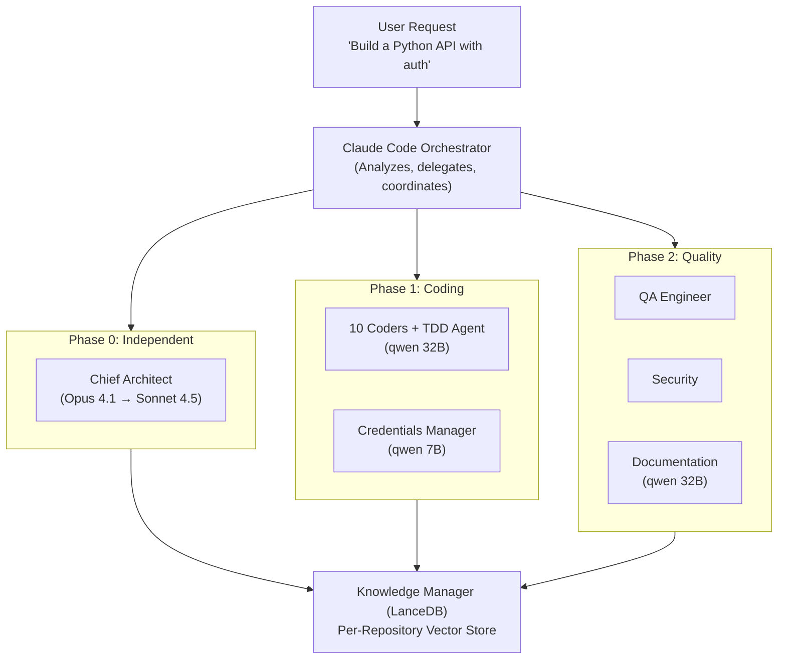
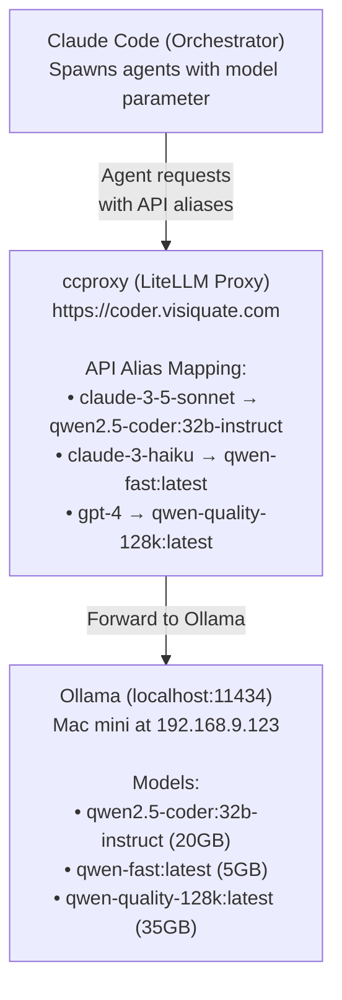
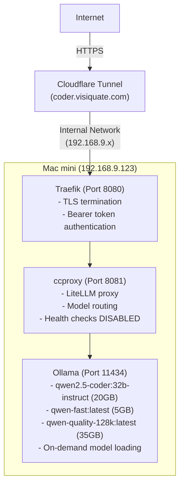

# Claude Orchestra - Technical Overview

**Version**: 2.1.0 (Reconciliation Edition)
**Audience**: Software engineers, technical leads, DevOps engineers
**Last Updated**: 2025-11-11
**Status**: Post-Reconciliation - 119 agents, 37 Sonnet (31.1%), 81 Haiku (68.1%)

## Table of Contents

1. [Executive Summary](#executive-summary)
2. [System Architecture](#system-architecture)
3. [How It Works](#how-it-works)
4. [Technology Stack](#technology-stack)
5. [Agent Types and Specialties](#agent-types-and-specialties)
6. [Coordination & Memory](#coordination--memory)
7. [Usage Patterns](#usage-patterns)
8. [Performance Characteristics](#performance-characteristics)
9. [Security & Credentials](#security--credentials)
10. [Deployment Architecture](#deployment-architecture)

---

## Executive Summary

Claude Orchestra is a comprehensive multi-agent development system featuring **118 specialized AI agents** organized across **15 agent types** in a TDD-aware pipeline. It's designed to accelerate software development by parallelizing work across diverse specialists—backend developers, security auditors, documentation writers, and quality assurance engineers.

**Post-Reconciliation (v2.1.0)**:
- **119 agents** (deduplicated, consolidated)
- **37 Sonnet agents** (31.1%) - Intelligent managers, reviewers, complex coding
- **81 Haiku agents** (68.1%) - Cost-optimized basic coders and utilities
- **Cost optimization**: 68% of agents use efficient Haiku model
- **$300-450/month savings** through local LLM routing

**Key Innovation**: A dedicated TDD Coding Agent ensures tests are written BEFORE implementation, maintaining true test-driven development practices while achieving 2.8-4.4x speed improvements through parallel execution.

**Core Capabilities**:
- Test-Driven Development with dedicated test-automator type
- Parallel agent execution with 119 specialized agents
- Persistent knowledge base surviving conversation compactions
- Cross-repository deployment (works from any directory)
- Local LLM routing for cost efficiency (via ccproxy)
- Intelligent type specialization for improved agent selection
- Automatic trigger detection based on task complexity

---

## System Architecture

### High-Level Architecture



### Component Breakdown

#### 1. Orchestrator (Claude Code)
- **Role**: Analyzes requirements, selects agents, coordinates execution
- **Model**: Sonnet 4.5 (orchestration only, not coding)
- **Responsibilities**:
  - Parse user requests
  - Detect task complexity
  - Select appropriate agents
  - Spawn agents in parallel
  - Synthesize results
  - Manage compaction lifecycle

#### 2. Agent Fleet (118 Specialized Agents Across 15 Types)
Organized in 3 phases with comprehensive specialization:

**Phase 0: Leadership (1 Agent)**
- Chief Architect (system-architect type) - Strategic decisions and coordination

**Phase 1: Implementation (36 Sonnet + 80 Haiku = 116 Agents)**
Core Specialists:
- **Test Automation**: TDD Coding Agent and QA testers (test-automator type)
- **Backend Development**: Database specialists, API experts, language specialists (backend-dev type)
- **Security**: API security auditors, penetration testers, compliance specialists (security-auditor type)
- **Architecture**: Next.js experts, GraphQL architects, legacy modernizers (system-architect type)
- **Research**: Researchers, analysts, fact checkers, protocol specialists (researcher type)
- **DevOps**: Cloud migration, Terraform, monitoring, incident response (deployment-engineer type)
- **Documentation**: Technical writers, API documenters, changelog generators (technical-writer type)
- **Support**: Utilities, workflow automation, credentials management, CLI tools (various types)

**Phase 2: Quality Assurance (2 Sonnet + 1 Haiku = 3 Agents - Reasoning Tasks)**
- QA Engineer (test-automator) - Comprehensive test review and enhancement
- Security Auditor (security-auditor) - Deep vulnerability analysis and threat modeling
- Documentation Lead (technical-writer) - System documentation and guides

#### 3. Knowledge Manager
- **Storage**: LanceDB vector database
- **Structure**: Per-repository isolation
- **Features**: Semantic search, compaction resilience
- **Location**: `data/knowledge/{repo-name}/`

#### 4. Model Router (ccproxy)
- **Function**: Routes agent requests to local Ollama models
- **Deployment**: Mac mini at 192.168.9.123
- **Public URL**: https://coder.visiquate.com
- **Technology**: LiteLLM proxy with Traefik

---

## How It Works

### 1. Task Delegation Flow


### 2. Agent Coordination Protocol

Every agent follows this protocol:

**Before Work:**
```bash
# Search Knowledge Manager for relevant context
node ~/git/cc-orchestra/src/knowledge-manager.js search "architect decisions"
node ~/git/cc-orchestra/src/knowledge-manager.js search "test specifications"
```

**During Work:**
```bash
# Store progress and decisions
node ~/git/cc-orchestra/src/knowledge-manager.js store \
  "Implemented JWT authentication with RS256" \
  --type implementation --agent python-specialist
```

**After Work:**
```bash
# Document completion
node ~/git/cc-orchestra/src/knowledge-manager.js store \
  "Task complete: API authentication ready" \
  --type completion --agent python-specialist
```

### 3. TDD Workflow

The system enforces true Test-Driven Development:

```
1. Chief Architect designs system architecture
   └─> Stores decisions in Knowledge Manager

2. TDD Coding Agent writes comprehensive failing tests
   └─> Stores test specifications in Knowledge Manager
   └─> Runs tests to verify RED phase

3. Language specialists implement code to pass tests
   └─> Retrieve tests from Knowledge Manager
   └─> Implement minimal code for GREEN phase
   └─> Refactor while keeping tests GREEN
   └─> Store implementation status

4. QA Engineer reviews and enhances (Phase 2)
   └─> Adds edge cases and integration tests
   └─> Ensures comprehensive coverage
   └─> Autonomous test fixing if needed

5. Security Auditor reviews implementation
   └─> Can block deployment for critical issues

6. Documentation Lead creates technical docs
   └─> Includes architectural reasoning
```

### 4. Cross-Repository Deployment

The orchestra works from **any directory**:

```bash
# Orchestra config lives in a fixed location
/Users/brent/git/cc-orchestra/

# But operates in the current working directory
cd ~/git/my-project
# Orchestra automatically uses my-project as context

cd ~/git/another-project
# Orchestra now uses another-project as context
```

**How it works:**
1. Global `~/.claude/CLAUDE.md` defines trigger patterns
2. Orchestra config in `cc-orchestra/config/orchestra-config.json`
3. Knowledge Manager creates per-repo databases in `cc-orchestra/data/knowledge/`
4. Agents execute in the current working directory
5. Each repository gets isolated knowledge context

---

## Technology Stack

### Core Technologies

| Component | Technology | Purpose |
|-----------|-----------|---------|
| Orchestration | Claude Code (Sonnet 4.5) | Task coordination |
| Chief Architect | Claude Opus 4.1 | Strategic decisions (direct API) |
| Phase 1 Core (36 Sonnet) | qwen2.5-coder:32b-instruct | TDD + Implementation |
| Phase 1 Lightweight (80 Haiku) | qwen-fast:latest (7B) | Basic coding, utilities |
| Phase 2 Reasoning (2 Sonnet) | qwen-quality-128k:latest (32B) | QA, Security analysis |
| Phase 2 Docs (1 Haiku) | qwen-fast:latest | Documentation |
| Knowledge Store | LanceDB | Vector database |
| Model Routing | LiteLLM (ccproxy) | OpenAI-compatible proxy |
| Embeddings | Sentence transformers | 384-dimensional vectors |
| Deployment | Mac mini + Traefik | Local LLM infrastructure |

### Model Routing Architecture



**Key Points:**
- Agents never know they're using local models
- All routing is transparent through ccproxy
- Model swapping happens automatically based on memory
- Health checks disabled to prevent model thrashing

### LanceDB Structure

```
data/knowledge/
├── statushub/
│   └── orchestra_knowledge/     # LanceDB table
│       ├── data/            # Parquet files
│       ├── _versions/       # Version control
│       └── _indices/        # Vector indices
├── cc-orchestra/
│   └── orchestra_knowledge/
└── other-repo/
    └── orchestra_knowledge/
```

**Schema:**
- `id`: Unique identifier
- `vector`: 384-dimensional embedding
- `text`: Knowledge content
- `type`: Category (architecture, decision, implementation, etc.)
- `project_id`: Repository name
- `agent`: Agent that created it
- `timestamp`: Creation time
- `metadata`: Additional context

---

## Agent Types and Specialties

### Phase 0: Independent

#### Chief Architect
- **Model**: Claude Opus 4.1 (fallback: Sonnet 4.5)
- **Routing**: Direct Claude API (not via ccproxy)
- **Type**: `system-architect`
- **Specialties**:
  - System design and architecture
  - Technology stack selection
  - API contract design
  - Strategic decision-making
  - Agent coordination
  - Compaction management
- **Authority**: Can approve/reject all agent work
- **Output**: Architecture decisions stored in Knowledge Manager

### Phase 1: Coding Specialists (qwen2.5-coder:32b-instruct)

**API Alias**: `claude-3-5-sonnet` via ccproxy
**Memory**: ~20GB
**Context**: 32k tokens

#### 1. TDD Coding Agent
- **Type**: `coder`
- **Role**: Write failing tests BEFORE any implementation
- **Specialties**:
  - Red-Green-Refactor cycle
  - Unit test design
  - Test fixtures and mocks
  - Acceptance criteria
  - Test coverage analysis (≥90% target)
- **Output**: Comprehensive failing test suite
- **Dependencies**: Architecture decisions

#### 2-6. Language Specialists
Each specialist implements code to pass TDD tests:

- **Python Expert** (`python-expert`)
  - FastAPI, Django, Flask
  - Data processing, ML/AI
  - Async/await patterns
  - SQLAlchemy, Pydantic

- **Swift Expert** (`ios-developer`)
  - SwiftUI, UIKit
  - Core Data, Combine
  - iOS app architecture
  - Native integrations

- **Go Expert** (`backend-dev`)
  - Microservices, gRPC
  - Concurrency patterns
  - Cloud-native applications
  - Performance optimization

- **Rust Expert** (`backend-dev`)
  - Systems programming
  - Memory safety
  - WebAssembly
  - Performance-critical code

- **Flutter Expert** (`mobile-developer`)
  - Cross-platform mobile
  - State management (Bloc, Riverpod)
  - Native integrations
  - UI/UX implementation

#### 7-9. Integration Specialists

- **API Explorer** (`researcher`)
  - REST/GraphQL API exploration
  - OpenAPI/Swagger documentation
  - Rate limiting strategies
  - Webhook integration
  - API performance testing

- **Salesforce API Expert** (`backend-dev`)
  - Salesforce REST/SOAP API
  - SOQL query optimization
  - OAuth 2.0 with Salesforce
  - Bulk API operations
  - Change Data Capture

- **Authentik API Expert** (`backend-dev`)
  - OAuth2/OIDC flows
  - SAML 2.0 integration
  - User provisioning
  - Policy engine integration
  - Multi-factor authentication

#### 10. DevOps Engineer
- **Type**: `deployment-engineer`
- **Specialties**:
  - Docker, Kubernetes
  - CI/CD pipelines
  - Infrastructure as Code
  - AWS/Azure/GCP
  - Monitoring and logging

### Phase 1: Lightweight (qwen-fast:latest)

**API Alias**: `claude-3-haiku` via ccproxy
**Memory**: ~5GB
**Context**: 32k tokens

#### 11. Credential Manager
- **Type**: `coder`
- **Specialties**:
  - AES-256-CBC encryption
  - Secure secrets management
  - Rotation tracking
  - Expiration monitoring
  - Never stores secrets in git
- **Runs in parallel with Phase 1 coding agents**
- **Total Phase 1 memory**: ~25GB (qwen2.5-coder + qwen-fast)

### Phase 2: Reasoning & Quality (qwen-quality-128k:latest)

**API Alias**: `gpt-4` via ccproxy
**Memory**: ~35GB
**Context**: 128k tokens (extended for deep analysis)

#### 13. QA Engineer
- **Type**: `test-automator`
- **Specialties**:
  - Test review and enhancement
  - Edge case identification
  - Integration and E2E testing
  - Performance benchmarking
  - Autonomous test fixing
  - Test quality analysis
- **Authority**: Can require test improvements

#### 14. Security Auditor
- **Type**: `security-auditor`
- **Specialties**:
  - Vulnerability assessment
  - Threat modeling
  - OWASP compliance
  - Penetration test planning
  - Security best practices
  - Code security review
- **Authority**: Can block deployment for critical issues

#### 15. Documentation Lead
- **Type**: `coder`
- **Specialties**:
  - Technical documentation
  - API reference with examples
  - Architecture diagrams
  - Deployment guides
  - Inline code comments
  - System design reasoning

---

## Coordination & Memory

### Knowledge Manager Integration

The Knowledge Manager provides persistent, searchable memory across compactions.

#### Storage Operations

```javascript
// Store knowledge
await knowledgeManager.store({
  text: "We chose PostgreSQL for ACID compliance and JSON support",
  type: "decision",
  agent: "architect"
});

// Search knowledge
const results = await knowledgeManager.search("database schema", {
  limit: 5
});

// Get project statistics
const stats = await knowledgeManager.getStats();
```

#### Knowledge Types

| Type | Purpose | Example |
|------|---------|---------|
| `architecture` | System design decisions | "3-tier architecture with React, Go, PostgreSQL" |
| `decision` | Important choices | "Chose OAuth2 over JWT for token revocation" |
| `implementation` | What was built | "Rate limiting with Redis, 100 req/min" |
| `configuration` | Settings and parameters | "Database pool: min=5, max=20" |
| `credential` | Secrets management info | "API keys in env vars, rotated monthly" |
| `issue` | Problems and solutions | "Fixed memory leak in WebSocket handler" |
| `pattern` | Reusable patterns | "Repository pattern for domain isolation" |
| `general` | Other information | "Project uses semantic versioning" |

#### Pre-Compaction Hook

Automatically triggered at 80% context usage:

```javascript
// Extracts critical knowledge before compaction
const result = await orchestra.preCompactionHook(conversation, {
  project_id: repoName,
  session_id: sessionId
});

// Result: { success: true, count: 15, ids: [...] }
```

**Process:**
1. Analyze conversation for critical information
2. Classify by knowledge type
3. Attribute to creating agent
4. Generate vector embeddings
5. Store in repository-specific LanceDB
6. Backup to MCP memory

#### Post-Compaction Hook

Automatically triggered after compaction:

```javascript
// Retrieves relevant context after compaction
const context = await orchestra.postCompactionHook('Implement authentication', {
  project_id: repoName
});

// Result: { searchResults: [...], recentKnowledge: [...], summary: {...} }
```

**Process:**
1. Semantic search for relevant knowledge
2. Retrieve recent project activity
3. Synthesize context
4. Generate actionable summary
5. Restore agent context

### Memory-Based Coordination

Agents coordinate through shared knowledge:

```
TDD Agent
  └─> Stores: "Tests written for authentication feature"

Python Expert
  └─> Reads: "Tests written for authentication feature"
  └─> Stores: "Implemented authentication, all tests passing"

Security Auditor
  └─> Reads: "Implemented authentication"
  └─> Stores: "Security review complete, approved"

Documentation Lead
  └─> Reads: All above
  └─> Stores: "Authentication documentation complete"
```

**Key Benefits:**
- No direct agent-to-agent communication needed
- All knowledge persists across compactions
- Semantic search finds relevant context
- Per-repository isolation prevents cross-contamination

---

## Usage Patterns

### Automatic Trigger Detection

The orchestra automatically activates based on task complexity.

#### Trigger Patterns (Activates Orchestra)

✅ **Full-Stack Applications**
```
User: "Build a mobile app with Flutter frontend and Go backend"
→ Spawns: Architect, TDD, Flutter Expert, Go Expert, QA, Security, DevOps, Docs
```

✅ **Multi-Technology Projects**
```
User: "Create microservices in Python and Rust with PostgreSQL"
→ Spawns: Architect, TDD, Python Expert, Rust Expert, QA, Security, DevOps, Docs
```

✅ **Complex Features**
```
User: "Implement OAuth2 authentication with Authentik"
→ Spawns: Architect, TDD, Authentik Expert, Python/Go, QA, Security, Credentials, Docs
```

✅ **DevOps & Deployment**
```
User: "Deploy to AWS ECS with CI/CD"
→ Spawns: Architect, DevOps, Security, Docs
```

✅ **Enterprise Integration**
```
User: "Sync Salesforce data to our database"
→ Spawns: Architect, TDD, Salesforce Expert, Python, QA, Security, Credentials, Docs
```

#### Bypass Patterns (Simple Execution)

❌ **Single-File Changes**
```
User: "Fix typo in README"
→ Direct execution, no orchestra
```

❌ **Simple Queries**
```
User: "What does this function do?"
→ Direct analysis, no orchestra
```

❌ **Basic Operations**
```
User: "Run tests"
→ Direct bash execution, no orchestra
```

### Explicit Invocation

Always available:

```
User: "Use the Claude Orchestra to implement this feature"
User: "Deploy the full orchestra for this task"
User: "I want the 15-agent team working on this"
```

### Agent Selection Examples

#### Minimal API Project (6 agents)
```
- Chief Architect
- TDD Coding Agent
- Python Expert
- QA Engineer
- Security Auditor
- Credential Manager
```

#### Full-Stack Mobile App (11 agents)
```
- Chief Architect
- TDD Coding Agent
- Python Expert (backend)
- Flutter Expert (mobile)
- Authentik API Expert (auth)
- DevOps Engineer
- Credential Manager
- QA Engineer
- Security Auditor
- Documentation Lead
```

#### Enterprise Integration (All 15 agents)
```
All agents including Salesforce/Authentik specialists
```

### Project-Specific Customization

Create `CLAUDE.md` in project root:

```markdown
# Project: StatusHub

## Claude Orchestra Configuration

### Required Agents
- Python Expert (Flask backend)
- Documentation Lead
- DevOps Engineer (Docker deployment)
- Security Auditor

### Technology Stack
- Backend: Python 3.11 + Flask
- Deployment: Docker + Watchtower
- Monitoring: Health endpoints

### Custom Triggers
- Always use TDD for API endpoints
- Security review required for all auth changes
```

---

## Performance Characteristics

### Speed Improvements

**Sequential Development**: 8 hours
```
1. Design → 30 min
2. Write tests → 45 min
3. Implement → 4 hours
4. Test → 1 hour
5. Security review → 45 min
6. Documentation → 1 hour
```

**Claude Orchestra**: 2 hours (2.8-4.4x faster)
```
Phase 0: Architecture → 10 min
Phase 1: TDD + Implementation (parallel) → 40 min
Phase 2: QA + Security + Docs (parallel) → 40 min
Total: ~1.5-2 hours
```

### Resource Usage

#### Memory Profile

**Phase 1**: 25GB total
- qwen2.5-coder:32b-instruct (20GB) - 36 Sonnet agents
- qwen-fast:latest (5GB) - 80 Haiku agents
- Both loaded simultaneously ✅

**Model Swap**: ~40 seconds
- qwen2.5-coder unloads
- qwen-quality-128k loads

**Phase 2**: 35GB total
- qwen-quality-128k:latest (35GB) - 2 Sonnet (QA, Security) + 1 Haiku (Docs)

#### Token Efficiency

- **Knowledge Manager**: ~32% token reduction
  - Shared context via vector database
  - No repetitive information in prompts
  - Semantic search instead of full context

- **Model Optimization**:
  - Phase 1: 32k context (sufficient for most coding)
  - Phase 2: 128k context (comprehensive analysis)
  - No wasted tokens on unnecessary context

#### Timing Breakdown

```
Total: ~70 minutes for complex full-stack app

00:00 - Chief Architect (Opus/Sonnet)
00:10 - Phase 1 starts (qwen2.5-coder + qwen-fast)
       ├─ TDD tests written
       ├─ All implementations in parallel
       └─ Credentials managed
00:40 - Model swap (qwen2.5 → qwen-quality)
00:41 - Phase 2 starts (qwen-quality-128k)
       ├─ QA review and enhancement
       ├─ Security analysis
       └─ Documentation
01:10 - Pipeline complete
```

### Scalability

| Project Size | Agents Used | Time | Notes |
|--------------|-------------|------|-------|
| Single API endpoint | 6 agents | ~20 min | TDD, Python, QA, Security, Creds, Docs |
| REST API with auth | 8 agents | ~45 min | Add Authentik, DevOps |
| Full-stack mobile app | 11 agents | ~1.5 hr | Add Flutter, Go |
| Enterprise integration | 15 agents | ~2 hr | All agents |

---

## Security & Credentials

### Credential Manager Agent

**Responsibilities:**
- Secure storage using AES-256-CBC encryption
- Rotation tracking and expiration monitoring
- Environment variable management
- Never commits secrets to git

**Usage:**
```bash
# Store credential
npm run credentials store db_password "secret123" database

# Retrieve credential
npm run credentials retrieve db_password

# List all credentials
npm run credentials list

# Check rotation status
npm run credentials check-rotation
```

**Storage Location:** `/tmp/credentials.json` (development)
**Production:** Environment variables only

### Security Auditor Integration

**Capabilities:**
- OWASP Top 10 compliance checking
- Threat modeling
- Vulnerability assessment
- Penetration test planning
- Security best practices enforcement

**Authority Levels:**
- **Low Risk**: Auto-approve minor changes
- **Medium Risk**: Requires documentation
- **High Risk**: Can block deployment

**Example Workflow:**
```
1. Python Expert implements authentication
2. Security Auditor reviews code
3. Finds issue: "Password stored in plaintext"
4. Status: BLOCKED ⛔
5. Python Expert fixes: Use bcrypt hashing
6. Security Auditor re-reviews
7. Status: APPROVED ✅
```

### Best Practices

**Never Hardcode Secrets:**
```python
# ❌ WRONG
API_KEY = "sk-1234567890abcdef"

# ✅ CORRECT
API_KEY = os.getenv("API_KEY")
```

**Use Credential Manager:**
```javascript
// Store during setup
await credentialManager.store("salesforce_api_key", value, "api");

// Retrieve in code
const apiKey = await credentialManager.retrieve("salesforce_api_key");
```

**Security Review Required:**
- All authentication implementations
- API key management
- Database credentials
- Third-party integrations
- File upload handling
- User input processing

---

## Deployment Architecture

### Infrastructure Overview



### Model Routing Configuration

**Location**: `/Users/brent/git/cc-orchestra/config/ccproxy/ccproxy-config-tdd-pipeline.yaml`

```yaml
model_list:
  # Phase 1: 36 Sonnet agents (TDD, implementation, integration)
  - model_name: claude-3-5-sonnet
    litellm_params:
      model: ollama/qwen2.5-coder:32b-instruct
      api_base: http://localhost:11434

  # Phase 1: 80 Haiku agents (basic coding, utilities, lightweight tasks)
  - model_name: claude-3-haiku
    litellm_params:
      model: ollama/qwen-fast:latest
      api_base: http://localhost:11434

  # Phase 2: 2 Sonnet + 1 Haiku (reasoning, QA, Security, Docs)
  - model_name: gpt-4
    litellm_params:
      model: ollama/qwen-quality-128k:latest
      api_base: http://localhost:11434

router_settings:
  timeout: 300
  num_retries: 0
  routing_strategy: simple-shuffle
  # Health checks DISABLED to prevent model thrashing
  disable_cooldowns: true
  allowed_fails: 1000
  cooldown_time: 0
```

### Deployment Status

**Public Endpoint**: https://coder.visiquate.com
**Status**: ✅ Operational
**Deployment Date**: 2025-11-04
**Last Verified**: 2025-11-04

**Services:**
- ✅ Ollama running (PID 70135)
- ✅ ccproxy running (PID 33401)
- ✅ Traefik routing verified
- ✅ All 3 models accessible
- ✅ Bearer token authentication working

**Verification:**
```bash
# Check models endpoint
curl https://coder.visiquate.com/v1/models

# Test completion (requires auth token)
curl https://coder.visiquate.com/v1/chat/completions \
  -H "Authorization: Bearer TOKEN" \
  -H "Content-Type: application/json" \
  -d '{"model":"claude-3-5-sonnet","messages":[{"role":"user","content":"Hi"}]}'
```

### Automatic Deployment

**Watchtower Integration:**
- Polls GitHub Container Registry every 30 seconds
- Pulls new images automatically
- Restarts containers with zero downtime
- Health checks ensure smooth transitions

**Deployment Flow:**
```
1. Code pushed to GitHub
2. GitHub Actions builds Docker image
3. Image pushed to GHCR
4. Watchtower detects new image (30s poll)
5. Watchtower pulls and restarts container
6. Health check confirms success
7. Old container removed
```

---

## Getting Started

### Prerequisites

- Node.js 16+
- Claude Code CLI
- Access to ccproxy endpoint (for local LLM routing)

### Quick Start

```bash
# Navigate to any project
cd ~/git/my-project

# Describe what you want to build
# Orchestra auto-activates for complex tasks
```

**Example:**
```
You: "Build a Python REST API with JWT authentication"

Claude Code:
✓ Detects complex multi-component task
✓ Loads orchestra configuration
✓ Spawns 8 agents in parallel:
  - Chief Architect (design)
  - TDD Agent (write tests)
  - Python Expert (implement)
  - Authentik Expert (auth)
  - QA Engineer (test review)
  - Security Auditor (security review)
  - Credential Manager (JWT secret)
  - Documentation Lead (API docs)
✓ Result: Production-ready API in ~45 minutes
```

### Knowledge Manager Setup

```bash
# Test Knowledge Manager
node src/knowledge-manager.js test

# View statistics
node src/knowledge-manager.js stats

# Search knowledge
node src/knowledge-manager.js search "authentication"
```

### Project Customization

Create `CLAUDE.md` in your project root:

```markdown
# Project Configuration

## Claude Orchestra

### Agent Selection
- Python Expert (backend)
- Flutter Expert (mobile)
- Authentik API Expert (OAuth2)
- All support agents

### Technology Stack
- Backend: Python 3.11 + FastAPI
- Frontend: Flutter 3.x
- Auth: Authentik OAuth2
- Database: PostgreSQL 15

### Custom Rules
- Always use TDD for API endpoints
- Security review required for auth changes
- Documentation required for all public APIs
```

---

## Related Documentation

- [README.md](../README.md) - Project overview and quick start
- [ORCHESTRA_ROSTER_TDD.md](ORCHESTRA_ROSTER_TDD.md) - Complete 15-agent roster
- [TDD_AWARE_PIPELINE.md](TDD_AWARE_PIPELINE.md) - TDD methodology details
- [KNOWLEDGE_MANAGER_GUIDE.md](KNOWLEDGE_MANAGER_GUIDE.md) - Persistent memory system
- [DEPLOYMENT_STATUS.md](DEPLOYMENT_STATUS.md) - Infrastructure deployment
- [QUICK_START.md](QUICK_START.md) - Getting started guide
- [API_INTEGRATION_GUIDE.md](API_INTEGRATION_GUIDE.md) - Salesforce/Authentik integration
- [DEVOPS_AGENT_GUIDE.md](DEVOPS_AGENT_GUIDE.md) - Infrastructure and deployment

---

## Summary

Claude Orchestra is a production-ready multi-agent development system that:

✅ **Accelerates Development**: 2.8-4.4x faster through parallelization
✅ **Enforces TDD**: Dedicated agent writes tests BEFORE implementation
✅ **Maintains Quality**: Built-in QA, security review, and documentation
✅ **Persists Knowledge**: Vector database survives conversation compactions
✅ **Reduces Costs**: Local LLM routing via ccproxy
✅ **Works Anywhere**: Cross-repository deployment from any directory
✅ **Scales Intelligently**: 6-15 agents based on project complexity

**Key Innovation**: Separating test creation (TDD Agent) from test review (QA Engineer) enables true test-first development while maintaining parallel execution efficiency.

**Production Status**: Deployed and operational at https://coder.visiquate.com with 15 specialized agents ready for complex software development tasks.

---

**Version**: 2.1.0 (Reconciliation Edition)
**Last Updated**: 2025-11-11
**Status**: Production Ready - 37 Sonnet (31.1%), 81 Haiku (68.1%)
