# Model-Aware Task Scheduling for Claude Orchestra

**Date**: 2025-11-04
**Version**: 1.0
**Status**: Design Proposal
**Author**: System Architecture Designer

**⚠️ POST-MIGRATION UPDATE (2025-11-09)**: MCP servers (claude-flow, ruv-swarm) have been **removed**. Option 1 (MCP-Coordinated Pipeline) is now **historical reference only**. The current system uses Knowledge Manager for agent coordination with manual phase control. See the [Migration Guide](MIGRATION_SETUP_GUIDE.md) for details.

---

## Executive Summary

The Claude Orchestra faces a critical constraint: **qwen-quality (32B, 32k)** and **qwen-latest (32B, 128k)** cannot coexist in memory on the same server. Both require ~32GB RAM, and Ollama must swap models between phases, introducing significant overhead.

This document proposes a **model-aware task scheduling system** that pipelines work based on model availability, transforming a parallel execution model into an efficient phased pipeline.

---

## Table of Contents

1. [Pipeline Design](#1-pipeline-design)
2. [Scheduling Strategies](#2-scheduling-strategies)
3. [Model Swap Overhead](#3-model-swap-overhead)
4. [Orchestration Implementation](#4-orchestration-implementation)
5. [Dependency Management](#5-dependency-management)
6. [Performance Analysis](#6-performance-analysis)
7. [Implementation Recommendations](#7-implementation-recommendations)
8. [Alternative Solutions](#8-alternative-solutions)
9. [Recommended Configuration](#9-recommended-configuration)
10. [Critical Decision](#10-critical-decision)

---

## 1. Pipeline Design

### Current Model Distribution

Based on the `docs/ccproxy/ARMY_MODEL_ASSIGNMENTS.md`:

**qwen-latest (32B, 128k) - 9 agents:**
- Python Specialist
- Swift Specialist
- Go Specialist
- Rust Specialist
- Flutter Specialist
- API Explorer
- Salesforce API Specialist
- Authentik API Specialist
- DevOps Engineer

**qwen-quality (32B, 32k) - 4 agents:**
- Chief Architect (when Opus 4.1 unavailable)
- Documentation Lead (updated from 7B for quality)
- QA Engineer
- Security Auditor

**qwen-fast (7B, 32k) - 1 agent:**
- Credential Manager

### Phased Pipeline Architecture

```mermaid
graph TD
    Start[User Request] --> Phase0[Phase 0: Architecture]
    Phase0 --> Check0{Opus Available?}
    Check0 -->|Yes| Phase1[Phase 1: Implementation]
    Check0 -->|No| Swap1[Load qwen-quality]
    Swap1 --> Arch[Chief Architect designs]
    Arch --> Swap2[Swap: quality → latest]
    Swap2 --> Phase1

    Phase1 --> Code[9 agents code in parallel<br/>qwen-latest 128k]
    Code --> Swap3[Swap: latest → quality]

    Swap3 --> Phase2[Phase 2: Quality Assurance]
    Phase2 --> QA[4 agents work in parallel<br/>qwen-quality 32k]
    QA --> Swap4[Swap: quality → fast]

    Swap4 --> Phase3[Phase 3: Credentials]
    Phase3 --> Cred[1 agent manages secrets<br/>qwen-fast 7B]
    Cred --> Complete[Deployment Ready]
```



### Detailed Phase Breakdown

#### **Phase 0: Architecture Planning (Conditional)**
- **Model**: Claude Opus 4.1 (preferred) or qwen-quality (fallback)
- **Agent**: Chief Architect
- **Duration**: 2-5 minutes
- **Output**: Architecture decisions stored in shared memory
- **Swap Required**: Only if Opus unavailable

#### **Phase 1: Implementation Sprint**
- **Model**: qwen-latest (32B, 128k)
- **Agents**: All 9 coding/integration specialists
- **Duration**: 20-40 minutes (parallel execution)
- **Activities**:
  ```
  Parallel Execution:
  ├── Python Specialist: API implementation
  ├── Swift Specialist: iOS app development
  ├── Go Specialist: Microservices
  ├── Rust Specialist: Systems components
  ├── Flutter Specialist: Cross-platform UI
  ├── API Explorer: Third-party analysis
  ├── Salesforce API: CRM integration
  ├── Authentik API: Auth implementation
  └── DevOps Engineer: Infrastructure setup
  ```
- **Critical**: 128k context essential for multi-file work

#### **Phase 2: Quality & Documentation**
- **Model**: qwen-quality (32B, 32k)
- **Agents**: 4 quality/documentation agents
- **Duration**: 15-25 minutes (parallel execution)
- **Activities**:
  ```
  Parallel Execution:
  ├── Documentation Lead: Technical docs
  ├── QA Engineer: Integration tests
  ├── Security Auditor: Vulnerability scan
  └── Technical Writer: User guides (if needed)
  ```
- **Swap Time**: ~60 seconds from qwen-latest

#### **Phase 3: Credential Management**
- **Model**: qwen-fast (7B, 32k)
- **Agents**: Credential Manager only
- **Duration**: 2-5 minutes
- **Activities**: Secure storage of all secrets and credentials
- **Swap Time**: ~30 seconds from qwen-quality

---

## 2. Scheduling Strategies

### Strategy A: Sequential Phases (Model-First)

**Concept**: Minimize model swaps by batching all work for each model.

```javascript
// Pseudocode
async function modelFirstPipeline(requirements) {
  // Phase 0: Architecture (if Opus unavailable)
  if (!opusAvailable) {
    await loadModel('qwen-quality');
    await runAgent('Chief Architect', requirements);
  }

  // Phase 1: All qwen-latest work
  await swapModel('qwen-quality', 'qwen-latest');
  await Promise.all([
    runAgent('Python Specialist'),
    runAgent('Swift Specialist'),
    runAgent('Go Specialist'),
    runAgent('Rust Specialist'),
    runAgent('Flutter Specialist'),
    runAgent('API Explorer'),
    runAgent('Salesforce API'),
    runAgent('Authentik API'),
    runAgent('DevOps Engineer')
  ]);

  // Phase 2: All qwen-quality work
  await swapModel('qwen-latest', 'qwen-quality');
  await Promise.all([
    runAgent('Documentation Lead'),
    runAgent('QA Engineer'),
    runAgent('Security Auditor')
  ]);

  // Phase 3: qwen-fast work
  await swapModel('qwen-quality', 'qwen-fast');
  await runAgent('Credential Manager');
}
```

**Pros:**
- ✅ Minimal model swaps (2-3 total)
- ✅ Maximum parallelism within phases
- ✅ Predictable timeline
- ✅ Efficient memory usage

**Cons:**
- ❌ No cross-phase parallelism
- ❌ QA must wait for all coding to complete
- ❌ Documentation can't start early

### Strategy B: Dependency-Based (Task-First)

**Concept**: Respect natural task dependencies, swap models as needed.

```javascript
// Pseudocode
async function dependencyBasedPipeline(requirements) {
  // Architecture first (always)
  const architecture = await runArchitect(requirements);

  // Critical path: Code implementation
  await loadModel('qwen-latest');
  const codeResults = await runCodingAgents(architecture);

  // As code completes, start testing
  await loadModel('qwen-quality');
  const testResults = await runQAAgent(codeResults);

  // Security can run on completed code
  const securityResults = await runSecurityAudit(codeResults);

  // Documentation after code stabilizes
  const docs = await runDocumentation(codeResults);

  // Credentials at any point
  await loadModel('qwen-fast');
  await runCredentialManager();
}
```

**Pros:**
- ✅ Respects natural workflow
- ✅ Can start testing early
- ✅ More flexible scheduling

**Cons:**
- ❌ More model swaps (4-6 total)
- ❌ Complex coordination logic
- ❌ Harder to predict timeline

### Strategy C: Hybrid Smart Batching (Recommended)

**Concept**: Balance between efficiency and dependencies.

```javascript
// Pseudocode
async function hybridPipeline(requirements) {
  // Phase 0: Architecture (Opus or fallback)
  const architecture = await getArchitecture(requirements);

  // Phase 1: Critical implementation (qwen-latest)
  await loadModel('qwen-latest');
  const criticalCode = await Promise.all([
    runAgent('Python Specialist'),    // Core API
    runAgent('Go Specialist'),        // Backend services
    runAgent('Authentik API'),        // Auth must be early
    runAgent('DevOps Engineer')       // Infrastructure
  ]);

  // Phase 2: Secondary implementation (still qwen-latest)
  const secondaryCode = await Promise.all([
    runAgent('Swift Specialist'),     // Mobile apps
    runAgent('Flutter Specialist'),   // Cross-platform
    runAgent('Rust Specialist'),      // Performance components
    runAgent('API Explorer'),         // External integrations
    runAgent('Salesforce API')        // CRM integration
  ]);

  // Phase 3: Quality assurance (qwen-quality)
  await swapModel('qwen-latest', 'qwen-quality');
  const quality = await Promise.all([
    runAgent('QA Engineer', [...criticalCode, ...secondaryCode]),
    runAgent('Security Auditor', criticalCode),  // Focus on critical
    runAgent('Documentation Lead', criticalCode) // Start with core
  ]);

  // Phase 4: Final touches (qwen-fast)
  await swapModel('qwen-quality', 'qwen-fast');
  await runAgent('Credential Manager');
}
```

**Pros:**
- ✅ Prioritizes critical path
- ✅ Allows early testing of core features
- ✅ Only 2 model swaps
- ✅ Good balance of efficiency and flexibility

**Cons:**
- ❌ Slightly more complex than pure sequential
- ❌ Requires priority decisions

---

## 3. Model Swap Overhead

### Measured Swap Times (Estimates)

Based on model sizes and typical NVMe SSD speeds:

| From Model | To Model | Model Size | Unload Time | Load Time | Total |
|------------|----------|------------|-------------|-----------|--------|
| qwen-latest (32B) | qwen-quality (32B) | ~20GB each | 15-20s | 20-25s | **35-45s** |
| qwen-quality (32B) | qwen-latest (32B) | ~20GB each | 15-20s | 20-25s | **35-45s** |
| qwen-quality (32B) | qwen-fast (7B) | 20GB → 5GB | 15-20s | 5-10s | **20-30s** |
| qwen-fast (7B) | qwen-quality (32B) | 5GB → 20GB | 5-10s | 20-25s | **25-35s** |

### Total Pipeline Overhead

**Sequential Pipeline (Strategy A):**
```
Swap 1: quality → latest  : 40s
Swap 2: latest → quality  : 40s
Swap 3: quality → fast    : 25s
Total Swap Overhead        : 105s (~1.75 minutes)
```

**Hybrid Pipeline (Strategy C):**
```
Swap 1: latest → quality  : 40s
Swap 2: quality → fast    : 25s
Total Swap Overhead        : 65s (~1 minute)
```

### Impact Analysis

For a typical 60-minute full-stack development:
- **Swap overhead**: 1-2 minutes (1.6-3.3% of total time)
- **Acceptable trade-off** for memory efficiency
- **Negligible** compared to agent execution time

---

## 4. Orchestration Implementation

### Option 1: MCP-Coordinated Pipeline (HISTORICAL)

**⚠️ HISTORICAL**: This option used MCP servers which have been removed. Kept for reference only.

<details>
<summary>Click to view historical MCP-coordinated pipeline approach</summary>

Leverage MCP's orchestration capabilities with model awareness (NO LONGER USED):

```javascript
// Initialize pipeline with model constraints
await mcp__claude-flow__swarm_init({
  topology: "sequential-pipeline",
  modelConstraints: {
    type: "single-32b-memory-limit",
    maxMemory: "32GB",
    models: {
      "qwen-latest": { size: "32B", context: "128k", agents: 9 },
      "qwen-quality": { size: "32B", context: "32k", agents: 4 },
      "qwen-fast": { size: "7B", context: "32k", agents: 1 }
    }
  },
  phases: [
    {
      name: "architecture",
      model: "opus",
      fallbackModel: "qwen-quality",
      agents: ["Chief Architect"],
      parallel: false
    },
    {
      name: "implementation",
      model: "qwen-latest",
      agents: ["Python Specialist", "Swift Specialist", "Go Specialist",
               "Rust Specialist", "Flutter Specialist", "API Explorer",
               "Salesforce API", "Authentik API", "DevOps Engineer"],
      parallel: true
    },
    {
      name: "quality",
      model: "qwen-quality",
      agents: ["Documentation Lead", "QA Engineer", "Security Auditor"],
      parallel: true
    },
    {
      name: "credentials",
      model: "qwen-fast",
      agents: ["Credential Manager"],
      parallel: false
    }
  ]
});

// MCP handles model swaps and agent scheduling automatically
```

</details>

### Option 2: Manual Phase Control (CURRENT APPROACH)

Direct control over phases with explicit model management:

```javascript
// Phase 1: Implementation (qwen-latest loaded)
Task("Python Specialist", "Build REST API", "python-pro", "gpt-4")
Task("Swift Specialist", "Create iOS app", "ios-developer", "gpt-4")
Task("Go Specialist", "Implement microservices", "backend-architect", "gpt-4")
Task("Rust Specialist", "Build performance components", "backend-architect", "gpt-4")
Task("Flutter Specialist", "Create mobile UI", "mobile-developer", "gpt-4")
Task("API Explorer", "Analyze third-party APIs", "technical-researcher", "gpt-4")
Task("Salesforce API", "Integrate CRM", "backend-architect", "gpt-4")
Task("Authentik API", "Setup authentication", "backend-architect", "gpt-4")
Task("DevOps Engineer", "Configure infrastructure", "deployment-engineer", "gpt-4")

// Wait for Phase 1 completion (Historical command - no longer needed)
// npx claude-flow@alpha swarm wait-phase --phase implementation
// Current approach: Use TodoWrite to track phase completion

// Trigger model swap
Bash("curl -X POST https://coder.visiquate.com/admin/swap-model -d 'from=qwen-latest&to=qwen-quality'")

// Phase 2: Quality (qwen-quality loaded)
Task("Documentation Lead", "Write technical docs", "fullstack-developer", "gpt-4-quality")
Task("QA Engineer", "Run integration tests", "test-automator", "gpt-4-quality")
Task("Security Auditor", "Audit code security", "security-auditor", "gpt-4-quality")

// Continue pattern...
```

### Option 3: Queue-Based System

Implement a task queue with model annotations:

```javascript
class ModelAwareScheduler {
  constructor() {
    this.queues = {
      'qwen-latest': [],
      'qwen-quality': [],
      'qwen-fast': []
    };
    this.currentModel = null;
  }

  addTask(agent, task, requiredModel) {
    this.queues[requiredModel].push({ agent, task });
  }

  async executePipeline() {
    // Execute in optimal order
    for (const model of ['qwen-latest', 'qwen-quality', 'qwen-fast']) {
      if (this.queues[model].length > 0) {
        await this.swapToModel(model);
        await this.executeQueue(model);
      }
    }
  }

  async swapToModel(targetModel) {
    if (this.currentModel !== targetModel) {
      console.log(`Swapping: ${this.currentModel} → ${targetModel}`);
      // Implement model swap logic
      this.currentModel = targetModel;
    }
  }

  async executeQueue(model) {
    const tasks = this.queues[model];
    // Execute all tasks in parallel
    await Promise.all(tasks.map(t => this.runAgent(t.agent, t.task)));
    this.queues[model] = [];
  }
}
```

---

## 5. Dependency Management

### Natural Task Dependencies


### Critical Path Analysis

**Minimum viable path:**
1. Architecture → Core API (Python/Go) → QA → Deploy
2. **Duration**: ~45 minutes with swaps

**Full implementation path:**
1. Architecture → All Coding → QA + Security + Docs → Deploy
2. **Duration**: ~60-75 minutes with swaps

### Dependency Resolution Strategy

```javascript
const dependencies = {
  'Python Specialist': ['Chief Architect'],
  'QA Engineer': ['Python Specialist', 'Go Specialist'],
  'Security Auditor': ['Python Specialist', 'Authentik API'],
  'Documentation Lead': ['Python Specialist'],
  'DevOps Engineer': ['QA Engineer', 'Security Auditor']
};

function canExecute(agent, completedAgents) {
  const deps = dependencies[agent] || [];
  return deps.every(dep => completedAgents.includes(dep));
}
```

---

## 6. Performance Analysis

### Baseline: Parallel Execution (Impossible)

If we could run all agents in parallel with both 32B models loaded:
```
Total Time: 30-40 minutes
Limitation: Requires 64GB+ RAM (not available)
```

### Sequential Pipeline Performance

```
Phase 0 (Arch)    :  3 min (if Opus unavailable)
Swap 0→1          :  0.7 min
Phase 1 (Code)    : 25 min (9 agents parallel)
Swap 1→2          :  0.7 min
Phase 2 (Quality) : 15 min (4 agents parallel)
Swap 2→3          :  0.4 min
Phase 3 (Creds)   :  3 min (1 agent)
─────────────────────────────
Total             : 47.8 minutes
```

### Hybrid Pipeline Performance

```
Phase 1a (Critical): 15 min (4 agents)
Phase 1b (Secondary): 10 min (5 agents)
Swap 1→2           :  0.7 min
Phase 2 (Quality)  : 15 min (3 agents)
Swap 2→3           :  0.4 min
Phase 3 (Creds)    :  3 min (1 agent)
─────────────────────────────
Total              : 44.1 minutes
```

### Comparison Summary

| Strategy | Total Time | Model Swaps | Complexity | Flexibility |
|----------|------------|-------------|------------|-------------|
| **Sequential** | 48 min | 2-3 | Low | Low |
| **Dependency** | 52 min | 4-6 | High | High |
| **Hybrid** | 44 min | 2 | Medium | Medium |

**Winner: Hybrid Strategy** - Best balance of performance and complexity

---

## 7. Implementation Recommendations

### Recommended Approach: Hybrid Pipeline

1. **Use qwen-latest for all coding work** (128k context critical)
2. **Batch agents by model** to minimize swaps
3. **Prioritize critical path** (core API → auth → testing)
4. **Allow flexibility** for urgent fixes

### Code Implementation

```javascript
// In orchestra-conductor.js
class ModelAwarePipeline {
  constructor(config) {
    this.config = config;
    this.phases = this.buildPhases();
  }

  buildPhases() {
    return [
      {
        name: 'architecture',
        model: 'opus',
        fallback: 'qwen-quality',
        agents: ['Chief Architect'],
        parallel: false
      },
      {
        name: 'core-implementation',
        model: 'qwen-latest',
        agents: ['Python Specialist', 'Go Specialist', 'Authentik API', 'DevOps Engineer'],
        parallel: true,
        priority: 'high'
      },
      {
        name: 'extended-implementation',
        model: 'qwen-latest',
        agents: ['Swift Specialist', 'Flutter Specialist', 'Rust Specialist', 'API Explorer', 'Salesforce API'],
        parallel: true,
        priority: 'medium'
      },
      {
        name: 'quality-assurance',
        model: 'qwen-quality',
        agents: ['QA Engineer', 'Security Auditor', 'Documentation Lead'],
        parallel: true,
        priority: 'high'
      },
      {
        name: 'credentials',
        model: 'qwen-fast',
        agents: ['Credential Manager'],
        parallel: false,
        priority: 'low'
      }
    ];
  }

  async execute(requirements) {
    const results = {};

    for (const phase of this.phases) {
      console.log(`\n=== Phase: ${phase.name} ===`);

      // Check if model swap needed
      if (await this.needsModelSwap(phase.model)) {
        await this.swapModel(phase.model);
      }

      // Execute agents in phase
      if (phase.parallel) {
        results[phase.name] = await Promise.all(
          phase.agents.map(agent => this.runAgent(agent, requirements))
        );
      } else {
        results[phase.name] = await this.runAgent(phase.agents[0], requirements);
      }

      // Store results in shared memory
      await this.storePhaseResults(phase.name, results[phase.name]);
    }

    return results;
  }
}
```

### TodoWrite Strategy

```javascript
TodoWrite({
  todos: [
    // Phase 0: Architecture
    {content: "Design system architecture", status: "in_progress", activeForm: "Designing architecture", phase: "architecture"},

    // Phase 1a: Core Implementation
    {content: "Build Python REST API", status: "pending", activeForm: "Building REST API", phase: "core-implementation"},
    {content: "Implement Go microservices", status: "pending", activeForm: "Implementing microservices", phase: "core-implementation"},
    {content: "Setup Authentik authentication", status: "pending", activeForm: "Setting up authentication", phase: "core-implementation"},
    {content: "Configure Docker infrastructure", status: "pending", activeForm: "Configuring infrastructure", phase: "core-implementation"},

    // Phase 1b: Extended Implementation
    {content: "Develop Swift iOS app", status: "pending", activeForm: "Developing iOS app", phase: "extended-implementation"},
    {content: "Create Flutter mobile UI", status: "pending", activeForm: "Creating mobile UI", phase: "extended-implementation"},
    {content: "Build Rust performance components", status: "pending", activeForm: "Building performance components", phase: "extended-implementation"},
    {content: "Integrate third-party APIs", status: "pending", activeForm: "Integrating APIs", phase: "extended-implementation"},
    {content: "Connect Salesforce CRM", status: "pending", activeForm: "Connecting Salesforce", phase: "extended-implementation"},

    // Phase 2: Quality
    {content: "Run integration tests", status: "pending", activeForm: "Running tests", phase: "quality-assurance"},
    {content: "Perform security audit", status: "pending", activeForm: "Auditing security", phase: "quality-assurance"},
    {content: "Write technical documentation", status: "pending", activeForm: "Writing documentation", phase: "quality-assurance"},

    // Phase 3: Credentials
    {content: "Secure credential storage", status: "pending", activeForm: "Securing credentials", phase: "credentials"}
  ]
})
```

### Error Handling

```javascript
class ResilientPipeline extends ModelAwarePipeline {
  async executeWithRetry(requirements) {
    const maxRetries = 3;
    let lastError;

    for (let attempt = 1; attempt <= maxRetries; attempt++) {
      try {
        return await this.execute(requirements);
      } catch (error) {
        lastError = error;
        console.error(`Pipeline attempt ${attempt} failed:`, error);

        if (error.type === 'MODEL_SWAP_FAILED') {
          // Wait longer before retry
          await this.wait(30000);
        } else if (error.type === 'AGENT_FAILED') {
          // Try to recover specific agent
          await this.recoverAgent(error.agent);
        }
      }
    }

    throw new Error(`Pipeline failed after ${maxRetries} attempts: ${lastError.message}`);
  }

  async recoverAgent(agentName) {
    console.log(`Attempting to recover agent: ${agentName}`);

    // Check if agent can be skipped
    if (this.isOptionalAgent(agentName)) {
      console.log(`Skipping optional agent: ${agentName}`);
      return;
    }

    // Try alternative model
    const alternativeModel = this.getAlternativeModel(agentName);
    if (alternativeModel) {
      console.log(`Trying alternative model: ${alternativeModel}`);
      await this.swapModel(alternativeModel);
    }
  }
}
```

---

## 8. Alternative Solutions

### Alternative 1: Use Only qwen-latest for Everything

**Concept**: Simplify by using qwen-latest (128k) for ALL agents except Credential Manager.

```javascript
const config = {
  models: {
    primary: 'qwen-latest',     // 13 agents
    credential: 'qwen-fast'      // 1 agent
  }
};
```

**Pros:**
- ✅ Only 1 model swap (latest → fast)
- ✅ Maximum context (128k) for everyone
- ✅ Full parallelism within coding phase
- ✅ Simpler orchestration

**Cons:**
- ❌ Potentially overkill for Documentation/QA
- ❌ Slightly slower for simple tasks
- ❌ No diversity in model capabilities

**Verdict**: **RECOMMENDED** - Simplicity outweighs minor inefficiencies

### Alternative 2: Use Only qwen-quality for All 32B Work

**Concept**: Standardize on qwen-quality (32k) for consistency.

**Pros:**
- ✅ No swaps between 32B models
- ✅ Consistent behavior

**Cons:**
- ❌ **CRITICAL**: Lose 128k context
- ❌ Cannot handle large codebases
- ❌ Salesforce/Authentik APIs may not fit

**Verdict**: **NOT RECOMMENDED** - 128k context too valuable

### Alternative 3: Distributed Deployment

**Concept**: Run two separate Ollama instances.

```yaml
Server 1 (Mac Mini):
  - qwen-latest (32B, 128k)
  - Handles: All coding agents
  - RAM: 32GB allocated

Server 2 (Cloud/Secondary):
  - qwen-quality (32B, 32k)
  - Handles: QA, Security, Docs
  - RAM: 32GB allocated
```

**Pros:**
- ✅ True parallelism
- ✅ No model swaps
- ✅ Optimal performance

**Cons:**
- ❌ Requires second server
- ❌ Complex networking
- ❌ Higher cost

**Verdict**: **FUTURE ENHANCEMENT** - Consider when scaling

### Alternative 4: Dynamic Model Selection

**Concept**: Choose model based on task complexity.

```javascript
function selectModel(task) {
  const taskSize = estimateTaskSize(task);

  if (taskSize > 50000) return 'qwen-latest';     // Large tasks
  if (taskSize > 10000) return 'qwen-quality';    // Medium tasks
  return 'qwen-fast';                             // Small tasks
}
```

**Pros:**
- ✅ Optimal model for each task
- ✅ Resource efficiency

**Cons:**
- ❌ Many more model swaps
- ❌ Complex estimation logic
- ❌ Unpredictable performance

**Verdict**: **NOT RECOMMENDED** - Too complex

---

## 9. Recommended Configuration

### Updated orchestra-config.json

```json
{
  "name": "claude-army",
  "version": "3.0.0",
  "description": "Model-aware pipeline execution system",

  "pipelineMode": {
    "enabled": true,
    "strategy": "simplified-two-model",
    "phases": [
      {
        "name": "architecture",
        "model": "opus",
        "fallback": "gpt-4",
        "agents": ["Chief Architect"]
      },
      {
        "name": "implementation-and-quality",
        "model": "gpt-4",
        "agents": [
          "Python Specialist",
          "Swift Specialist",
          "Go Specialist",
          "Rust Specialist",
          "Flutter Specialist",
          "API Explorer",
          "Salesforce API Specialist",
          "Authentik API Specialist",
          "DevOps Engineer",
          "Documentation Lead",
          "QA Engineer",
          "Security Auditor"
        ]
      },
      {
        "name": "credentials",
        "model": "ollama/qwen2.5-coder:7b-instruct",
        "agents": ["Credential Manager"]
      }
    ]
  },

  "llmRouting": {
    "endpoints": {
      "ccproxy": {
        "url": "https://coder.visiquate.com/v1",
        "models": {
          "fast": "ollama/qwen2.5-coder:7b-instruct",
          "latest": "ollama/qwen2.5-coder:32b-instruct-128k"
        },
        "aliases": {
          "gpt-4": "ollama/qwen2.5-coder:32b-instruct-128k",
          "gpt-4-turbo": "ollama/qwen2.5-coder:32b-instruct-128k"
        }
      }
    }
  }
}
```

### Updated ccproxy Configuration

```yaml
# config.yaml
models:
  default: qwen2.5-coder:32b-instruct-128k
  available:
    - name: qwen2.5-coder:32b-instruct-128k
      alias: [gpt-4, gpt-4-turbo, claude-3-5-sonnet]
      memory: 32GB
      context: 128k
      priority: high
    - name: qwen2.5-coder:7b-instruct
      alias: [gpt-3.5-turbo]
      memory: 8GB
      context: 32k
      priority: low

memory_management:
  max_loaded_models: 1
  swap_strategy: lru
  preload: qwen2.5-coder:32b-instruct-128k
```

### Orchestration Pattern

```javascript
// Simplified two-model approach
async function executeArmy(requirements) {
  // Phase 1: Architecture (Opus or qwen-latest)
  const architecture = await Task("Chief Architect",
    "Design system architecture",
    "backend-architect",
    "opus"  // Falls back to gpt-4 (qwen-latest) if needed
  );

  // Phase 2: Everything else with qwen-latest (gpt-4 alias)
  const implementation = await Promise.all([
    // Coding specialists
    Task("Python Specialist", "...", "python-pro", "gpt-4"),
    Task("Swift Specialist", "...", "ios-developer", "gpt-4"),
    Task("Go Specialist", "...", "backend-architect", "gpt-4"),
    Task("Rust Specialist", "...", "backend-architect", "gpt-4"),
    Task("Flutter Specialist", "...", "mobile-developer", "gpt-4"),

    // Integration specialists
    Task("API Explorer", "...", "technical-researcher", "gpt-4"),
    Task("Salesforce API", "...", "backend-architect", "gpt-4"),
    Task("Authentik API", "...", "backend-architect", "gpt-4"),

    // Quality and documentation
    Task("QA Engineer", "...", "test-automator", "gpt-4"),
    Task("Security Auditor", "...", "security-auditor", "gpt-4"),
    Task("Documentation Lead", "...", "fullstack-developer", "gpt-4"),
    Task("DevOps Engineer", "...", "deployment-engineer", "gpt-4")
  ]);

  // Phase 3: Credentials (small model)
  // Model swap: qwen-latest → qwen-fast (automatic via Ollama)
  const credentials = await Task("Credential Manager",
    "Secure all credentials",
    "fullstack-developer",
    "ollama/qwen2.5-coder:7b-instruct"
  );

  return { architecture, implementation, credentials };
}
```

---

## 10. Critical Decision

### The Core Question

**Should we implement model-aware pipelining, or simplify to a single 32B model?**

### Analysis

| Factor | Pipeline Approach | Single Model Approach |
|--------|------------------|----------------------|
| **Complexity** | High - requires orchestration | Low - simple parallel execution |
| **Performance** | 44-48 min with swaps | 40-45 min no swaps |
| **Memory Usage** | Optimal (32GB max) | Optimal (32GB max) |
| **Context Window** | Mixed (32k/128k) | Consistent 128k |
| **Maintenance** | Complex scheduling logic | Simple agent spawning |
| **Flexibility** | Can optimize per task | One-size-fits-all |
| **Model Swaps** | 1-2 swaps (1-2 min overhead) | 1 swap (fast model only) |

### 🎯 Final Recommendation

**SIMPLIFY: Use qwen-latest (128k) for ALL agents except Credential Manager**

**Rationale:**
1. **128k context is transformative** - Worth using for all technical work
2. **1-2 minute swap overhead is negligible** - Less than 3% of total time
3. **Complexity isn't worth it** - Simple approach is more maintainable
4. **Quality argument is weak** - qwen-latest with 128k context likely produces better documentation than qwen-quality with 32k
5. **Future-proof** - When memory increases, already using best model

### Implementation Steps

1. **Update orchestra-config.json**:
   - Set all agents (except Credential Manager) to use `gpt-4` (aliases to qwen-latest)
   - Keep Credential Manager on `ollama/qwen2.5-coder:7b-instruct`

2. **Simplify orchestration**:
   - Remove complex phasing logic
   - Spawn all agents in parallel (except Credential Manager)
   - Let Ollama handle the single model swap automatically

3. **Update documentation**:
   - Document the two-model approach
   - Explain why we chose simplicity over optimization

4. **Monitor and iterate**:
   - Track actual execution times
   - Measure swap overhead in production
   - Adjust if bottlenecks emerge

---

## Conclusion

While model-aware pipelining is technically feasible and could provide minor optimizations, the **complexity cost outweighs the benefits**. The recommended approach is to:

1. **Use qwen-latest (32B, 128k) as the primary model** for all coding, integration, quality, and documentation work
2. **Use qwen-fast (7B) only for Credential Manager** to optimize resource usage
3. **Accept the single model swap** (1-2 minutes overhead)
4. **Prioritize simplicity and maintainability** over minor performance gains

This approach provides:
- ✅ Maximum context (128k) for all complex tasks
- ✅ Simple, maintainable orchestration
- ✅ Minimal model swaps (just 1)
- ✅ Future scalability without code changes

The Army can execute with full parallelism within each model phase, maintaining high performance while respecting memory constraints.

---

**Next Steps:**
1. Update `config/orchestra-config.json` with simplified model assignments
2. Test the two-model approach in production
3. Monitor performance metrics
4. Document lessons learned

---

**Document Version**: 1.0
**Status**: Ready for Review and Implementation
**Confidence**: High (85%) - Based on architecture analysis and model capabilities
**Risk Level**: Low - Easy rollback to current configuration if needed